# Entity Pipeline Framework - AI Agent Guide

This AGENTS.md file provides comprehensive guidance for AI agents working with the Entity Pipeline Framework codebase, a production-ready pipeline-based plugin architecture for building AI agents.

PLEASE REVIEW IT FOR ALL ARCHITECTURE DECISIONS!  (Architecture is outlined at bottom of this file.)

## Project Structure for AI Agent Navigation

- `/src/pipeline` – core execution engine, context system and shared abstractions
- `/src/pipeline/user_plugins` – plugin implementations organized by type
  - `/resources` – databases, LLMs and storage backends
  - `/tools` – user functions such as weather or search
  - `/prompts` – reasoning logic and memory helpers
  - `/adapters` – input/output interfaces (HTTP, CLI, WebSocket)
  - `/failure` – error formatting and logging
- `/src/config` – configuration management and validation
- `/src/registry` – plugin registration and dependency management
- `/config` – YAML configuration files for different environments
- `/tests` – test files organized by plugin type and core functionality
- `/docs` – additional documentation and architecture guides

## Important Notes
- This is a pre-alpha project.  We do NOT need to maintain backwards compatibility or legacy systems.  If we do not need it, delete it.
- When attempting to determine if something is in scope, favor leaving a `TODO: <MESSAGE>` comment in the codebase rather than implementing it.  This will allow us to focus on the core functionality and avoid scope creep.

## Project Tools
- poetry 
- readthedocs
- pyenv
- pytest
- mypy

> **Please always use the poetry virtual environment and dependencies.**
## Public API Overview

Import :class:`Agent` from the ``entity`` package and use ``pipeline`` for
framework components. The root ``pipeline`` module exposes only the primary
entrypoints:

```python
from entity import Agent
from pipeline import (
    PipelineStage,
    PipelineState,
    PluginContext,
    SimpleContext,
    ConversationEntry,
    ToolCall,
    LLMResponse,
    LLM,
    FailureInfo,
    MetricsCollector,
    BasePlugin,
    ResourcePlugin,
    ToolPlugin,
    PromptPlugin,
    AdapterPlugin,
    FailurePlugin,
    AutoGeneratedPlugin,
    plugin,
    ValidationResult,
    ReconfigResult,
    ConfigurationError,
    PluginRegistry,
    ResourceRegistry,
    ToolRegistry,
    ClassRegistry,
    SystemInitializer,
    SystemRegistries,
    execute_pipeline,
    create_default_response,
    create_static_error_response,
    ConfigUpdateResult,
    update_plugin_configuration,
    PipelineManager,
    ConversationManager,
    HTTPAdapter,
    WebSocketAdapter,
    CLIAdapter,
)
```

Internal helpers such as ``execute_stage`` and ``execute_pending_tools`` are not
part of the public API. Import them directly from their submodules when needed.

## 📚 Crafting Beautiful Documentation

Your project's documentation lives in the `project_root/docs/` folder and serves as the welcoming front door to your work. Think of it as your project's autobiography - it should tell the story of what you've built, why it matters, and how others can join the journey.

### Essential Components

**ReadTheDocs Integration** - Connect your repository to ReadTheDocs for automatic building and hosting. Configure your `.readthedocs.yaml` file to specify Python version, requirements, and build settings. This creates a professional, searchable documentation site that updates with every commit.

**Sphinx Configuration** - Your `conf.py` file is the control center. Set up extensions like `autodoc` for automatic API documentation, `napoleon` for Google-style docstrings, and `sphinx_rtd_theme` for that polished look. Don't forget to configure your project metadata and version handling.

**Markdown Magic** - Structure your content with clear hierarchies. Start with a compelling `index.md` that hooks readers immediately. Create separate files for installation, quickstart guides, API references, and examples. Use consistent formatting, helpful code blocks, and engaging language that makes complex topics approachable.

**The Human Touch** - Sprinkle in personality through friendly explanations, real-world examples, and occasional humor. Documentation doesn't have to be dry - make it a conversation with your future users and collaborators.

Remember: great documentation is written for the person discovering your project at 2 AM, slightly caffeinated, trying to solve a pressing problem.

## Architecture Overview for AI Agents

The Entity Pipeline Framework follows a **linear pipeline architecture** with these stages:

```
User Request → Parse → Think → Do → Review → Deliver → Response
                ↓       ↓      ↓      ↓         ↓        ↑
              Error → Error → Error → Error → Error →  Error 
```

## Development Resources

You have access to a postgres 16 database for development purposes. The database connection details are as follows:

- Database Type: PostgreSQL
- Connection String: `postgresql://agent@localhost:5432/dev_db`

The `PostgresConnectionPool` resource manages asyncpg connections, while the
`ConversationHistory` plugin loads and saves chat history via the pool.

There is no password.

A local LLM server is available at `http://localhost:11434` for development.
Configure the `llm` resource with `provider: ollama` to use it. The dev init
script launches the server automatically.

### Pipeline Stages

- **Parse**: Input validation, context setup, memory retrieval
- **Think**: Reasoning, planning, intent classification, decision making
- **Do**: Tool execution, action orchestration, external API calls
- **Review**: Response formatting, safety checks, content filtering
- **Deliver**: Output transmission (HTTP, TTS, file operations)
- **Error**: User-friendly error communication and logging

## Coding Conventions for AI Agents

### General Conventions

- Use Python 3.11+ with type hints for all new code
- Follow black style guidelines
- Use meaningful variable, method, constant, and function names.  Ensure they describe intent.
- Add comprehensive docstrings for all classes and methods
- Use type hints
- Favor dataclasses, pydantic mode;s, or other structured data types
- Implement proper error handling with specific exception types
- Ensure code is readable and maintainable, with clear separation of concerns


### Plugin Development Guidelines

All plugins must inherit from base plugin classes and follow these patterns:

```python
class MyPlugin(PromptPlugin):  # or ResourcePlugin, ToolPlugin, AdapterPlugin, FailurePlugin
    dependencies = ["database", "llm"]  # List dependency registry keys
    stages = [PipelineStage.THINK]  # Explicitly declare execution stages
    
    @classmethod
    def validate_config(cls, config: Dict) -> ValidationResult:
        """Validate plugin configuration (no external dependencies)"""
        # Implementation here
        return ValidationResult.success()
    
    async def _execute_impl(self, context: PluginContext):
        """Main plugin logic implementation"""
        # Implementation here
        pass
```

### Plugin Types and Responsibilities

1. **ResourcePlugin**: Infrastructure (databases, LLMs, logging)
2. **ToolPlugin**: User functions (weather, calculator, search)
3. **PromptPlugin**: Processing logic (reasoning, memory, coordination)
4. **AdapterPlugin**: Input/output interfaces (HTTP, TTS, CLI)
5. **FailurePlugin**: Error handling (formatters, loggers, notifications)

### Configuration Management

- All configuration uses YAML format with environment variable interpolation
- Environment variables use `${VARIABLE_NAME}` syntax
- Configuration validation happens at load time, not runtime
- Plugin dependencies are explicitly declared and validated

### Context Interface Usage

Plugins interact through a controlled context interface:

```python
# Resource access
llm = context.get_llm()
db = context.get_resource("database")

# Tool execution (immediate)
result_key = context.execute_tool("weather", {"location": "Seattle"})

# Conversation management
context.add_conversation_entry(content="...", role="assistant")
history = context.get_conversation_history(last_n=10)

# Response control
context.set_response("Final response to user")

# Stage results
context.set_stage_result("reasoning_complete", True)
result = context.get_stage_result("intent_classification")

# Error handling
context.add_failure(FailureInfo(...))
```

## Testing Requirements for AI Agents

AI agents should run tests with the following commands:

```bash
# Run all tests
pytest

# Run tests with coverage
pytest --cov=src --cov-report=html

# Run integration tests
pytest tests/integration/

# Run infrastructure tests
pytest tests/infrastructure/

# Run performance tests
pytest tests/performance/ -m performance
```

### Testing Guidelines

- Write unit tests for each plugin in isolation
- Use mocked dependencies for resource plugins
- Test configuration validation separately from plugin logic
- Include integration tests for complete pipeline flows
- Test error handling and failure scenarios
- Validate plugin stage assignments and dependencies

## Configuration Examples for AI Agents

### Development Configuration
```yaml
entity:
  entity_id: "dev_agent"
  name: "Development Agent"

plugins:
  resources:
    database:
      type: pipeline.resources.postgres:PostgresResource
      host: "localhost"
      name: "dev_db"
      username: "agent"
      password: ""
      pool_min_size: 1
      pool_max_size: 5
    llm:
      type: pipeline.resources.llm.unified:UnifiedLLMResource
      provider: ollama
      base_url: "http://localhost:11434"
      model: "llama3:8b"

  tools:
    calculator:
      type: calculator
      precision: 10

  prompts:
    intent_classifier:
      type: intent_classifier
      confidence_threshold: 0.7
```

### Production Configuration
```yaml
entity:
  entity_id: "prod_agent"
  name: "Production Agent"

plugins:
  resources:
    database:
      type: pipeline.resources.postgres:PostgresResource
      host: "${DB_HOST}"
      name: "${DB_NAME}"
      username: "${DB_USERNAME}"
      password: "${DB_PASSWORD}"
      pool_min_size: 5
      pool_max_size: 20
    llm:
      type: pipeline.resources.llm.unified:UnifiedLLMResource
      provider: openai
      api_key: "${OPENAI_API_KEY}"
      model: "gpt-4"
    logging:
      type: structured_logging
      level: "INFO"
      format: "json"

  tools:
    weather:
      type: weather_api
      api_key: "${WEATHER_API_KEY}"
      max_retries: 3

  prompts:
    chain_of_thought:
      type: chain_of_thought
      enable_reasoning: true
      max_steps: 5
```

## Plugin Implementation Patterns for AI Agents

### Resource Plugin Pattern
```python
class DatabaseResourcePlugin(ResourcePlugin):
    stages = [PipelineStage.PARSE, PipelineStage.THINK, 
             PipelineStage.DO, PipelineStage.REVIEW, 
             PipelineStage.DELIVER, PipelineStage.ERROR]
    
    async def initialize(self):
        """Set up database connections"""
        pass
    
    async def search_conversations(self, query: str) -> List[Dict]:
        """Search historical conversations"""
        pass
```

Resources compose other resources. A `StorageResource` takes a
`DatabaseResource`, a `VectorStoreResource`, and a `FileSystemResource`. The
`DatabaseResource` points to a specific implementation such as
`PostgresResource`. Each resource should expose one clear name so there
is only one way to reference it.

### Tool Plugin Pattern
```python
class WeatherToolPlugin(ToolPlugin):
    stages = [PipelineStage.DO]
    
    async def execute_function(self, params: Dict) -> str:
        """Execute weather lookup"""
        location = params.get("location")
        # Implementation here
        return weather_result
```

### Prompt Plugin Pattern
```python
class ChainOfThoughtPlugin(PromptPlugin):
    dependencies = ["llm"]
    stages = [PipelineStage.THINK]
    
    async def _execute_impl(self, context: PluginContext):
        """Implement reasoning logic"""
        # Step-by-step reasoning using context.call_llm()
        pass
```

## Pull Request Guidelines for AI Agents

When creating PRs for the Entity Pipeline Framework:

1. **Clear Description**: Include purpose, changes made, and affected components
2. **Plugin Type**: Specify which plugin type(s) are affected
3. **Dependencies**: List any new dependencies or dependency changes
4. **Configuration**: Include any required configuration updates
5. **Testing**: Ensure all existing tests pass and new tests are included
6. **Documentation**: Update relevant documentation and examples
7. **Stage Assignment**: Verify plugin stage assignments are correct
8. **Error Handling**: Include proper error handling and failure scenarios

### PR Title Format
```
[PluginType] Brief description of changes

Examples:
[Resource] Add PostgreSQL connection pooling
[Tool] Implement weather forecast API integration
[Prompt] Add ReAct reasoning strategy
[Adapter] Support WebSocket input interface
[Failure] Improve error message formatting
```

## Programmatic Checks for AI Agents

Before submitting changes, run these validation checks:

```bash
# Code formatting and linting
black src/ tests/
isort src/ tests/
flake8 src/ tests/

# Type checking
mypy src/

# Security scanning
bandit -r src/

# Configuration validation
python -m src.config.validator --config config/dev.yaml
python -m src.config.validator --config config/prod.yaml

# Plugin dependency validation
python -m src.registry.validator

# Integration tests
pytest tests/integration/ -v

# Infrastructure tests
pytest tests/infrastructure/ -v

# Performance benchmarks
pytest tests/performance/ -m benchmark
```

All checks must pass before code can be merged. The framework includes automatic validation for:

- Plugin dependency resolution
- Configuration schema validation
- Stage assignment verification
- Error handling completeness

## System Initialization for AI Agents

The framework uses a four-phase initialization process:

1. **Phase 1**: Register all plugin classes (order independent)
2. **Phase 2**: Validate dependencies and configuration (fail fast)
3. **Phase 3**: Initialize resources in dependency order
4. **Phase 4**: Instantiate plugins (everything ready)

```python
# Initialize system from YAML
initializer = SystemInitializer.from_yaml("config/prod.yaml")
plugin_registry, resource_registry, tool_registry = await initializer.initialize()

# Execute pipeline
response = await execute_pipeline(user_request)
```

## Error Handling for AI Agents

The framework implements fail-fast error handling:

- **Plugin Failures**: Caught and routed to error stage
- **Tool Failures**: Captured with retry logic
- **System Failures**: Logged with full context
- **User Communication**: Friendly error messages via failure plugins
- **Static Fallback**: Guaranteed response even if error plugins fail

## Multi-Turn and Complex Reasoning

- **Plugin-Level Iteration**: Complex reasoning happens within plugins
- **Single Pipeline Execution**: Each request runs pipeline once
- **Explicit Multi-Turn**: Handle through conversation management
- **Tool Integration**: Tools available throughout all stages
- **State Persistence**: Plugin metadata persists across single execution

## Performance Considerations for AI Agents

- Resources are shared across all plugins for efficiency
- Tools execute immediately when needed (no artificial staging)
- LLM calls are tracked with automatic observability
- Plugin execution order determined by YAML configuration
- Single pipeline execution ensures predictable performance

## Security Guidelines for AI Agents

- Environment variables resolved at system level only
- Plugin context provides controlled access to system resources
- Configuration validation happens before plugin instantiation
- Error information sanitized before user communication
- Plugin dependencies explicitly declared and validated

This framework enables building production-ready AI agents through composable, testable, and observable plugin architectures. All AI agents working with this codebase should follow these patterns and conventions to ensure consistency and reliability.


## Design Principles for AI Agents

## 🎯 Design Principles

1. **Progressive Disclosure**: Make simple things simple, complex things possible
2. **15-Minute Rule**: Working agent in 15 minutes or less  
3. **Zero Configuration Default**: Sensible defaults for everything
4. **Async-First**: Consistent async patterns throughout with educational support
5. **Natural Graduation**: Smooth path from simple to sophisticated
6. **Immediate Gratification**: Instant feedback and results
7. **Preserve All Power**: Advanced users lose no capabilities
8. **Community-Friendly**: Easy to contribute and share async plugins
9. **Configuration Over Code**: Behavior defined in YAML, not hardcoded (Layer 2-3)
10. **Plugin Composition**: Multiple plugins work together seamlessly
11. **Resource Agnostic**: Plugins work with/without optional dependencies
12. **Explicit Dependencies**: Missing requirements cause immediate, clear errors
13. **Pipeline Control**: Plugins can short-circuit by setting response or trigger reprocessing
14. **Structured Communication**: Rich context object for plugin collaboration
15. **Fail-Fast Validation**: All plugin dependencies validated statically before instantiation
16. **Observable by Design**: Structured logging, metrics, and tracing built into every plugin
17. **Explicit Stage Assignment**: Plugin stages are always explicitly defined in the plugin class (Layer 2-3; Layer 1 uses smart auto-assignment)
18. **Configuration Flexibility**: Multiple config formats (YAML, JSON, Dict) with secure env interpolation
19. **Separation of Concerns**: Clear distinction between config validation and dependency validation
20. **Load-Time Validation**: Validation should be done at load time, reducing runtime errors
21. **Intuitive Mental Models**: Mental models should be intensely easy to understand
22. **Structured LLM Access**: LLM available throughout pipeline with automatic observability
23. **Linear Pipeline Flow**: Simple, predictable execution order with clear stage responsibilities
24. **Immediate Tool Access**: Tools available in any stage with immediate execution and result access
25. **Distributed Tool Execution**: Tools execute when needed with centralized logging for debugging
26. **Plugin-Level Iteration**: Complex reasoning patterns handle iteration internally within plugins
27. **Explicit Multi-Turn Support**: Multi-iteration scenarios handled explicitly through delegation or conversation management
28. **YAML Execution Ordering**: Plugin execution order within stages determined by YAML configuration order (Layer 2-3)
29. **Fail-Fast Error Handling**: Plugin failures are caught early and routed to dedicated error stage
30. **Error Communication**: Technical failures are converted to user-friendly messages
31. **Static Error Fallback**: Reliable fallback responses when error handling itself fails
32. **Standardized Results**: Explicit result keys with no fallback mechanisms
33. **Stage Awareness**: Explicit stage context enables reliable multi-stage plugin behavior
34. **Framework Extension Points**: Base classes enable framework-wide capability additions without plugin changes
35. **Controlled Plugin Access**: Layered context architecture prevents accidental system state corruption
36. **Clear Interface Contracts**: Plugin capabilities explicitly defined through controlled access methods
37. **Single Resource Names**: Each resource exposes one canonical name and may depend on other resources (e.g. `StorageResource` -> `DatabaseResource`, `VectorStoreResource`, `FileSystemResource`)


---

# Entity Pipeline Framework - Architecture Document

## 🎯 Vision
A **reconfigurable pipeline framework** that makes AI agent behavior easily adjustable through plugins and configuration, inspired by Bevy's plugin architecture. **Progressive disclosure design**: approachable for beginners, infinitely powerful for experts. Change agent behavior through configuration, not code rewrites.

**Requires Python 3.11 or higher.**

## 🔄 Reconfigurable Agent Infrastructure

The framework's core value is **making agent behavior adjustable** without code changes:

- **Swap reasoning strategies**: Change from ReAct to Chain-of-Thought by replacing a single plugin
- **Modify tool combinations**: Add weather tools to a research agent through configuration
- **Adjust personality**: Switch from professional to casual tone with prompt plugin changes
- **Runtime reconfiguration**: Update agent behavior while the system is running

**Example**: Transform a basic Q&A agent into a research assistant by adding memory plugins, search tools, and citation formatting - all through configuration changes.

### Module Structure

The codebase now consolidates the core engine under `src/pipeline`. This module
contains the context system, execution logic and shared abstractions. Plugins
reside in the new `src/plugins` package, grouped by type. The old
`src/pipeline/plugins` directory remains as **temporary shims** re-exporting
from `plugins`:

- `resources` for databases, LLM providers and storage backends
- `tools` for user-facing functions
- `prompts` for reasoning strategies
- `adapters` for input/output interfaces
- `failure` for error formatting and logging

Common interfaces such as `LLM` live in `src/pipeline/resources`. Storage
resources optionally expose `save_history` and `load_history` so plugins can
persist conversations independently of the concrete backend.

## 🏗️ Core Architecture

### Pipeline Execution Model

The pipeline follows a **single-execution pattern** optimized for reconfigurable agent behavior:

1. **Single Pipeline Execution**: Each request runs through the pipeline once with a guaranteed response
2. **Structured LLM Access**: Any stage can call the LLM when needed with automatic observability
3. **Distributed Tool System**: Any stage can execute tools immediately when needed
4. **Standardized Results**: Explicit result keys with no fallback chains
5. **Plugin-Level Iteration**: Complex reasoning patterns handle iteration internally within plugins
6. **Dynamic Configuration Updates**: Runtime configuration changes without application restart via plugin reconfiguration
7. **Fail-Fast Error Handling**: Plugin failures route to dedicated error stage for user communication
8. **Explicit Multi-Turn Support**: Multi-iteration scenarios handled explicitly through delegation or conversation management

**Why Single Execution for Agents**: Predictable execution patterns make behavior changes more reliable and easier to debug. Plugin swaps produce consistent results because the execution flow remains stable.

```python
from enum import Enum, auto
from dataclasses import dataclass, field
from typing import Dict, List, Any, Optional
from datetime import datetime

async def execute_pipeline(request):
    """Main pipeline execution with layered context"""
    state = PipelineState(
        conversation=[ConversationEntry(content=str(request), role="user", timestamp=datetime.now())],
        response=None,
        prompt="",
        stage_results={},
        pending_tool_calls=[],
        metadata={},
        pipeline_id=generate_pipeline_id(),
        current_stage=None,
        metrics=MetricsCollector()
    )
    
    registries = SystemRegistries(
        resources=resource_registry,
        tools=tool_registry,
        plugins=plugin_registry
    )
    
    # Single pipeline execution - always produces a response
    await execute_stage(PipelineStage.PARSE, state, registries)
    await execute_stage(PipelineStage.THINK, state, registries)
    await execute_stage(PipelineStage.DO, state, registries)
    await execute_stage(PipelineStage.REVIEW, state, registries)
    await execute_stage(PipelineStage.DELIVER, state, registries)
    
    # Guaranteed response - error stage provides fallback if needed
    return state.response or create_default_response("No response generated", state.pipeline_id)

async def execute_stage(stage: PipelineStage, state: PipelineState, registries: SystemRegistries):
    """Execute a pipeline stage with controlled plugin access"""
    state.current_stage = stage
    
    # Execute plugins with appropriate context layer
    stage_plugins = registries.plugins.get_for_stage(stage)
    for plugin in stage_plugins:
        context = PluginContext(state, registries)
        await plugin.execute(context)
        
        # Execute pending tools (framework handles this)
        if state.pending_tool_calls:
            tool_results = await execute_pending_tools(state, registries)
            
            # Add tool results to conversation
            for tool_call, result in tool_results.items():
                if isinstance(plugin, AutoGeneratedPlugin):
                    # Simple context handles this automatically
                    pass
                else:
                    # Advanced context gets explicit control
                    plugin_context.add_conversation_entry(
                        content=f"Tool result: {result}",
                        role="system",
                        metadata={"tool_name": tool_call.name, "stage": str(stage)}
                    )
            
            state.pending_tool_calls.clear()

def create_default_response(message: str, pipeline_id: str) -> Dict[str, Any]:
    """Create default response when no plugin sets a response"""
    return {
        "message": message,
        "pipeline_id": pipeline_id,
        "timestamp": datetime.now().isoformat(),
        "type": "default_response"
    }
```



```mermaid
flowchart TD
    Users[👤 Users] --> API[🌐 API]
    API --> IA[📥 Input Adapter]
    IA --> Pipeline[🔄 Processing Pipeline]
    
    Pipeline --> Stage1[🔄 Parse]
    Stage1 --> Stage2[🧠 Think] 
    Stage2 --> Stage3[⚡ Do]
    Stage3 --> Stage4[🔍 Review]
    Stage4 --> Stage5[📤 Deliver]
    
    Stage5 --> OA[📮 Output Adapter]
    OA --> Response[📱 Response]
    
    %% Error handling flow
    Stage1 -.-> ErrorStage[❌ Error]
    Stage2 -.-> ErrorStage
    Stage3 -.-> ErrorStage
    Stage4 -.-> ErrorStage
    Stage5 -.-> ErrorStage
    ErrorStage --> OA
    
    %% LLM / DB / Misc. Resources Available Throughout Pipeline
    LLM[🧠 LLM / DB / Misc. Resources] -.-> Stage1
    LLM -.-> Stage2
    LLM -.-> Stage3
    LLM -.-> Stage4
    LLM -.-> Stage5
    LLM -.-> ErrorStage
    
    %% Simple plugins auto-route to appropriate stages
    SimplePlugins[🔌 Simple Plugins] --> AutoRouter[🤖 Auto Router]
    AutoRouter -.-> Stage1
    AutoRouter -.-> Stage2
    AutoRouter -.-> Stage3
    AutoRouter -.-> Stage4
    AutoRouter -.-> Stage5
    
    %% Styling
    classDef input fill:#e3f2fd
    classDef processing fill:#fff3e0
    classDef llm fill:#f3e5f5
    classDef output fill:#e8f5e8
    classDef endpoints fill:#fce4ec
    classDef tools fill:#e8f5f0
    classDef error fill:#ffebee
    classDef simple fill:#e8f8e8
    
    class Users,API,Response endpoints
    class IA,Stage1 input
    class Stage2 processing
    class LLM llm
    class Stage3 tools
    class Stage4,Stage5,OA output
    class ErrorStage error
    class SimplePlugins,AutoRouter simple
```

### Resource Composition
This is an excellent mental model! The composition pattern you're proposing aligns perfectly with the framework's design principles and would make memory management much more intuitive. Here are my thoughts:

## Strengths of This Approach

1. **Clear Separation of Concerns**
   - Each resource has a single, well-defined responsibility
   - Easy to understand what each component does
   - Follows the Single Responsibility Principle

2. **Flexible Composition**
   - Users can mix and match backends
   - Easy to swap implementations (Postgres → SQLite, S3 → local filesystem)
   - Supports gradual complexity (start with just DB, add vector store later)

3. **Intuitive Mental Model**
   - Memory = Database + Vector Store + File System
   - Matches how developers think about storage layers
   - Clear upgrade path from simple to complex


Here’s a more expanded, agent-focused version for your `AGENTS.md`, written to be both practical and opinionated, with a concrete example that reinforces the composability model:

---

## 🧱 Composable Resources: Building Blocks for Agent Capability

Agents in this framework are powered by *resources*—pluggable components like databases, vector stores, and file systems—that provide persistent capability. Rather than tightly coupling functionality to a specific backend, we follow a **composition pattern**: each resource is composed of smaller, interchangeable parts that work together to deliver the desired behavior. This design makes agents easier to extend, test, and deploy across environments.

Take the `MemoryResource` as a canonical example. It doesn’t “store memory” in one specific place. Instead, it acts as an orchestration layer that can delegate persistence to a relational database, semantic search to a vector store, and file handling to an object store. You might start with a basic setup using SQLite and a local folder. Later, without rewriting your agent logic, you can swap in PostgreSQL, PGVector, and S3—just by changing the YAML config or passing different objects programmatically.

```yaml
plugins:
  resources:
    memory:
      type: memory
      database:
        type: sqlite
        path: ./agent.db
```

Later:

```yaml
plugins:
  resources:
    memory:
      type: memory
      database:
        type: postgres
        host: db.internal
        name: agent_db
      vector_store:
        type: pgvector
        table: embeddings
      filesystem:
        type: s3
        bucket: agent-files
```

This approach isn’t limited to memory. It applies to *any* agent capability—logging, configuration, tools, adapters. You can compose a `VectorMemorySystem` that reuses a shared `PostgresResource` connection pool, or build a `KnowledgeBaseResource` that pulls from both local files and cloud APIs.

### 🧠 Why It Matters

* **Progressive adoption**: start simple, scale later
* **Swappable backends**: move from SQLite to Postgres with zero code changes
* **Shared dependencies**: vector store can piggyback off a DB connection
* **Modular testing**: mock individual components cleanly
* **Clear upgrade paths**: every resource supports layered enhancement

This composition pattern is at the heart of agent development. Instead of hardwiring behavior into monoliths, you build capability from decoupled parts—each with a focused responsibility and predictable interface. The result is a framework where simple things stay simple, and complex things become possible *on your terms*.

---

## Network Architecture

### 🛰️ Standardized Inter-Service Communication

All internal communication between agent services—such as TTS, STT, LLM, and orchestrators—**must standardize on gRPC with Protobuf and streaming**. This enables:

* **Low-latency, bi-directional streaming** (ideal for audio/text chunking)
* **Strongly typed interfaces** with Protobuf schemas
* **Native support for async in Python (`grpc.aio`)**
* **Multiplexed, scalable connections** over HTTP/2
* **Robust error handling**, retries, and timeouts

This architecture ensures fast, structured, and maintainable communication between distributed inference services. While WebSockets may be used for client-facing adapters (e.g., browser microphone streaming), all backend model services should expose and consume **gRPC streaming endpoints**.

> ✅ All model components must be gRPC-compatible and expose Protobuf-defined streaming interfaces for maximum performance and interoperability.

The repository's `src/grpc_services` package contains example protocol
definitions and a stub server implementation. Use these files as templates when
adding new model services.


---

Let me know if you'd like a Mermaid diagram or resource registry pattern callout added.

## Suggested Implementation

```python
from abc import ABC, abstractmethod
from typing import Optional, List, Dict, Any

class MemoryResource(ResourcePlugin):
    """Unified memory interface composing multiple storage backends."""
    
    stages = [PipelineStage.PARSE]
    name = "memory"
    
    def __init__(
        self,
        database: Optional[DatabaseResource] = None,
        vector_store: Optional[VectorStoreResource] = None,
        filesystem: Optional[FileSystemResource] = None,
        config: Optional[Dict] = None
    ):
        super().__init__(config or {})
        self.database = database
        self.vector_store = vector_store
        self.filesystem = filesystem
        
    @classmethod
    def from_config(cls, config: Dict) -> "MemoryResource":
        """Create MemoryResource from YAML configuration."""
        # Allow both programmatic and config-based initialization
        db_config = config.get("database")
        if db_config:
            db_type = db_config.get("type", "postgres")
            if db_type == "postgres":
                db = PostgresResource(db_config)
            elif db_type == "sqlite":
                db = SQLiteDatabaseResource(db_config)
            else:
                db = None
        else:
            db = None
            
        # Similar for vector_store and filesystem
        return cls(database=db, vector_store=vector_store, filesystem=filesystem)
    
    async def save_conversation(self, conversation_id: str, entries: List[ConversationEntry]):
        """Save conversation history using the database backend."""
        if self.database:
            await self.database.save_history(conversation_id, entries)
    
    async def search_similar(self, query: str, k: int = 5) -> List[str]:
        """Semantic search using the vector store."""
        if self.vector_store:
            return await self.vector_store.query_similar(query, k)
        return []
    
    async def store_file(self, key: str, content: bytes) -> str:
        """Store a file using the filesystem backend."""
        if self.filesystem:
            return await self.filesystem.store(key, content)
        raise ValueError("No filesystem backend configured")
```

## Configuration Examples

### Simple Configuration
```yaml
plugins:
  resources:
    memory:
      type: memory
      database:
        type: sqlite
        path: ./agent.db
```

### Advanced Configuration
```yaml
plugins:
  resources:
    memory:
      type: memory
      database:
        type: postgres
        host: localhost
        name: agent_db
      vector_store:
        type: pgvector
        dimensions: 768
        table: embeddings
      filesystem:
        type: s3
        bucket: agent-files
        region: us-east-1
```

### Programmatic Configuration
```python
# Start simple
memory = MemoryResource(
    database=SQLiteDatabaseResource("./agent.db")
)

# Evolve to complex
postgres = PostgresResource(connection_str)
memory = MemoryResource(
    database=postgres,
    vector_store=PgVectorStore(postgres, dimensions=768),
    filesystem=S3FileSystem(bucket="agent-files")
)
```

## Implementation Recommendations

1. **Create Abstract Base Classes**
   ```python
   class DatabaseResource(ABC):
       @abstractmethod
       async def save_history(self, conversation_id: str, entries: List[ConversationEntry]): ...
       
       @abstractmethod
       async def load_history(self, conversation_id: str) -> List[ConversationEntry]: ...
   
   class VectorStoreResource(ABC):
       @abstractmethod
       async def add_embedding(self, text: str, metadata: Dict = None): ...
       
       @abstractmethod
       async def query_similar(self, query: str, k: int) -> List[Dict]: ...
   ```

2. **Support Dependency Sharing**
   ```python
   # Vector store can reuse database connection
   postgres = PostgresResource(config)
   vector_store = PgVectorStore(postgres)  # Reuses connection pool
   ```

3. **Provide Sensible Defaults**
   ```python
   # If no config provided, use SQLite + local filesystem
   memory = MemoryResource()  # Works out of the box
   ```

4. **Clear Migration Path**
   ```python
   # Easy to migrate data between backends
   await memory.migrate_to(new_memory)
   ```


### Agent-Focused Stage Definitions

#### **parse** - "Get ready to think"
- Input validation, format conversion
- Initial context setup
- Memory/context retrieval (first pass)
- Basic input sanitization
- **Agent Context**: Prepare the request for reasoning

#### **think** - "Reason and plan"  
- Intent classification and understanding
- Multi-step reasoning (chain-of-thought, ReAct)
- Planning tool usage and workflows
- Memory retrieval during reasoning (second pass)
- Decision making about actions
- **Agent Context**: Core reasoning and planning stage

#### **do** - "Execute actions"
- Primary stage for complex tool orchestration
- Handle tool failures and retries
- Parse and validate tool results
- Coordinate multiple tool interactions
- **Agent Context**: Take actions in the world

#### **review** - "Final processing and safety"
- Generate responses and apply formatting
- Privacy protection (PII scrubbing)
- Content filtering and safety checks
- Personality and tone adjustments
- Response quality validation
- Final security review
- **Agent Context**: Ensure response quality and safety

#### **deliver** - "Send the response"
- Pure output delivery (HTTP response, TTS, file write)
- No content modification - just transmission
- Handle delivery failures
- **Agent Context**: Communicate with the user

#### **error** - "Handle failures gracefully"
- Convert technical errors to user-friendly messages
- Log errors for debugging
- Recovery strategies
- **Agent Context**: Maintain user experience during failures

## 🔌 Plugin System Architecture

### Five-Layer Reconfigurable Plugin System

The framework maintains a sophisticated five-layer plugin architecture designed for easy agent behavior modification:

#### **Resource Plugins** (Infrastructure - Enables Agent Function)
- **Database**: PostgreSQL, SQLite connections
- **Connection Pool**: `PostgresConnectionPool` shares asyncpg connections
- **Conversation History**: Prompt plugin that persists chats
- **LLM**: Ollama, OpenAI, Claude servers  
- **Semantic Memory**: Vector databases, Redis cache
- **Storage**: File systems, cloud storage
- **Logging**: Structured logging, metrics, tracing
- **Monitoring**: Health checks, performance metrics

Resource plugins can depend on other resources. For example, a
`StorageResource` typically requires a `DatabaseResource`, a
`VectorStoreResource`, and a `FileSystemResource`. A `DatabaseResource` then
selects a concrete implementation like `PostgresResource`. Each
resource exposes a single canonical name to keep the mental model clear.

**Reconfiguration Example**: Switch from OpenAI to local Ollama by changing one configuration line.


### Single-Name Resources and Unified LLM

Every resource registers under a single, unchanging name. The concrete implementation can vary or be composed of other resources, but callers always reference the same key. This keeps configuration small and mental models easy to grasp.

The `UnifiedLLMResource` embodies this principle. Regardless of which provider you choose—OpenAI, Ollama, Claude or Gemini—the resource is simply named `llm`. Provider selection happens through the `provider` field:

```yaml
plugins:
  resources:
    llm:
      type: pipeline.resources.llm.unified:UnifiedLLMResource
      provider: openai
      api_key: ${OPENAI_API_KEY}
```

Switching to a local Ollama server requires only a single line change:

```yaml
plugins:
  resources:
    llm:
      type: pipeline.resources.llm.unified:UnifiedLLMResource
      provider: ollama
      base_url: http://localhost:11434
      model: llama3:8b
```

Because the name stays constant, plugins and configuration always refer to the same key. This simplifies reasoning and reinforces the single-name resource principle across the entire framework.
#### **Tool Plugins** (Functionality - Performs Tasks for Agents)
- **Weather**: Get current conditions, forecasts
- **Calculator**: Mathematical computations
- **SearchTool**: Web search, document search
- **File Operations**: Read, write, process files
- **API Integrations**: Slack, email, custom APIs

**Tool Execution Model**: Tools are registered during system initialization as static capabilities and are available throughout all pipeline stages. Any plugin in any stage can execute tools immediately when needed, with results available to subsequent plugins in the same stage or later stages.

**Reconfiguration Example**: Add web search capability to a math tutor agent by including search tool plugins in configuration.

#### **Prompt Plugins** (Processing - Controls Agent Behavior)
- **Strategies**: ReAct, Chain-of-Thought, Direct Response
- **Personality**: Sarcasm, loyalty, wit injection
- **Memory**: Context retrieval and storage
- **Output**: Formatting, validation, filtering
- **Tool Coordination**: Execute tools during processing with immediate access to results

**Reconfiguration Example**: Change agent personality from formal to casual by swapping personality prompt plugins.

#### **Adapter Plugins** (Input/Output - Interface Handling)
- **Input Adapters**: HTTP, WebSocket, CLI interfaces
- **Output Adapters**: HTTP responses, TTS, formatted output
  - **TTS**: Text-to-speech services

**Reconfiguration Example**: Add voice interface to a text-based agent by including TTS adapter plugins.

#### **Failure Plugins** (Error Communication - User-Facing Error Handling)
- **Error Formatters**: Convert technical errors to user-friendly messages
- **Error Loggers**: Record failures for debugging and monitoring
- **Notification Systems**: Alert administrators of critical failures

**Note**: Plugin use is discouraged in the error stage to maintain reliability. Keep error stage plugins minimal and ensure static fallback responses are available.

Plugin implementations live in `src/plugins/<type>` directories. For example,
error-handling plugins are located in `src/plugins/failure`. The
`src/pipeline/plugins` paths are just thin wrappers to maintain backward
compatibility during the transition.

### Plugin Stage Assignment System

The framework uses **explicit stage assignment** for advanced plugins and **automatic stage assignment** for simple plugins, with base classes serving as organizational categories and framework extension points:

#### **Progressive Stage Assignment**
```python
from abc import ABC, abstractmethod
from enum import Enum, auto

class PipelineStage(Enum):
    PARSE = auto()
    THINK = auto() 
    DO = auto()
    REVIEW = auto()
    DELIVER = auto()
    ERROR = auto()
    
    def __str__(self):
        return self.name.lower()
    
    @classmethod
    def from_str(cls, stage_name: str) -> 'PipelineStage':
        """Convert string to enum with validation"""
        try:
            return cls[stage_name.upper()]
        except KeyError:
            valid_stages = [stage.name.lower() for stage in cls]
            raise ValueError(f"Invalid stage '{stage_name}'. Valid stages: {valid_stages}")

class BasePlugin(ABC):
    stages: List[PipelineStage]  # Explicit for Layer 2-3, auto-assigned for Layer 1
    
    @abstractmethod
    async def execute(self, context):
        pass

class ResourcePlugin(BasePlugin):
    """Organizational category + framework extension point for infrastructure plugins"""
    
    async def health_check(self) -> bool:
        """Framework-provided health monitoring for all resources"""
        return True  # Override for custom health logic
    
    def get_metrics(self) -> Dict[str, Any]:
        """Framework-provided metrics collection"""
        return {"status": "healthy"}

class ToolPlugin(BasePlugin):
    """Organizational category + framework extension point for tool plugins"""
    
    def validate_tool_params(self, params: Dict) -> bool:
        """Framework-provided validation for all tools"""
        return self._validate_required_params(params)
    
    async def execute_with_timeout(self, context, timeout=30):
        """Framework-provided timeout wrapper for all tools"""
        return await asyncio.wait_for(self.execute(context), timeout=timeout)

class PromptPlugin(BasePlugin):
    """Organizational category + framework extension point for processing plugins"""
    
    def get_token_usage(self) -> int:
        """Framework-provided token tracking for all prompt plugins"""
        return getattr(self, '_token_count', 0)

class AdapterPlugin(BasePlugin):
    """Organizational category + framework extension point for input/output plugins"""
    pass

class FailurePlugin(BasePlugin):
    """Organizational category + framework extension point for error handling plugins"""
    pass
```

#### **Layer 1: Function-Based Plugins (Auto-Classified)**
```python
# Framework automatically determines plugin type and stage placement
@agent.plugin
async def weather_check(context):
    """Auto-classified as ToolPlugin, auto-routed to DO stage"""
    return await get_weather()

@agent.plugin(stage="think")  # Optional explicit control
async def reasoning_plugin(context):
    """Auto-classified as PromptPlugin, explicit stage assignment"""
    context.think("Analyzing the request...")

@agent.plugin(priority=10)  # Optional execution order
async def high_priority_plugin(context):
    """Runs early in its stage"""
    pass

# Framework automatically generates appropriate plugin class:
class AutoGeneratedWeatherPlugin(ToolPlugin):
    stages = [PipelineStage.DO]  # Auto-determined
    priority = 50  # Default
    
    async def execute(self, context):
        return await weather_check(context)  # Wraps user function
```

#### **Layer 2: Class-Based Plugins (Explicit Control)**
```python
class WeatherToolPlugin(ToolPlugin):
    stages = [PipelineStage.DO]  # Default to DO stage for tools
    priority = 50  # Default execution order
    dependencies = []  # Auto-detected from usage
    
    async def execute(self, context):
        if "weather" in context.message:
            weather = await self.get_weather(context.location)
            context.set_response(f"Weather: {weather}")
    
    async def get_weather(self, location):
        # Implementation details
        pass

class DatabaseResourcePlugin(ResourcePlugin):
    stages = [PipelineStage.PARSE, PipelineStage.THINK, 
             PipelineStage.DO, PipelineStage.REVIEW, 
             PipelineStage.DELIVER, PipelineStage.ERROR]  # Available in all stages

class ChainOfThoughtPromptPlugin(PromptPlugin):
    stages = [PipelineStage.THINK]  # Main processing stage

class HTTPAdapterPlugin(AdapterPlugin):
    stages = [PipelineStage.PARSE, PipelineStage.DELIVER]  # Interface boundaries

class ErrorFormatterFailurePlugin(FailurePlugin):
    stages = [PipelineStage.ERROR]  # Dedicated error handling stage
```

#### **Layer 3: Advanced Plugins (Full Sophisticated Control)**
```python
class ChainOfThoughtPlugin(PromptPlugin):
    # Full control over pipeline behavior
    stages = [PipelineStage.THINK]
    dependencies = ["database", "ollama"]
    priority = 10
    
    async def execute(self, context):
        # Full sophisticated pipeline access
        conversation_text = self._get_conversation_text(context.get_conversation_history())
        
        # Step-by-step reasoning with full control
        reasoning_steps = []
        for step in range(self.config.get("max_steps", 5)):
            reasoning_prompt = f"Reason through step {step + 1}: {conversation_text}"
            reasoning = await self.call_llm(context, reasoning_prompt, purpose=f"reasoning_step_{step + 1}")
            reasoning_steps.append(reasoning.content)
            
            context.add_conversation_entry(
                content=f"Reasoning step {step + 1}: {reasoning.content}",
                role="assistant",
                metadata={"reasoning_step": step + 1}
            )
            
            if self._needs_tools(reasoning.content):
                result_key = context.execute_tool(
                    "analysis_tool",
                    {"data": conversation_text, "reasoning_step": reasoning.content}
                )
            
            if "final answer" in reasoning.content.lower():
                break
        
        context.set_stage_result("reasoning_complete", True)
        context.set_stage_result("reasoning_steps", reasoning_steps)
    
    def _needs_tools(self, reasoning_text: str) -> bool:
        tool_indicators = ["need to calculate", "should look up", "requires analysis"]
        return any(indicator in reasoning_text.lower() for indicator in tool_indicators)
    
    def _get_conversation_text(self, conversation: List[ConversationEntry]) -> str:
        user_entries = [entry.content for entry in conversation if entry.role == "user"]
        return user_entries[-1] if user_entries else ""
```

### Automatic Plugin Classification and Routing

The framework automatically classifies simple plugins and routes them appropriately:

```python
class PluginAutoClassifier:
    @staticmethod
    def classify_and_route(plugin_func, user_hints=None):
        """Automatically determine plugin type and stage from function analysis"""
        
        # Ensure all plugin functions are async
        if not asyncio.iscoroutinefunction(plugin_func):
            raise ValueError(f"Plugin function {plugin_func.__name__} must be async. Use: async def {plugin_func.__name__}(context):")
        
        # Analyze function for automatic classification
        source = inspect.getsource(plugin_func)
        
        # Smart defaults based on content analysis
        if any(keyword in source for keyword in ["return", "response", "answer"]):
            stage = PipelineStage.DO  # Likely produces output
            plugin_type = ToolPlugin if "tool" in source or "use_tool" in source else PromptPlugin
        elif any(keyword in source for keyword in ["think", "reason", "analyze"]):
            stage = PipelineStage.THINK  # Likely reasoning
            plugin_type = PromptPlugin
        elif any(keyword in source for keyword in ["parse", "validate", "check"]):
            stage = PipelineStage.PARSE  # Likely input processing
            plugin_type = AdapterPlugin
        else:
            stage = PipelineStage.DO  # Safe default
            plugin_type = ToolPlugin
        
        # User hints override automatic detection
        if user_hints and "stage" in user_hints:
            stage = PipelineStage.from_str(user_hints["stage"])
        
        # Generate full plugin class with appropriate base class
        return AutoGeneratedPlugin(
            func=plugin_func,
            stages=[stage],
            priority=user_hints.get("priority", 50),
            name=plugin_func.__name__,
            base_class=plugin_type
        )

class AutoGeneratedPlugin(BasePlugin):
    def __init__(self, func, stages, priority, name, base_class):
        self.func = func
        self.stages = stages
        self.priority = priority
        self.name = name
        self.__class__.__bases__ = (base_class,)  # Dynamic inheritance
    
    async def execute(self, context):
        # All plugin functions are async
        result = await self.func(context)
        
        # Auto-set response if function returns a string
        if isinstance(result, str) and not context.has_response():
            context.set_response(result)
```

## 🧠 LLM Access and Usage Guidelines

### LLM Availability Throughout Pipeline

The LLM resource is available in all pipeline stages to support flexible agent behavior, with usage guidelines for optimal performance:

**Available Everywhere**: Any plugin in any stage can access the LLM resource through `context.get_resource("llm")` or `self.call_llm(context, prompt, purpose)`.

**Usage Guidelines by Stage**:
- **Parse**: Minimal LLM use - only for complex input interpretation when necessary
- **Think**: Primary LLM stage - reasoning, planning, decision making
- **Do**: LLM for tool result interpretation and next-step decisions
- **Review**: LLM for response formatting, safety checks, quality validation
- **Deliver**: No LLM use - pure output transmission
- **Error**: **Strongly discouraged** - keep error handling simple and reliable

**Best Practices**:
```python
# Good: Structured LLM access with purpose tracking
async def execute(self, context):
    reasoning = await self.call_llm(
        context, 
        "Analyze this request: " + context.get_conversation_history()[-1].content,
        purpose="intent_analysis"
    )

# Avoid: LLM calls in error stage
class ErrorPlugin(FailurePlugin):
    async def execute(self, context):
        # Don't do this - keep error handling deterministic
        # llm_response = await self.call_llm(context, "Explain this error...")
        
        # Do this instead
        return self.format_static_error(context.failure_info)
```

## 🗃️ Data Structures and Context

### Three-Layer Context System

```python
@dataclass
class ConversationEntry:
    content: str
    role: str  # "user", "assistant", "system"
    timestamp: datetime
    metadata: Dict[str, Any] = field(default_factory=dict)

@dataclass
class ToolCall:
    name: str
    params: Dict[str, Any]
    result_key: str
    source: str  # "static" | "dynamic" | "llm_generated"

# Layer 1: Internal Pipeline State (Framework Only)
class PipelineState:
    """Internal state - plugins never see this directly"""
    conversation: List[ConversationEntry]
    response: Any
    prompt: str
    stage_results: Dict[str, Any]
    pending_tool_calls: List[ToolCall]
    metadata: Dict[str, Any]  # Used for plugin state persistence within single pipeline execution
    pipeline_id: str
    current_stage: Optional[PipelineStage]
    metrics: MetricsCollector
    failure_info: Optional[FailureInfo] = None

# Layer 2: Plugin Interface (What Plugins See)
class PluginContext:
    """Clean, controlled interface for plugins"""
    
    def __init__(self, state: PipelineState, registries: SystemRegistries):
        self._state = state  # Private - plugins can't access directly
        self._registries = registries
    
    # Read-only system info
    @property
    def pipeline_id(self) -> str:
        return self._state.pipeline_id
    
    @property
    def current_stage(self) -> PipelineStage:
        return self._state.current_stage
    
    # Controlled resource access
    def get_resource(self, name: str):
        """Access system resources (LLM, database, etc.)"""
        return self._registries.resources.get(name)
    
    def execute_tool(self, tool_name: str, params: Dict[str, Any], result_key: str = None) -> str:
        """Execute a tool immediately and return result key"""
        tool = self._registries.tools.get(tool_name)
        if not tool:
            raise ValueError(f"Tool '{tool_name}' not found")
        
        if result_key is None:
            result_key = f"{tool_name}_result_{len(self._state.pending_tool_calls)}"
        
        tool_call = ToolCall(
            name=tool_name,
            params=params,
            result_key=result_key,
            source="direct_execution"
        )
        self._state.pending_tool_calls.append(tool_call)
        return result_key
    
    # Controlled conversation access
    def add_conversation_entry(self, content: str, role: str, metadata: Dict = None):
        """Add entry to conversation history"""
        entry = ConversationEntry(
            content=content,
            role=role,
            timestamp=datetime.now(),
            metadata=metadata or {}
        )
        self._state.conversation.append(entry)
    
    def get_conversation_history(self, last_n: int = None) -> List[ConversationEntry]:
        """Get read-only access to conversation history"""
        if last_n is None:
            return self._state.conversation.copy()  # Defensive copy
        return self._state.conversation[-last_n:].copy()
    
    # Response control - only one plugin can set
    def set_response(self, response: Any):
        """Set the final response (can only be set once)"""
        if self._state.response is not None:
            raise ValueError(f"Response already set by another plugin")
        self._state.response = response
    
    def has_response(self) -> bool:
        """Check if response has been set"""
        return self._state.response is not None
    
    # Stage results with validation
    def set_stage_result(self, key: str, value: Any):
        """Set a stage result (can only be set once per key)"""
        if key in self._state.stage_results:
            raise ValueError(f"Stage result '{key}' already set by another plugin")
        self._state.stage_results[key] = value
    
    def get_stage_result(self, key: str) -> Any:
        """Get a stage result (raises if not available)"""
        if key not in self._state.stage_results:
            raise KeyError(f"Required result '{key}' not available")
        return self._state.stage_results[key]
    
    def has_stage_result(self, key: str) -> bool:
        """Check if stage result exists"""
        return key in self._state.stage_results
    
    # Plugin metadata access
    def get_metadata(self, key: str, default: Any = None) -> Any:
        """Get plugin metadata for state persistence"""
        return self._state.metadata.get(key, default)
    
    def set_metadata(self, key: str, value: Any):
        """Set plugin metadata for state persistence"""
        self._state.metadata[key] = value
    
    # Error handling
    def add_failure(self, failure: FailureInfo):
        """Add failure information for error stage routing"""
        self._state.failure_info = failure

# Layer 3: Framework Execution (Internal)
@dataclass
class SystemRegistries:
    """Container for all system registries"""
    resources: ResourceRegistry
    tools: ToolRegistry
    plugins: PluginRegistry
```

## ⚠️ Error Handling and Failure Recovery

The framework implements a **fail-fast error handling strategy** with dedicated failure communication:

### Failure Information Structure
```python
@dataclass
class FailureInfo:
    stage: str                    # Stage where failure occurred
    plugin_name: str              # Plugin that caused the failure
    error_type: str               # "plugin_error", "tool_error", "system_error"
    error_message: str            # Human-readable error description
    original_exception: Exception # Original exception for debugging
    context_snapshot: Dict[str, Any] = None  # Context state when failure occurred
    timestamp: datetime = field(default_factory=datetime.now)
```

### Error Handling Flow
1. **Plugin Failures**: Caught during stage execution, added to context, routed to error stage
2. **Tool Failures**: Captured in tool results, detected after tool execution, routed to error stage  
3. **System Failures**: Unexpected exceptions caught at pipeline level, routed to error stage
4. **Error Stage**: Processes all failures through dedicated plugins for user communication
5. **Static Fallback**: If error stage plugins fail, return static error response

### Tool Retry Configuration
```python
class ToolPlugin(BasePlugin):
    stages: List[PipelineStage]  # Must be explicitly defined
    
    def __init__(self, config: Dict):
        self.max_retries = config.get("max_retries", 1)  # Default sensible retry count
        self.retry_delay = config.get("retry_delay", 1.0)  # Seconds between retries
    
    async def execute_function_with_retry(self, params: Dict) -> str:
        """Execute tool function with configured retry logic"""
        for attempt in range(self.max_retries + 1):
            try:
                return await self.execute_function(params)
            except Exception as e:
                if attempt == self.max_retries:
                    raise e  # Final attempt failed
                await asyncio.sleep(self.retry_delay)
        
    async def execute_function(self, params: Dict) -> str:
        """Override this method in tool implementations"""
        raise NotImplementedError("Tool plugins must implement execute_function")
```

### Static Error Fallback
```python
# Used when error stage plugins themselves fail
STATIC_ERROR_RESPONSE = {
    "error": "System error occurred",
    "message": "An unexpected error prevented processing your request. Please try again or contact support.",
    "error_id": None,  # Will be populated with pipeline_id
    "timestamp": None,  # Will be populated with current time
    "type": "static_fallback"
}

def create_static_error_response(pipeline_id: str) -> Dict[str, Any]:
    """Create fallback error response when error stage fails"""
    response = STATIC_ERROR_RESPONSE.copy()
    response["error_id"] = pipeline_id
    response["timestamp"] = datetime.now().isoformat()
    return response
```

## 🔧 Tool Execution System

### Tool Execution (Available Throughout Pipeline)
```python
async def execute_pending_tools(state: PipelineState, registries: SystemRegistries) -> Dict[str, Any]:
    """Execute tools immediately when requested by any plugin"""
    results = {}
    
    for tool_call in state.pending_tool_calls:
        try:
            tool_plugin = registries.tools.get(tool_call.name)
            
            # Use retry logic if configured
            if hasattr(tool_plugin, 'execute_function_with_retry'):
                result = await tool_plugin.execute_function_with_retry(tool_call.params)
            else:
                result = await tool_plugin.execute_function(tool_call.params)
            
            results[tool_call.result_key] = result
            
            # Centralized logging for debugging regardless of execution location
            state.metrics.record_tool_execution(
                tool_name=tool_call.name,
                stage=str(state.current_stage),
                pipeline_id=state.pipeline_id,
                result_key=tool_call.result_key,
                source=tool_call.source
            )
            
        except Exception as e:
            results[tool_call.result_key] = f"Error: {e}"
            state.metrics.record_tool_error(
                tool_name=tool_call.name,
                stage=str(state.current_stage),
                pipeline_id=state.pipeline_id,
                error=str(e)
            )
    
    return results
```

## 📊 Observability & Monitoring

### Plugin Observability & Logging
```python
class BasePlugin:
    def __init__(self):
        self.logger = None  # Injected during initialization
        
    async def execute(self, context):
        # Automatic logging with pipeline ID and stage
        self.logger.info(
            "Plugin execution started",
            plugin=self.__class__.__name__,
            pipeline_id=context.pipeline_id,
            stage=str(context.current_stage)
        )
        
        start_time = time.time()
        try:
            result = await self._execute_impl(context)
            
            # Automatic metrics collection
            if hasattr(context, '_state'):
                context._state.metrics.record_plugin_duration(
                    plugin=self.__class__.__name__,
                    stage=str(context.current_stage),
                    duration=time.time() - start_time
                )
            
            return result
        except Exception as e:
            self.logger.error(
                "Plugin execution failed",
                plugin=self.__class__.__name__,
                pipeline_id=context.pipeline_id,
                stage=str(context.current_stage),
                error=str(e),
                exc_info=True
            )
            raise
    
    async def call_llm(self, context, prompt: str, purpose: str) -> LLMResponse:
        """Structured LLM access with automatic logging and metrics"""
        llm = context.get_llm()  # previously context.get_resource("ollama")
        
        # Enhanced observability
        if hasattr(context, '_state'):
            context._state.metrics.record_llm_call(
                plugin=self.__class__.__name__,
                stage=str(context.current_stage),
                purpose=purpose
            )
        
        start_time = time.time()
        response = await llm.generate(prompt)
        
        # Log with purpose for better debugging
        self.logger.info(
            "LLM call completed",
            plugin=self.__class__.__name__,
            stage=str(context.current_stage),
            purpose=purpose,
            prompt_length=len(prompt),
            response_length=len(response.content),
            duration=time.time() - start_time,
            pipeline_id=context.pipeline_id
        )
        
        return response
    
    # Layer 1: Simple plugins get automatic implementation
    async def _execute_impl(self, context):
        """Override this method in plugin implementations"""
        pass
```

## 🔄 System Initialization

### Four-Phase System Initialization
```python
class SystemInitializer:
    @classmethod
    def from_yaml(cls, yaml_path: str) -> 'SystemInitializer':
        """Load entire system configuration from single YAML file"""
        with open(yaml_path, 'r') as file:
            yaml_content = file.read()
        
        config = cls._interpolate_env_vars(yaml.safe_load(yaml_content))
        return cls(config)

    def initialize(self):
        with initialization_cleanup_context():
            # Phase 1: Register all plugin classes and extract dependency graph
            registry = ClassRegistry()
            dependency_graph = {}
            
            for plugin_type in ["resources", "tools", "adapters", "prompts"]:
                for plugin_name, plugin_config in self.config["plugins"].get(plugin_type, {}).items():
                    plugin_class = import_plugin_class(plugin_config.get("type", plugin_name))
                    registry.register_class(plugin_class, plugin_config, plugin_name)
                    dependency_graph[plugin_name] = plugin_class.dependencies
            
            # Phase 2: Validate dependencies and config
            self._validate_dependency_graph(registry, dependency_graph)
            
            for plugin_class, config in registry.all_plugin_classes():
                config_result = plugin_class.validate_config(config)
                if not config_result.success:
                    raise SystemError(f"Config validation failed for {plugin_class.__name__}: {config_result.error_message}")
            
            # Phase 3: Initialize resources and tools
            resource_registry = ResourceRegistry()
            tool_registry = ToolRegistry()
            
            for resource_class, config in registry.resource_classes():
                instance = resource_class(config)
                await instance.initialize()
                resource_registry.add_resource(instance)
            
            for tool_class, config in registry.tool_classes():
                instance = tool_class(config)
                tool_registry.add_tool(instance)
            
            # Phase 4: Instantiate remaining plugins
            plugin_registry = PluginRegistry()
            for plugin_class, config in registry.non_resource_non_tool_classes():
                instance = plugin_class(config)
                plugin_registry.add_plugin(instance)
            
            return plugin_registry, resource_registry, tool_registry

    def _validate_dependency_graph(self, registry, dep_graph: Dict[str, List[str]]):
        """Validate dependency graph: check existence and detect circular dependencies"""
        # Check all dependencies exist
        for plugin_name, dependencies in dep_graph.items():
            for dep in dependencies:
                if not registry.has_plugin(dep):
                    available = registry.list_plugins()
                    raise SystemError(f"Plugin '{plugin_name}' requires '{dep}' but it's not registered. Available: {available}")
        
        # Detect circular dependencies using topological sort
        in_degree = {node: 0 for node in dep_graph}
        for node in dep_graph:
            for neighbor in dep_graph[node]:
                if neighbor in in_degree:
                    in_degree[neighbor] += 1
        
        queue = [node for node, degree in in_degree.items() if degree == 0]
        processed = []
        
        while queue:
            current = queue.pop(0)
            processed.append(current)
            
            for neighbor in dep_graph[current]:
                if neighbor in in_degree:
                    in_degree[neighbor] -= 1
                    if in_degree[neighbor] == 0:
                        queue.append(neighbor)
        
        if len(processed) != len(in_degree):
            cycle_nodes = [node for node in in_degree if node not in processed]
            raise SystemError(f"Circular dependency detected involving: {cycle_nodes}")
    
    @staticmethod
    def _interpolate_env_vars(config: Any) -> Any:
        """Recursively interpolate environment variables in configuration"""
        if isinstance(config, dict):
            return {k: SystemInitializer._interpolate_env_vars(v) for k, v in config.items()}
        elif isinstance(config, list):
            return [SystemInitializer._interpolate_env_vars(item) for item in config]
        elif isinstance(config, str) and config.startswith("${") and config.endswith("}"):
            env_var = config[2:-1]
            value = os.environ.get(env_var)
            if value is None:
                raise EnvironmentError(f"Required environment variable {env_var} not found")
            return value
        else:
            return config
```

## 🔍 Plugin Validation System

```python
class ValidationResult:
    success: bool
    error_message: str = None
    warnings: List[str] = []

@dataclass
class ReconfigResult:
    success: bool
    error_message: str = None
    requires_restart: bool = False
    warnings: List[str] = []

class BasePlugin:
    dependencies = []  # List of registry keys that this plugin depends on
    stages: List[PipelineStage]  # Always explicit, always required
    
    @classmethod
    def validate_config(cls, config: Dict) -> ValidationResult:
        """Pure configuration validation - no external dependencies"""
        return ValidationResult(success=True)
    
    @classmethod
    def validate_dependencies(cls, registry) -> ValidationResult:
        """Dependency validation - checks that declared dependencies exist in registry"""
        for dep in cls.dependencies:
            if not registry.has_plugin(dep):
                available = registry.list_plugins()
                return ValidationResult(
                    success=False,
                    error_message=f"{cls.__name__} requires '{dep}' but it's not registered. Available: {available}"
                )
        
        return ValidationResult(success=True)
    
    def supports_runtime_reconfiguration(self) -> bool:
        """Can this plugin be reconfigured without restart?"""
        return True  # Override in plugins that can't handle runtime reconfiguration
    
    async def reconfigure(self, new_config: Dict) -> ReconfigResult:
        """Update plugin configuration at runtime"""
        validation_result = self.validate_config(new_config)
        if not validation_result.success:
            return ReconfigResult(
                success=False,
                error_message=f"Configuration validation failed: {validation_result.error_message}"
            )
        
        if not self.supports_runtime_reconfiguration():
            return ReconfigResult(
                success=False,
                requires_restart=True,
                error_message="This plugin requires application restart for configuration changes"
            )
        
        try:
            old_config = self.config
            self.config = new_config
            await self._handle_reconfiguration(old_config, new_config)
            return ReconfigResult(success=True)
        except Exception as e:
            self.config = old_config
            return ReconfigResult(
                success=False,
                error_message=f"Reconfiguration failed: {str(e)}"
            )
    
    async def _handle_reconfiguration(self, old_config: Dict, new_config: Dict):
        """Override this method to handle configuration changes"""
        pass  # Default: no special handling needed
```

## 🚀 Plugin Capabilities Summary

- **Read/Write Context**: Plugins can modify conversation and response through controlled interface
- **Resource Access**: `context.get_resource("llm")` - request what you need with validation
- **Tool Access**: `context.execute_tool("name", params)` - execute tools when needed with immediate results
- **Short Circuit**: Skip remaining pipeline stages by setting `context.set_response()`
- **Plugin-Level Iteration**: Handle complex reasoning patterns with internal loops
- **Pipeline Delegation**: Explicitly request additional pipeline passes for multi-step workflows
- **Dynamic Reconfiguration**: Update configuration at runtime via `reconfigure()` method with cascading dependency notifications
- **Immediate Tool Execution**: Execute tools in any stage with immediate access to results
- **Structured LLM Access**: Any plugin can call the LLM resource with automatic observability via `self.call_llm()`
- **Standardized Results**: Set and get standardized results with explicit dependencies via controlled interface
- **Error Signaling**: Add failure information with `context.add_failure()` to route to error stage
- **Tool Retry Logic**: Configure retry behavior for individual tools with `max_retries` and `retry_delay`
- **Stage Awareness**: Access current execution stage with `context.current_stage` property
- **Controlled Access**: Clean interface prevents accidental system state corruption
- **Metadata Persistence**: Store plugin state across single pipeline execution via `context.get_metadata()` and `context.set_metadata()`

## 🎨 Bottom Line

**Entity Pipeline Framework = Bevy for AI Agents + Amazing Developer Experience**

- **Three Layers**: Async function decorators → Class plugins → Full pipeline control
- **Async-First**: Consistent async patterns throughout with modern Python best practices
- **Configuration Examples**: Comprehensive YAML configuration with environment variable interpolation
- **Preserve All Power**: Advanced users get complete sophisticated pipeline
- **Natural Progression**: Smooth path from beginner to expert
- **Community-Friendly**: Easy to contribute and share async plugins
- **Production-Ready**: Graduates seamlessly from prototype to enterprise

**Result**: An async-first AI agent framework that's approachable for beginners while maintaining full sophistication for experts! 🚀