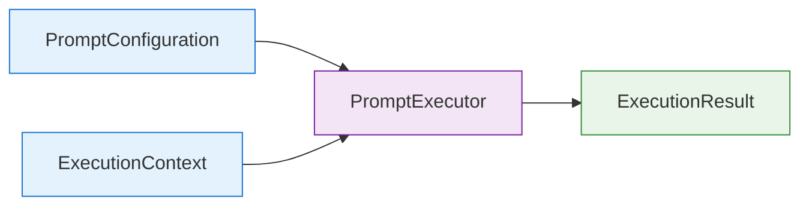

## Adding Proompting 2025-06-23

## Refactoring 2025-06-22
🧯 Tool Usage Limits: Added Then Removed

Originally, a tool usage limit (`max_per_tool`, `max_total`) was implemented to:
- Prevent runaway execution loops
- Cap costs of expensive tools (e.g., API calls)
- Force the agent to reach conclusions with minimal dependencies

However, in practice, this led to frequent premature terminations:
- The agent would hit limits before resolving the task
- Responses like "Agent stopped due to iteration limit" emerged
- Final answers were not produced, degrading UX

📌 Root Cause: Prompt engineering failed to sufficiently incentivize the LLM to reach a conclusion.
Instead of limiting the agent's ability to explore, we needed better instruction in the ReAct prompt.

✅ Resolution:
Tool usage limits were removed in favor of:
- Improved prompt structure ("you must answer eventually")
- Tool usage feedback (`tool_used` flag) in prompt context
- Agent fallback response if `Final Answer:` is never reached

This shift restored agent reliability while preserving flexibility.

---

def check_limit(self, tool_name: str) -> bool:
    """Check if a specific tool can still be used"""
    # Check global limit first (account for the pending increment)
    if (
        self._global_limit is not None
        and self.get_total_usage() + 1 > self._global_limit  # +1 for this pending call
    ):
        print(f"🚫 DEBUG: Global limit would be exceeded! Current: {self.get_total_usage()}, Limit: {self._global_limit}")
        return False

    # Check per-tool limit
    usage = self._usage_count.get(tool_name, 0)
    max_uses = self._limits.get(tool_name)
    if max_uses is not None and usage >= max_uses:
        print(f"🚫 DEBUG: Tool '{tool_name}' individual limit hit! Usage: {usage}, Limit: {max_uses}")
        return False

    return True