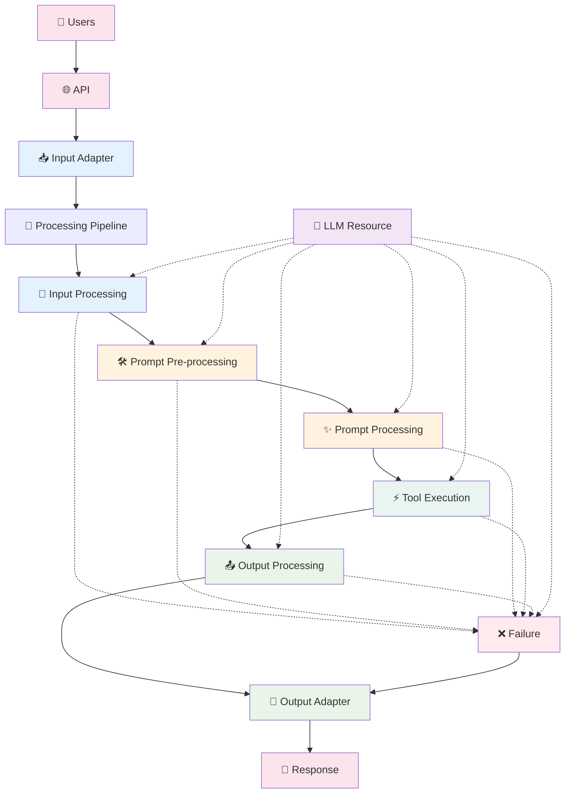

# Entity Pipeline Framework Architecture Summary

## 🎯 Vision
A **pipeline-based plugin framework** for AI agents that processes requests through configurable stages, inspired by Bevy's plugin architecture. Composable, extensible, and configuration-driven.

## 🏗️ Core Architecture

### Stage-Based Processing Pipeline with LLM as Shared Resource

```mermaid
flowchart TD
    Users[👤 Users] --> API[🌐 API]
    API --> IA[📥 Input Adapter]
    IA --> Pipeline[🔄 Processing Pipeline]
    
    Pipeline --> Stage1[🔄 Input Processing]
    Stage1 --> Stage2[🛠️ Prompt Pre-processing] 
    Stage2 --> Stage3[✨ Prompt Processing]
    Stage3 --> Stage4[⚡ Tool Execution]
    Stage4 --> Stage5[📤 Output Processing]
    
    Stage5 --> OA[📮 Output Adapter]
    OA --> Response[📱 Response]
    
    %% Error handling flow
    Stage1 -.-> FailureStage[❌ Failure]
    Stage2 -.-> FailureStage
    Stage3 -.-> FailureStage
    Stage4 -.-> FailureStage
    Stage5 -.-> FailureStage
    FailureStage --> OA
    
    %% LLM Resource Available Throughout Pipeline
    LLM[🧠 LLM Resource] -.-> Stage1
    LLM -.-> Stage2
    LLM -.-> Stage3
    LLM -.-> Stage4
    LLM -.-> Stage5
    LLM -.-> FailureStage
    
    %% Styling
    classDef input fill:#e3f2fd
    classDef processing fill:#fff3e0
    classDef llm fill:#f3e5f5
    classDef output fill:#e8f5e8
    classDef endpoints fill:#fce4ec
    classDef tools fill:#e8f5f0
    classDef error fill:#ffebee
    
    class Users,API,Response endpoints
    class IA,Stage1 input
    class Stage2,Stage3 processing
    class LLM llm
    class Stage4 tools
    class Stage5,OA output
    class FailureStage error
```

### Pipeline Execution Model

The pipeline follows a **centralized tool execution pattern** with structured tool calls, standardized results, and comprehensive error handling:

1. **Linear Pipeline Execution**: All stages run once in order
2. **Structured LLM Access**: Any stage can call the LLM when needed with automatic observability
3. **Structured Tool System**: Stages can queue structured tool calls, executed in tool_execution stage
4. **Standardized Results**: Explicit result keys with no fallback chains
5. **Stateful Plugin Iteration**: Plugins persist state across pipeline iterations until response is generated
6. **Dynamic Configuration Updates**: Runtime configuration changes without application restart via plugin reconfiguration
7. **Fail-Fast Error Handling**: Plugin failures route to dedicated failure stage for user communication
8. **Iteration Limit**: `max_iterations` prevents infinite loops (for complex patterns like ReAct)

```python
from enum import Enum, auto
from dataclasses import dataclass, field
from typing import Dict, List, Any, Optional
from datetime import datetime

class PipelineStage(Enum):
    INPUT_PROCESSING = auto()
    PROMPT_PREPROCESSING = auto() 
    PROMPT_PROCESSING = auto()
    TOOL_EXECUTION = auto()
    OUTPUT_PROCESSING = auto()
    FAILURE = auto()
    
    def __str__(self):
        return self.name.lower()
    
    @classmethod
    def from_str(cls, stage_name: str) -> 'PipelineStage':
        """Convert string to enum with validation"""
        try:
            return cls[stage_name.upper()]
        except KeyError:
            valid_stages = [stage.name.lower() for stage in cls]
            raise ValueError(f"Invalid stage '{stage_name}'. Valid stages: {valid_stages}")

async def execute_pipeline(request):
    context = PipelineContext(
        conversation=[ConversationEntry(content=str(request), role="user", timestamp=datetime.now())],
        _stage_results={},
        pending_tool_calls=[],
        executed_tool_results={},
        resources=resource_registry,
        metadata={},
        pipeline_id=generate_pipeline_id(),
        max_iterations=config.max_iterations,
        current_stage=None  # Track current stage execution
    )
    
    for iteration in range(context.max_iterations):
        # Execute each pipeline stage in sequence
        await execute_stage(PipelineStage.INPUT_PROCESSING, context)
        await execute_stage(PipelineStage.PROMPT_PREPROCESSING, context) 
        await execute_stage(PipelineStage.PROMPT_PROCESSING, context)
        await execute_stage(PipelineStage.TOOL_EXECUTION, context)      # ONLY stage that executes tools
        await execute_stage(PipelineStage.OUTPUT_PROCESSING, context)
        
        # Simple continuation logic
        if context.response is not None:
            break  # We have a response, we're done
            
        # Otherwise continue to next iteration
    
    return context.response or create_timeout_response(context.pipeline_id)

async def execute_stage(stage: PipelineStage, context: PipelineContext):
    # Set current stage for plugin awareness
    context.current_stage = stage
    
    # 1. Execute all plugins registered for this stage
    stage_plugins = plugin_registry.get_plugins_for_stage(stage)
    
    for plugin in stage_plugins:
        await plugin.execute(context)
    
    # 2. Execute tools ONLY in the tool_execution stage
    if stage == PipelineStage.TOOL_EXECUTION and context.pending_tool_calls:
        tool_results = await execute_stage_tools(context.pending_tool_calls)
        context.executed_tool_results.update(tool_results)
        
        # Add tool results to conversation for subsequent stages
        for tool_call, result in tool_results.items():
            context.add_conversation_entry(
                content=f"Tool result: {result}",
                role="system",
                metadata={"tool_name": tool_call.name}
            )
        
        context.pending_tool_calls.clear()
```

### Three-Layer Plugin System

#### **Resource Plugins** (Infrastructure - Enables System Function)
- **Database**: PostgreSQL, SQLite connections
- **LLM**: Ollama, OpenAI, Claude servers  
- **Semantic Memory**: Vector databases, Redis cache
- **Storage**: File systems, cloud storage
- **Logging**: Structured logging, metrics, tracing
- **Monitoring**: Health checks, performance metrics

**Default Stages**: `[PipelineStage.INPUT_PROCESSING, PipelineStage.PROMPT_PREPROCESSING, PipelineStage.PROMPT_PROCESSING, PipelineStage.TOOL_EXECUTION, PipelineStage.OUTPUT_PROCESSING, PipelineStage.FAILURE]` (can run in any stage when needed)

#### **Tool Plugins** (Functionality - Performs Tasks for Users)
- **Weather**: Get current conditions, forecasts
- **Calculator**: Mathematical computations
- **Search**: Web search, document search
- **File Operations**: Read, write, process files
- **API Integrations**: Slack, email, custom APIs

**Tool Execution Model**: Tools are registered during system initialization as static capabilities. During any stage, plugins can queue structured tool calls to the context. Only the tool_execution stage actually executes tools, with results available to subsequent stages.

**Default Stages**: `[PipelineStage.TOOL_EXECUTION]` (tools only execute in dedicated stage)

#### **Prompt Plugins** (Processing - Controls Request Flow)
- **Strategies**: ReAct, Chain-of-Thought, Direct Response
- **Personality**: Sarcasm, loyalty, wit injection
- **Memory**: Context retrieval and storage
- **Output**: Formatting, validation, filtering
- **Tool Coordination**: Queue structured tool calls during processing

**Default Stages**: `[PipelineStage.PROMPT_PROCESSING]` (main processing stage)

#### **Adapter Plugins** (Input/Output - Interface Handling)
- **Input Adapters**: HTTP, WebSocket, CLI interfaces
- **Output Adapters**: HTTP responses, TTS, formatted output
  - **TTS**: Text-to-speech services

**Default Stages**: `[PipelineStage.INPUT_PROCESSING, PipelineStage.OUTPUT_PROCESSING]` (interface boundary stages)

#### **Failure Plugins** (Error Communication - User-Facing Error Handling)
- **Error Formatters**: Convert technical errors to user-friendly messages
- **Error Loggers**: Record failures for debugging and monitoring
- **Notification Systems**: Alert administrators of critical failures

**Default Stages**: `[PipelineStage.FAILURE]` (dedicated error handling stage)

**Note**: Plugin use is discouraged in the failure stage to maintain reliability. Keep failure stage plugins minimal and ensure static fallback responses are available.

### Plugin Stage Assignment System

The framework uses a **hybrid approach** for assigning plugins to pipeline stages, balancing ease of evolution with flexibility:

#### **Default Stage Assignment via Base Classes**
```python
class ResourcePlugin(BasePlugin):
    default_stages = [PipelineStage.INPUT_PROCESSING, PipelineStage.PROMPT_PREPROCESSING, 
                     PipelineStage.PROMPT_PROCESSING, PipelineStage.TOOL_EXECUTION, 
                     PipelineStage.OUTPUT_PROCESSING, PipelineStage.FAILURE]  # Can run in any stage when needed

class ToolPlugin(BasePlugin):
    default_stages = [PipelineStage.TOOL_EXECUTION]  # Tools only execute in dedicated stage

class PromptPlugin(BasePlugin):
    default_stages = [PipelineStage.PROMPT_PROCESSING]  # Main processing stage

class AdapterPlugin(BasePlugin):
    default_stages = [PipelineStage.INPUT_PROCESSING, PipelineStage.OUTPUT_PROCESSING]  # Interface boundaries

class FailurePlugin(BasePlugin):
    default_stages = [PipelineStage.FAILURE]  # Dedicated error handling stage
```

#### **Explicit Stage Override for Multi-Stage Plugins**
```python
class MemoryRetrievalPlugin(PromptPlugin):
    # Override default - runs in multiple stages
    stages = [PipelineStage.INPUT_PROCESSING, PipelineStage.PROMPT_PROCESSING]

class DebugLoggingPlugin(ResourcePlugin):
    # Explicit override - runs in all stages for debugging
    stages = [PipelineStage.INPUT_PROCESSING, PipelineStage.PROMPT_PREPROCESSING, 
             PipelineStage.PROMPT_PROCESSING, PipelineStage.TOOL_EXECUTION, 
             PipelineStage.OUTPUT_PROCESSING, PipelineStage.FAILURE]

class ContextEnhancerPlugin(PromptPlugin):
    # Override - only runs early in pipeline
    stages = [PipelineStage.INPUT_PROCESSING]
```

#### **YAML Configuration Order = Execution Order**
Plugins execute within each stage in the **exact order** they appear in the YAML configuration:

```yaml
prompts:
  # Execution order within prompt_processing stage:
  # 1. intent_classifier → 2. memory_retrieval → 3. chain_of_thought → 4. smart_coordinator
  intent_classifier:
    type: intent_classifier
    confidence_threshold: 0.8
  
  memory_retrieval:
    type: memory_retrieval
    max_context_length: 4000
    # This plugin runs in input_processing AND prompt_processing stages
    stages: ["input_processing", "prompt_processing"]
  
  chain_of_thought:
    type: chain_of_thought
    enable_reasoning: true
  
  smart_tool_coordinator:
    type: smart_tool_coordinator
```

#### **Stage Registration Process**
```python
def register_plugin_for_stages(plugin_instance, plugin_name):
    """Register plugin for appropriate stages based on class definition"""
    # Use explicit stages if defined, otherwise use class default
    stages = getattr(plugin_instance.__class__, 'stages', plugin_instance.__class__.default_stages)
    
    for stage in stages:
        plugin_registry.register_plugin_for_stage(plugin_instance, stage, plugin_name)
```

## 🔧 Key Components

### Error Handling and Failure Recovery

The framework implements a **fail-fast error handling strategy** with dedicated failure communication:

#### **Failure Information Structure**
```python
@dataclass
class FailureInfo:
    stage: str                    # Stage where failure occurred
    plugin_name: str              # Plugin that caused the failure
    error_type: str               # "plugin_error", "tool_error", "system_error"
    error_message: str            # Human-readable error description
    original_exception: Exception # Original exception for debugging
    context_snapshot: Dict[str, Any] = None  # Context state when failure occurred
    timestamp: datetime = field(default_factory=datetime.now)

class PipelineContext:
    # ... existing fields ...
    failure_info: Optional[FailureInfo] = None
    current_stage: Optional[PipelineStage] = None  # Track current executing stage
    
    def get_current_stage(self) -> Optional[PipelineStage]:
        """Get currently executing stage"""
        return self.current_stage
    
    def is_stage(self, stage: PipelineStage) -> bool:
        """Check if currently in specific stage"""
        return self.current_stage == stage
    
    def add_failure(self, failure: FailureInfo):
        """Add failure information and prepare for failure stage routing"""
        self.failure_info = failure
        self.logger.error(
            "Pipeline failure detected",
            stage=failure.stage,
            plugin=failure.plugin_name,
            error_type=failure.error_type,
            error_message=failure.error_message,
            pipeline_id=self.pipeline_id
        )
```

#### **Error Handling Flow**
1. **Plugin Failures**: Caught during stage execution, added to context, routed to failure stage
2. **Tool Failures**: Captured in tool results, detected after tool execution, routed to failure stage  
3. **System Failures**: Unexpected exceptions caught at pipeline level, routed to failure stage
4. **Failure Stage**: Processes all failures through dedicated plugins for user communication
5. **Static Fallback**: If failure stage plugins fail, return static error response

#### **Tool Retry Configuration**
```python
class ToolPlugin(BasePlugin):
    default_stages = [PipelineStage.TOOL_EXECUTION]
    
    def __init__(self, config: Dict):
        self.max_retries = config.get("max_retries", 1)  # Default sensible retry count
        self.retry_delay = config.get("retry_delay", 1.0)  # Seconds between retries
    
    async def execute_function_with_retry(self, params: Dict) -> str:
        """Execute tool function with configured retry logic"""
        for attempt in range(self.max_retries + 1):
            try:
                return await self.execute_function(params)
            except Exception as e:
                if attempt == self.max_retries:
                    raise e  # Final attempt failed
                await asyncio.sleep(self.retry_delay)
        
    async def execute_function(self, params: Dict) -> str:
        """Override this method in tool implementations"""
        raise NotImplementedError("Tool plugins must implement execute_function")
```

#### **Static Error Fallback**
```python
# Used when failure stage plugins themselves fail
STATIC_ERROR_RESPONSE = {
    "error": "System error occurred",
    "message": "An unexpected error prevented processing your request. Please try again or contact support.",
    "error_id": None,  # Will be populated with pipeline_id
    "timestamp": None,  # Will be populated with current time
    "type": "static_fallback"
}

def create_static_error_response(pipeline_id: str) -> Dict[str, Any]:
    """Create fallback error response when failure stage fails"""
    response = STATIC_ERROR_RESPONSE.copy()
    response["error_id"] = pipeline_id
    response["timestamp"] = datetime.now().isoformat()
    return response
```

### Context and Data Structures

```python
@dataclass
class ConversationEntry:
    content: str
    role: str  # "user", "assistant", "system"
    timestamp: datetime
    metadata: Dict[str, Any] = field(default_factory=dict)

@dataclass
class ToolCall:
    name: str
    params: Dict[str, Any]
    result_key: str
    source: str  # "static" | "dynamic" | "llm_generated"

class PipelineContext:
    # Structured conversation history
    conversation: List[ConversationEntry]
    
    # Final response
    response: Any
    
    # Current prompt being built
    prompt: str
    
    # Results from pipeline stages (no fallbacks)
    _stage_results: Dict[str, Any]
    
    # Tool call management
    pending_tool_calls: List[ToolCall]
    executed_tool_results: Dict[str, Any]
    
    # System resources and metadata
    resources: ResourceRegistry
    metadata: Dict[str, Any]  # Used for plugin state persistence across iterations
    pipeline_id: str
    metrics: MetricsCollector
    max_iterations: int
    
    # Stage execution tracking
    current_stage: Optional[PipelineStage] = None
    
    # Stage result methods (no fallbacks)
    def set_stage_result(self, key: str, value: Any):
        if key in self._stage_results:
            raise ValueError(f"Stage result '{key}' already set by another plugin")
        self._stage_results[key] = value
    
    def get_stage_result(self, key: str) -> Any:
        if key not in self._stage_results:
            raise KeyError(f"Required result '{key}' not available")
        return self._stage_results[key]
    
    def has_stage_result(self, key: str) -> bool:
        return key in self._stage_results
    
    # Tool call management
    def add_tool_call(self, tool_call: ToolCall):
        self.pending_tool_calls.append(tool_call)
    
    def add_conversation_entry(self, content: str, role: str, metadata: Dict = None):
        entry = ConversationEntry(
            content=content,
            role=role,
            timestamp=datetime.now(),
            metadata=metadata or {}
        )
        self.conversation.append(entry)
    
    def add_failure(self, failure: FailureInfo):
        """Add failure information and prepare for failure stage routing"""
        self.failure_info = failure
```

### Tool Execution (No Templates)
```python
async def execute_stage_tools(tool_calls: List[ToolCall]) -> Dict[str, Any]:
    """Execute tools and return results mapped by result_key"""
    results = {}
    
    # Execute tools (can be parallel or sequential based on config)
    for tool_call in tool_calls:
        try:
            tool_plugin = tool_registry.get_tool(tool_call.name)
            # Use retry logic if configured
            if hasattr(tool_plugin, 'execute_function_with_retry'):
                result = await tool_plugin.execute_function_with_retry(tool_call.params)
            else:
                result = await tool_plugin.execute_function(tool_call.params)
            results[tool_call.result_key] = result
        except Exception as e:
            results[tool_call.result_key] = f"Error: {e}"
    
    return results
```

### Plugin Observability & Logging
```python
class BasePlugin:
    def __init__(self):
        self.logger = None  # Injected during initialization
        
    async def execute(self, context: PipelineContext):
        # Automatic logging with pipeline ID and stage
        self.logger.info(
            "Plugin execution started",
            plugin=self.__class__.__name__,
            pipeline_id=context.pipeline_id,
            stage=str(context.get_current_stage())
        )
        
        start_time = time.time()
        try:
            result = await self._execute_impl(context)
            
            # Automatic metrics collection
            context.metrics.record_plugin_duration(
                plugin=self.__class__.__name__,
                stage=str(context.get_current_stage()),
                duration=time.time() - start_time
            )
            
            return result
        except Exception as e:
            self.logger.error(
                "Plugin execution failed",
                plugin=self.__class__.__name__,
                pipeline_id=context.pipeline_id,
                stage=str(context.get_current_stage()),
                error=str(e),
                exc_info=True
            )
            raise
    
    async def call_llm(self, context: PipelineContext, prompt: str, purpose: str) -> LLMResponse:
        """Structured LLM access with automatic logging and metrics"""
        llm = context.resources.get("ollama")  # or configured LLM resource
        
        # Enhanced observability
        context.metrics.record_llm_call(
            plugin=self.__class__.__name__,
            stage=str(context.get_current_stage()),
            purpose=purpose
        )
        
        start_time = time.time()
        response = await llm.generate(prompt)
        
        # Log with purpose for better debugging
        self.logger.info(
            "LLM call completed",
            plugin=self.__class__.__name__,
            stage=str(context.get_current_stage()),
            purpose=purpose,
            prompt_length=len(prompt),
            response_length=len(response.content),
            duration=time.time() - start_time,
            pipeline_id=context.pipeline_id
        )
        
        return response
```

### Plugin Validation System
```python
class ValidationResult:
    success: bool
    error_message: str = None
    warnings: List[str] = []

@dataclass
class ReconfigResult:
    success: bool
    error_message: str = None
    requires_restart: bool = False
    warnings: List[str] = []

class BasePlugin:
    dependencies = []  # List of registry keys that this plugin depends on
    
    @classmethod
    def validate_config(cls, config: Dict) -> ValidationResult:
        """
        Pure configuration validation - no external dependencies.
        Validates:
        - Required config keys exist
        - Values are correct types/formats
        - URLs are well-formed
        - Numeric ranges are valid
        - Stage assignments (if provided)
        - No registry or cross-plugin concerns
        """
        # Validate stages if explicitly provided
        config_stages = config.get("stages", [])
        if config_stages:
            try:
                [PipelineStage.from_str(stage) for stage in config_stages]
            except ValueError as e:
                return ValidationResult.error(f"Invalid stage configuration: {e}")
        
        return ValidationResult(success=True)
    
    @classmethod
    def validate_dependencies(cls, registry: ClassRegistry) -> ValidationResult:
        """
        Dependency validation - checks that declared dependencies exist in registry.
        Validates:
        - All items in cls.dependencies exist in registry
        - No circular dependency chains (using topological sort)
        - Plugin execution order can be determined
        
        Uses registry keys (YAML config names) for dependencies.
        """
        # Check all dependencies exist
        for dep in cls.dependencies:
            if not registry.has_plugin(dep):
                available = registry.list_plugins()
                return ValidationResult.error(f"{cls.__name__} requires '{dep}' but it's not registered. Available: {available}")
        
        return ValidationResult.success()
    
    @classmethod
    def validate_all(cls, config: Dict, registry: ClassRegistry) -> ValidationResult:
        """Convenience method for complete validation (config + dependencies)"""
        config_result = cls.validate_config(config)
        if not config_result.success:
            return config_result
        return cls.validate_dependencies(registry)
    
    def supports_runtime_reconfiguration(self) -> bool:
        """Can this plugin be reconfigured without restart?"""
        return True  # Override in plugins that can't handle runtime reconfiguration
    
    async def reconfigure(self, new_config: Dict) -> ReconfigResult:
        """
        Update plugin configuration at runtime.
        Returns success/failure and whether restart is required.
        """
        # Validate new configuration first
        validation_result = self.validate_config(new_config)
        if not validation_result.success:
            return ReconfigResult(
                success=False,
                error_message=f"Configuration validation failed: {validation_result.error_message}"
            )
        
        # Check if plugin supports runtime reconfiguration
        if not self.supports_runtime_reconfiguration():
            return ReconfigResult(
                success=False,
                requires_restart=True,
                error_message="This plugin requires application restart for configuration changes"
            )
        
        # Apply new configuration
        try:
            old_config = self.config
            self.config = new_config
            await self._handle_reconfiguration(old_config, new_config)
            return ReconfigResult(success=True)
        except Exception as e:
            # Restore old configuration on failure
            self.config = old_config
            return ReconfigResult(
                success=False,
                error_message=f"Reconfiguration failed: {str(e)}"
            )
    
    async def on_dependency_reconfigured(self, dependency_name: str, old_config: Dict, new_config: Dict) -> bool:
        """
        Called when a dependency's configuration changes.
        Returns True if successfully handled, False if restart required.
        """
        # Default implementation: no action needed
        return True
    
    async def _handle_reconfiguration(self, old_config: Dict, new_config: Dict):
        """
        Override this method to handle configuration changes.
        Called after validation passes and config is updated.
        """
        pass  # Default: no special handling needed
    
    @classmethod
    def from_dict(cls, config: Dict) -> 'Self':
        """
        Create plugin from config with CONFIG VALIDATION ONLY.
        
        WARNING: This does NOT validate dependencies. Use only for:
        - Testing with mocked dependencies
        - Development/prototyping
        - When dependencies are guaranteed to exist
        
        For production systems, use four-phase initialization.
        """
        result = cls.validate_config(config)
        if not result.success:
            raise ConfigurationError(f"{cls.__name__} config validation failed: {result.error_message}")
        return cls(config)
    
    @classmethod
    def from_yaml(cls, yaml_content: str) -> 'Self':
        """Parse YAML then delegate to from_dict (config validation only)"""
        config = yaml.safe_load(yaml_content)
        return cls.from_dict(config)
    
    @classmethod
    def from_json(cls, json_content: str) -> 'Self':
        """Parse JSON then delegate to from_dict (config validation only)"""
        config = json.loads(json_content)
        return cls.from_dict(config)
```

### Dynamic Configuration Management

The framework supports runtime configuration updates without application restart through a **fail-fast, cascading reconfiguration system**:

#### **Configuration Update Flow**
```python
async def update_plugin_configuration(plugin_name: str, new_config: Dict) -> ConfigUpdateResult:
    """
    Update plugin configuration at runtime with cascading dependency updates.
    Implements fail-fast behavior - any failure aborts the entire update.
    """
    # 1. Wait for in-flight pipelines to complete
    await wait_for_pipeline_completion()
    
    # 2. Validate new configuration
    plugin_instance = plugin_registry.get_plugin(plugin_name)
    validation_result = plugin_instance.validate_config(new_config)
    if not validation_result.success:
        return ConfigUpdateResult.failure(f"Validation failed: {validation_result.error_message}")
    
    # 3. Attempt reconfiguration
    reconfig_result = await plugin_instance.reconfigure(new_config)
    if not reconfig_result.success:
        if reconfig_result.requires_restart:
            return ConfigUpdateResult.restart_required(reconfig_result.error_message)
        else:
            return ConfigUpdateResult.failure(reconfig_result.error_message)
    
    # 4. Cascade to dependent plugins (automatic)
    dependent_plugins = plugin_registry.get_dependents(plugin_name)
    for dependent_plugin in dependent_plugins:
        cascade_success = await dependent_plugin.on_dependency_reconfigured(
            plugin_name, old_config, new_config
        )
        if not cascade_success:
            # Fail-fast: abort entire update if any dependent plugin fails
            return ConfigUpdateResult.failure(
                f"Dependency cascade failed for plugin: {dependent_plugin.name}"
            )
    
    # 5. Success - all plugins reconfigured
    return ConfigUpdateResult.success()

async def wait_for_pipeline_completion(timeout_seconds: int = 30):
    """Wait for all in-flight pipelines to complete before reconfiguration"""
    start_time = time.time()
    while pipeline_manager.has_active_pipelines():
        if time.time() - start_time > timeout_seconds:
            raise TimeoutError("Timeout waiting for pipelines to complete")
        await asyncio.sleep(0.1)  # Check every 100ms
```

#### **Plugin Reconfiguration Examples**
```python
class LLMResourcePlugin(ResourcePlugin):
    def supports_runtime_reconfiguration(self) -> bool:
        return True  # Can change temperature, model parameters
    
    async def _handle_reconfiguration(self, old_config: Dict, new_config: Dict):
        """Handle LLM configuration changes"""
        # Update temperature, top_p, etc.
        if old_config.get("model") != new_config.get("model"):
            # Model change requires reconnection
            await self._reconnect_with_new_model(new_config["model"])
        
        # Update generation parameters
        self.llm_client.update_generation_params({
            "temperature": new_config.get("temperature", 0.7),
            "top_p": new_config.get("top_p", 0.9),
            "top_k": new_config.get("top_k", 40)
        })

class DatabaseResourcePlugin(ResourcePlugin):
    def supports_runtime_reconfiguration(self) -> bool:
        return True  # Can change pool sizes, timeouts
    
    async def _handle_reconfiguration(self, old_config: Dict, new_config: Dict):
        """Handle database configuration changes"""
        # Update connection pool settings
        if old_config.get("max_pool_size") != new_config.get("max_pool_size"):
            await self.connection_pool.resize(new_config["max_pool_size"])
        
        if old_config.get("host") != new_config.get("host"):
            # Host change requires restart
            raise RuntimeError("Database host changes require application restart")

class IntentClassifierPlugin(PromptPlugin):
    def supports_runtime_reconfiguration(self) -> bool:
        return True  # Can change thresholds
    
    async def on_dependency_reconfigured(self, dependency_name: str, old_config: Dict, new_config: Dict) -> bool:
        """React to LLM configuration changes"""
        if dependency_name == "ollama":
            # LLM model changed - might need to adjust confidence thresholds
            if old_config.get("model") != new_config.get("model"):
                self.logger.info(f"LLM model changed from {old_config.get('model')} to {new_config.get('model')}")
                # Could automatically adjust thresholds based on new model
                return True
        return True  # Successfully handled
```

#### **Configuration Update Results**
```python
@dataclass
class ConfigUpdateResult:
    success: bool
    error_message: str = None
    requires_restart: bool = False
    updated_plugins: List[str] = field(default_factory=list)
    
    @classmethod
    def success(cls, updated_plugins: List[str] = None) -> 'ConfigUpdateResult':
        return cls(success=True, updated_plugins=updated_plugins or [])
    
    @classmethod
    def failure(cls, error_message: str) -> 'ConfigUpdateResult':
        return cls(success=False, error_message=error_message)
    
    @classmethod
    def restart_required(cls, error_message: str) -> 'ConfigUpdateResult':
        return cls(success=False, requires_restart=True, error_message=error_message)
```

### Plugin Capabilities
- **Read/Write Context**: Plugins can modify any part of the response.
- **Resource Access**: `context.resources.get("llm")` - request what you need
- **Short Circuit**: Skip remaining pipeline stages by setting `context.response`
- **Stateful Iteration**: Persist state across pipeline iterations via `context.metadata` until response is generated
- **Dynamic Reconfiguration**: Update configuration at runtime via `reconfigure()` method with cascading dependency notifications
- **Structured Tools**: Queue structured tool calls during any stage
- **Structured LLM Access**: Any plugin can call the LLM resource with automatic observability via `self.call_llm()`
- **Standardized Results**: Set and get standardized results with explicit dependencies
- **Error Signaling**: Add failure information with `context.add_failure()` to route to failure stage
- **Tool Retry Logic**: Configure retry behavior for individual tools with `max_retries` and `retry_delay`
- **Stage Awareness**: Access current execution stage with `context.get_current_stage()`

## ⚙️ Configuration

### Four-Phase System Initialization
```python
# Phase 1: Class Registration (Metadata Only - Order Independent)
# Phase 2: Static Validation (All Classes Available - Fail Fast)
# Phase 3: Resource Initialization (Dependency Order with Cleanup)
# Phase 4: Plugin Instantiation (Everything Ready)

class SystemInitializer:
    @classmethod
    def from_yaml(cls, yaml_path: str) -> 'SystemInitializer':
        """
        Load entire system configuration from single YAML file.
        Handles environment variable interpolation at system level for security.
        """
        # 1. Load YAML content
        with open(yaml_path, 'r') as file:
            yaml_content = file.read()
        
        # 2. Interpolate ALL environment variables at system level (security)
        config = cls._interpolate_env_vars(yaml.safe_load(yaml_content))
        
        # 3. Return SystemInitializer with fully resolved config
        return cls(config)
    
    def get_resource_config(self, name: str) -> Dict:
        """Explicitly extract resource configuration"""
        return self.config["plugins"]["resources"][name]
    
    def get_tool_config(self, name: str) -> Dict:
        """Explicitly extract tool configuration"""
        return self.config["plugins"]["tools"][name]
    
    def get_adapter_config(self, name: str) -> Dict:
        """Explicitly extract adapter configuration"""
        return self.config["plugins"]["adapters"][name]
    
    def get_prompt_config(self, name: str) -> Dict:
        """Explicitly extract prompt configuration"""
        return self.config["plugins"]["prompts"][name]

    def initialize(self):
        with initialization_cleanup_context():
            # Phase 1: Register all plugin classes and extract dependency graph
            registry = ClassRegistry()
            dependency_graph = {}
            
            # Register resources
            for resource_name, resource_config in self.config["plugins"]["resources"].items():
                resource_class = import_plugin_class(resource_config.get("type", resource_name))
                registry.register_class(resource_class, resource_config, resource_name)
                dependency_graph[resource_name] = resource_class.dependencies
            
            # Register tools, adapters, prompts...
            for plugin_type in ["tools", "adapters", "prompts"]:
                for plugin_name, plugin_config in self.config["plugins"].get(plugin_type, {}).items():
                    plugin_class = import_plugin_class(plugin_config.get("type", plugin_name))
                    registry.register_class(plugin_class, plugin_config, plugin_name)
                    dependency_graph[plugin_name] = plugin_class.dependencies
            
            # Phase 2: Validate dependencies exist and detect circular dependencies
            self._validate_dependency_graph(registry, dependency_graph)
            
            # Phase 2 continued: Config validation for all plugins
            for plugin_class, config in registry.all_plugin_classes():
                config_result = plugin_class.validate_config(config)
                if not config_result.success:
                    raise SystemError(f"Config validation failed for {plugin_class.__name__}: {config_result.error_message}")
            
            # Phase 3: Initialize resources in dependency order (no validation needed - already done!)
            resource_registry = ResourceRegistry()
            for resource_class, config in registry.resource_classes():
                instance = resource_class(config)  # Direct instantiation
                await instance.initialize()
                resource_registry.add_resource(instance)
            
            # Phase 3.5: Register tools as static system capabilities
            tool_registry = ToolRegistry()
            for tool_class, config in registry.tool_classes():
                instance = tool_class(config)  # Direct instantiation
                tool_registry.add_tool(instance)
            
            # Phase 4: Instantiate prompt and adapter plugins (no validation needed - already done!)
            plugin_registry = PluginRegistry()
            for plugin_class, config in registry.non_resource_non_tool_classes():
                instance = plugin_class(config)  # Direct instantiation
                plugin_registry.add_plugin(instance)
            
            return plugin_registry, resource_registry, tool_registry
    
    def _validate_dependency_graph(self, registry: ClassRegistry, dep_graph: Dict[str, List[str]]):
        """
        Validate dependency graph: check existence and detect circular dependencies.
        Uses registry keys (YAML config names) for dependency resolution.
        """
        # 1. Check all dependencies exist
        for plugin_name, deps in dep_graph.items():
            for dep in deps:
                if not registry.has_plugin(dep):
                    available = registry.list_plugins()
                    raise SystemError(f"Plugin '{plugin_name}' requires '{dep}' but it's not registered. Available: {available}")
        
        # 2. Detect circular dependencies using topological sort (Kahn's algorithm)
        in_degree = {node: 0 for node in dep_graph}
        for node in dep_graph:
            for neighbor in dep_graph[node]:
                if neighbor in in_degree:  # Only count registered plugins
                    in_degree[neighbor] += 1
        
        queue = [node for node, degree in in_degree.items() if degree == 0]
        processed = []
        
        while queue:
            current = queue.pop(0)
            processed.append(current)
            
            for neighbor in dep_graph[current]:
                if neighbor in in_degree:
                    in_degree[neighbor] -= 1
                    if in_degree[neighbor] == 0:
                        queue.append(neighbor)
        
        # If we didn't process all nodes, there's a cycle
        if len(processed) != len(in_degree):
            cycle_nodes = [node for node in in_degree if node not in processed]
            raise SystemError(f"Circular dependency detected involving: {cycle_nodes}")
        
    @staticmethod
    def _interpolate_env_vars(config: Any) -> Any:
        """Recursively interpolate environment variables in configuration"""
        if isinstance(config, dict):
            return {k: SystemInitializer._interpolate_env_vars(v) for k, v in config.items()}
        elif isinstance(config, list):
            return [SystemInitializer._interpolate_env_vars(item) for item in config]
        elif isinstance(config, str) and config.startswith("${") and config.endswith("}"):
            env_var = config[2:-1]
            value = os.environ.get(env_var)
            if value is None:
                raise EnvironmentError(f"Required environment variable {env_var} not found")
            return value
        else:
            return config
```

### Hierarchical YAML Configuration
```yaml
entity:
  entity_id: "jade"
  max_iterations: 500  # Prevent infinite pipeline loops
  name: "Jade"
  server:
    host: "0.0.0.0"
    port: 8000
    reload: false
    log_level: "info"

plugins:
  resources:
    database:
      type: postgres
      host: "192.168.1.104"
      port: 5432
      name: "memory"
      username: "${DB_USERNAME}"      # Environment variable interpolation
      password: "${DB_PASSWORD}"      # Resolved at system level for security
      db_schema: "entity"
      history_table: "chat_history"
      min_pool_size: 2
      max_pool_size: 10
      init_on_startup: true
    
    ollama:
      type: ollama_llm
      base_url: "http://192.168.1.110:11434"
      model: "llama3:8b-instruct-q6_K"
      temperature: 0.7
      top_p: 0.9
      top_k: 40
      repeat_penalty: 1.1
    
    logging:
      type: structured_logging
      level: "DEBUG"
      format: "%(asctime)s - %(name)s - %(levelname)s - %(message)s"
      file_enabled: true
      file_path: "logs/entity.log"
      max_file_size: 10485760
      backup_count: 5
  
  tools:
    weather:
      type: weather_api
      api_key: "${WEATHER_API_KEY}"
      base_url: "https://api.weather.com"
      timeout: 30
      max_retries: 3          # Tool-specific retry configuration
      retry_delay: 2.0        # Seconds between retries
    
    calculator:
      type: calculator
      precision: 10
      max_retries: 1          # Simple tools may need fewer retries
  
  adapters:
    tts:
      type: speech_synthesis
      base_url: "http://192.168.1.110:8888"
      voice_name: "bf_emma"
      voice_sample_path: "voice_samples/ai_mee.wav"
      output_format: "wav"
      speed: 0.3
      cfg_weight: 0.9
      exaggeration: 0.5
      sample_rates: [44100, 48000, 22050, 16000, 8000]
      fade_out_samples: 2000
  
  prompts:
    chain_of_thought:
      type: chain_of_thought
      enable_reasoning: true
      max_steps: 5
    
    memory_retrieval:
      type: memory_retrieval
      max_context_length: 4000
      similarity_threshold: 0.7
      stages: ["input_processing", "prompt_processing"]  # Multi-stage plugin
    
    intent_classifier:
      type: intent_classifier
      confidence_threshold: 0.8
```

## 🚀 Key Benefits

### For Users
- **No Code Changes**: New strategies via config only
- **Mix and Match**: Combine multiple prompt strategies
- **Resource Flexibility**: Works with/without optional resources
- **Easy Experimentation**: Swap plugins to test approaches
- **Order Independent**: Plugin configuration order doesn't matter

### For Developers  
- **Plugin Ecosystem**: Share and discover community plugins
- **Clean Testing**: Mock resources, test plugins in isolation
- **Extensible**: Add new resources and strategies without core changes
- **Composable**: Plugins build on each other's work
- **Separated Validation**: Test config parsing independently from dependency resolution
- **Performance-Optimized**: Structured execution and parallel tool execution for better performance
- **Structured Tools**: Clean separation between intent and execution
- **Dynamic Configuration**: Runtime configuration updates enable rapid experimentation and tuning
- **Stateful Plugins**: Complex reasoning patterns like ReAct can manage internal state across iterations
- **Simple Mental Model**: "Linear pipeline with structured data flow"
- **Flexible LLM Usage**: Any plugin can call LLM when needed with structured observability
- **Predictable Tool Execution**: All tools execute at a single, well-defined stage
- **Easier Debugging**: Tool failures have clear location and context
- **Simpler Testing**: Tool execution can be tested in isolation
- **Fail-Fast Development**: Plugin failures caught early in development cycle
- **Graceful Error Communication**: Dedicated failure stage for user-friendly error messages
- **Reliable Fallback**: Static error responses ensure users always receive feedback
- **Stage Awareness**: Explicit stage context for reliable plugin behavior

### For Operations
- **Runtime Reconfiguration**: Update plugin configurations without restart for rapid development and tuning
- **Configuration-Driven**: Different setups for dev/staging/prod
- **Fail Fast**: Static validation catches issues early
- **Observable**: Rich metadata from each plugin
- **Scalable**: Resources shared across all plugins
- **Environment Security**: Centralized environment variable interpolation
- **Explicit Configuration**: Clear, transparent config extraction

## 🔌 Plugin Examples

### Chain of Thought with Structured Results
```python
class ChainOfThoughtPlugin(PromptPlugin):
    dependencies = ["database", "logging", "ollama"]
    
    @classmethod
    def validate_config(cls, config: Dict) -> ValidationResult:
        max_steps = config.get("max_steps", 5)
        if not isinstance(max_steps, int) or max_steps <= 0:
            return ValidationResult.error("max_steps must be a positive integer")
        
        return ValidationResult.success()
    
    async def _execute_impl(self, context: PipelineContext):
        if not self.config.get("enable_reasoning", True):
            return
            
        # Get clean conversation history for LLM
        conversation_text = self._get_conversation_text(context.conversation)
        
        # Step 1: Break down the problem using structured LLM access
        breakdown_prompt = f"Break this problem into logical steps: {conversation_text}"
        breakdown = await self.call_llm(context, breakdown_prompt, purpose="problem_breakdown")
        
        # Add reasoning to conversation
        context.add_conversation_entry(
            content=f"Problem breakdown: {breakdown.content}",
            role="assistant",
            metadata={"reasoning_step": "breakdown"}
        )
        
        # Step 2: Reason through each step
        reasoning_steps = []
        for step_num in range(self.config.get("max_steps", 5)):
            reasoning_prompt = f"Reason through step {step_num + 1} of solving: {conversation_text}"
            reasoning = await self.call_llm(
                context, 
                reasoning_prompt, 
                purpose=f"reasoning_step_{step_num + 1}"
            )
            reasoning_steps.append(reasoning.content)
            
            context.add_conversation_entry(
                content=f"Reasoning step {step_num + 1}: {reasoning.content}",
                role="assistant",
                metadata={"reasoning_step": step_num + 1}
            )
            
            # Check if we have enough reasoning
            if "final answer" in reasoning.content.lower() or "conclusion" in reasoning.content.lower():
                break
        
        # Step 3: Set standardized results for other plugins
        context.set_stage_result("reasoning_complete", True)
        context.set_stage_result("reasoning_steps", reasoning_steps)
        context.set_stage_result("needs_tools", self._needs_tools(reasoning_steps))
        
        # Step 4: Queue tool calls if needed (executed later in tool_execution stage)
        if context.get_stage_result("needs_tools"):
            context.add_tool_call(ToolCall(
                name="analysis_tool",
                params={"data": conversation_text, "reasoning": reasoning_steps},
                result_key="analysis_result",
                source="dynamic"
            ))
            # Plugin will continue in next iteration when tool results are available
    
    def _needs_tools(self, reasoning_steps: List[str]) -> bool:
        """Determine if reasoning indicates need for tools"""
        tool_indicators = ["need to calculate", "should look up", "requires analysis", "need data"]
        reasoning_text = " ".join(reasoning_steps).lower()
        return any(indicator in reasoning_text for indicator in tool_indicators)
    
    def _get_conversation_text(self, conversation: List[ConversationEntry]) -> str:
        """Extract clean conversation text for LLM processing"""
        user_entries = [entry.content for entry in conversation if entry.role == "user"]
        return user_entries[-1] if user_entries else ""
```

### ReAct Plugin (Stateful Iteration Example)
```python
class ReActPlugin(PromptPlugin):
    """Demonstrates stateful iteration for complex reasoning patterns"""
    dependencies = ["ollama"]
    
    @classmethod
    def validate_config(cls, config: Dict) -> ValidationResult:
        max_steps = config.get("max_steps", 5)
        if not isinstance(max_steps, int) or max_steps <= 0:
            return ValidationResult.error("max_steps must be a positive integer")
        
        return ValidationResult.success()
    
    async def _execute_impl(self, context: PipelineContext):
        # Get or initialize our state across iterations
        react_state = context.metadata.get("react_state", {
            "step": 0, 
            "thoughts": [], 
            "actions": [], 
            "observations": []
        })
        
        max_steps = self.config.get("max_steps", 5)
        current_step = react_state["step"]
        
        # If we just executed tools, process observations first
        if react_state.get("waiting_for_tool"):
            tool_result_key = react_state["waiting_for_tool"]
            if tool_result_key in context.executed_tool_results:
                observation = context.executed_tool_results[tool_result_key]
                react_state["observations"].append(observation)
                react_state["waiting_for_tool"] = None
                
                # Add observation to conversation
                context.add_conversation_entry(
                    content=f"Observation: {observation}",
                    role="assistant",
                    metadata={"react_step": current_step, "type": "observation"}
                )
        
        # Continue ReAct loop
        for step in range(current_step, max_steps):
            # Build context for this step
            step_context = self._build_react_context(context.conversation, react_state)
            
            # Thought
            thought_prompt = f"""Think step by step about this problem:
            
            Context: {step_context}
            
            What should I think about next?"""
            
            thought = await self.call_llm(context, thought_prompt, purpose=f"react_thought_step_{step}")
            react_state["thoughts"].append(thought.content)
            
            context.add_conversation_entry(
                content=f"Thought: {thought.content}",
                role="assistant",
                metadata={"react_step": step, "type": "thought"}
            )
            
            # Action decision
            action_prompt = f"""Based on my thought: "{thought.content}"
            
            Should I:
            1. Take an action (specify: search, calculate, etc.)
            2. Give a final answer
            
            Respond with either "Action: <action_name> <parameters>" or "Final Answer: <answer>"""
            
            action_decision = await self.call_llm(context, action_prompt, purpose=f"react_action_step_{step}")
            
            if action_decision.content.startswith("Final Answer:"):
                # We're done!
                final_answer = action_decision.content.replace("Final Answer:", "").strip()
                context.response = final_answer
                
                # Clean up state
                context.metadata.pop("react_state", None)
                return
            
            elif action_decision.content.startswith("Action:"):
                # Parse and queue action
                action_text = action_decision.content.replace("Action:", "").strip()
                action_name, params = self._parse_action(action_text)
                
                tool_result_key = f"react_step_{step}_result"
                context.add_tool_call(ToolCall(
                    name=action_name,
                    params=params,
                    result_key=tool_result_key,
                    source="react_reasoning"
                ))
                
                react_state["actions"].append(action_text)
                react_state["step"] = step + 1
                react_state["waiting_for_tool"] = tool_result_key
                
                # Save state and exit - we'll continue when tools are done
                context.metadata["react_state"] = react_state
                
                context.add_conversation_entry(
                    content=f"Action: {action_text}",
                    role="assistant",
                    metadata={"react_step": step, "type": "action"}
                )
                
                return  # Tools will execute, then we'll resume next iteration
        
        # If we've hit max steps without a final answer
        context.response = "I've reached my reasoning limit without finding a definitive answer."
        context.metadata.pop("react_state", None)
    
    def _build_react_context(self, conversation: List[ConversationEntry], react_state: Dict) -> str:
        """Build context string for current ReAct step"""
        user_messages = [entry.content for entry in conversation if entry.role == "user"]
        latest_question = user_messages[-1] if user_messages else "No question provided"
        
        context_parts = [f"Question: {latest_question}"]
        
        # Add previous thoughts, actions, observations
        for i, thought in enumerate(react_state["thoughts"]):
            context_parts.append(f"Thought {i+1}: {thought}")
            if i < len(react_state["actions"]):
                context_parts.append(f"Action {i+1}: {react_state['actions'][i]}")
            if i < len(react_state["observations"]):
                context_parts.append(f"Observation {i+1}: {react_state['observations'][i]}")
        
        return "\n".join(context_parts)
    
    def _parse_action(self, action_text: str) -> Tuple[str, Dict[str, Any]]:
        """Parse action text into tool name and parameters"""
        parts = action_text.split(" ", 1)
        if len(parts) < 2:
            return "search", {"query": action_text}
        
        action_name = parts[0].lower()
        params_text = parts[1]
        
        if action_name == "search":
            return "search_tool", {"query": params_text}
        elif action_name == "calculate":
            return "calculator_tool", {"expression": params_text}
        else:
            return "search_tool", {"query": action_text}  # fallback
```

## 🎨 Design Principles

1. **Configuration Over Code**: Behavior defined in YAML, not hardcoded
2. **Plugin Composition**: Multiple plugins work together seamlessly  
3. **Resource Agnostic**: Plugins work with/without optional dependencies
4. **Explicit Dependencies**: Missing requirements cause immediate, clear errors
5. **Pipeline Control**: Plugins can short-circuit by setting response or trigger reprocessing
6. **Structured Communication**: Rich context object for plugin collaboration
7. **Fail-Fast Validation**: All plugin dependencies validated statically before instantiation
8. **Observable by Design**: Structured logging, metrics, and tracing built into every plugin
9. **Order Independence**: Plugin configuration order doesn't matter - validation handles dependencies
10. **Configuration Flexibility**: Multiple config formats (YAML, JSON, Dict) with secure env interpolation
11. **Separation of Concerns**: Clear distinction between config validation and dependency validation
12. **Load-Time Validation**: Validation should be done at load time, reducing runtime errors
13. **Intuitive Mental Models**: Mental models should be intensely easy to understand
14. **Structured LLM Access**: LLM available throughout pipeline with automatic observability
15. **Linear Pipeline Flow**: Simple, predictable execution order with clear stage responsibilities
16. **Structured Tool Calls**: Clean separation between intent and execution
17. **Static Tool Registration**: Tools registered once at system initialization, not per-request
18. **Centralized Tool Execution**: All tools execute at a single, well-defined stage for predictable debugging
19. **Stateful Plugin Iteration**: Plugins manage internal state across pipeline iterations for complex reasoning patterns
20. **Hybrid Stage Assignment**: Default stages via base classes with explicit override capability
21. **YAML Execution Ordering**: Plugin execution order within stages determined by YAML configuration order
22. **Fail-Fast Error Handling**: Plugin failures are caught early and routed to dedicated failure stage
23. **Error Communication**: Technical failures are converted to user-friendly messages
24. **Static Error Fallback**: Reliable fallback responses when error handling itself fails
25. **Standardized Results**: Explicit result keys with no fallback mechanisms
26. **Stage Awareness**: Explicit stage context enables reliable multi-stage plugin behavior

## 🌟 Real-World Usage

```yaml
# Development: Simple setup with execution order control
entity:
  entity_id: "dev_agent"
  name: "Development Agent"
  max_iterations: 50

plugins:
  resources:
    database:
      type: sqlite
      file_path: "dev.db"
    ollama:
      type: ollama_llm
      base_url: "http://localhost:11434"
      model: "llama3:8b"

  prompts:
    # Execution order within prompt_processing stage:
    # 1. intent_classifier → 2. smart_tool_coordinator
    intent_classifier:
      type: intent_classifier
      confidence_threshold: 0.7
    
    smart_tool_coordinator:
      type: smart_tool_coordinator

  # Failure handling plugins (minimal, discouraged)
  failure:
    error_formatter:
      type: error_formatter
      user_friendly_messages: true

# Production: Full stack with observability and multi-stage plugins
entity:
  entity_id: "prod_agent"
  name: "Production Agent"
  max_iterations: 100

plugins:
  resources:
    database:
      type: postgresql
      host: "db.company.com"
      username: "${DB_USERNAME}"
      password: "${DB_PASSWORD}"
    openai:
      type: openai_llm
      api_key: "${OPENAI_API_KEY}"
      model: "gpt-4"
    logging:
      type: structured_logging
      level: "INFO"
      output: "elasticsearch"
      format: "json"
    metrics:
      type: prometheus_metrics
      port: 9090
    tracing:
      type: jaeger_tracing
      endpoint: "http://jaeger:14268"

  prompts:
    # Execution order within stages:
    # input_processing: memory_retrieval
    # prompt_processing: memory_retrieval → intent_classifier → chain_of_thought → smart_coordinator
    memory_retrieval:
      type: memory_retrieval  # Runs in input_processing AND prompt_processing
      max_context_length: 4000
      similarity_threshold: 0.7
      stages: ["input_processing", "prompt_processing"]
    
    intent_classifier:
      type: intent_classifier
      confidence_threshold: 0.9
    
    chain_of_thought:
      type: chain_of_thought
      enable_reasoning: true
      max_steps: 5
    
    smart_tool_coordinator:
      type: smart_tool_coordinator

  # Comprehensive error handling for production
  failure:
    error_formatter:
      type: error_formatter
      user_friendly_messages: true
    
    error_logger:
      type: error_logger
      log_level: "ERROR"
      include_context: true

# Experimentation: A/B testing different reasoning strategies with explicit ordering
plugins:
  prompts:
    # Order matters - intent classification must come before reasoning
    intent_classifier:
      type: intent_classifier
      confidence_threshold: 0.8
    
    reasoning:
      type: "chain_of_thought"    # Strategy A
      # type: "react"             # Strategy B (commented out)
      enable_reasoning: true
      max_steps: 5
    
    tool_coordinator:
      type: smart_tool_coordinator  # Must come after reasoning
```

## 🎯 Bottom Line

**Entity Pipeline Framework = Bevy for AI Agents**

- **Three Plugin Types**: Resources (infrastructure), Tools (user functions), Prompts (processing)
- **Infrastructure**: Clean separation between enabling vs performing
- **Composable**: Mix and match capabilities via configuration  
- **Testable**: Clean separation, easy mocking, isolated testing
- **Production-Ready**: Explicit dependencies, rich observability
- **Developer-Friendly**: Clear patterns, shared community plugins
- **Performance-Optimized**: Structured execution and parallel tool execution for better performance
- **Linear Pipeline**: Simple, predictable execution flow with structured data
- **Stage Awareness**: Explicit stage context for reliable plugin behavior

**Result**: Build AI agents like assembling LEGO blocks - flexible, reusable, and fun! 🧩