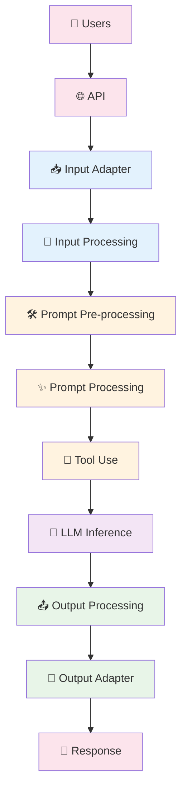
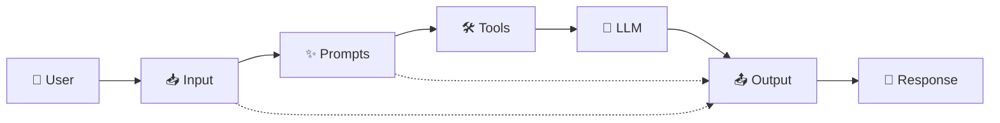
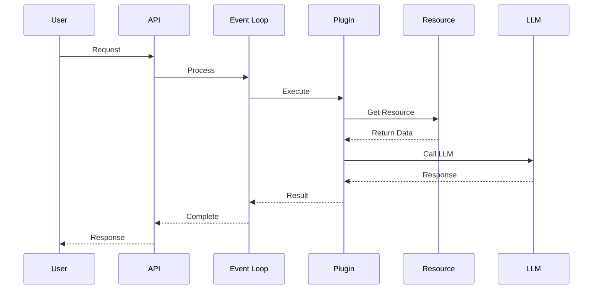

# Entity Framework Architecture Summary

## 🎯 Vision
A **Bevy-inspired plugin framework** for AI agents that's composable, extensible, and configuration-driven.

## 🏗️ Core Architecture

### Event Loop Pipeline

```mermaid
flowchart TD
    Users[👤 Users] --> API[🌐 API]
    API --> IA[📥 Input Adapter]
    IA --> IP[🔄 Input Processing]
    IP --> PPP[🛠️ Prompt Pre-processing]
    PPP --> PP[✨ Prompt Processing]
    PP --> TU[🔧 Tool Use]
    TU --> LLM[🧠 LLM Inference]
    LLM --> OP[📤 Output Processing]
    OP --> OA[📮 Output Adapter]
    OA --> Response[📱 Response]
    
    %% Styling
    classDef input fill:#e3f2fd
    classDef processing fill:#fff3e0
    classDef llm fill:#f3e5f5
    classDef output fill:#e8f5e8
    classDef endpoints fill:#fce4ec
    
    class Users,API,Response endpoints
    class IA,IP input
    class PPP,PP,TU processing
    class LLM llm
    class OP,OA output
```

### Three-Layer Plugin System

#### **Resource Plugins** (Infrastructure - Enables System Function)
- **Database**: PostgreSQL, SQLite connections
- **LLM**: Ollama, OpenAI, Claude servers  
- **Memory**: Vector databases, Redis cache
- **TTS**: Text-to-speech services
- **Storage**: File systems, cloud storage
- **Logging**: Structured logging, metrics, tracing
- **Monitoring**: Health checks, performance metrics

#### **Tool Plugins** (Functionality - Performs Tasks for Users)
- **Weather**: Get current conditions, forecasts
- **Calculator**: Mathematical computations
- **Search**: Web search, document search
- **File Operations**: Read, write, process files
- **API Integrations**: Slack, email, custom APIs

#### **Prompt Plugins** (Processing - Controls Request Flow)
- **Strategies**: ReAct, Chain-of-Thought, Direct Response
- **Personality**: Sarcasm, loyalty, wit injection
- **Memory**: Context retrieval and storage
- **Output**: Formatting, validation, filtering

## 🔧 Key Components

### Shared Context
```python
class EventContext:
    request: Any              # User input
    response: Any             # Final output
    prompt: str               # Current prompt
    memory_context: str       # Retrieved context
    metadata: Dict            # Plugin data
    recompile: bool           # Trigger LLM reprocessing
    resources: ResourceRegistry  # Access to all resources
    trace_id: str             # Unique request identifier for logging
    metrics: MetricsCollector # Performance and usage metrics
```

### Plugin Observability & Logging
```python
class BasePlugin:
    def __init__(self):
        self.logger = None  # Injected during initialization
        
    async def execute(self, context: EventContext):
        # Automatic logging with trace ID
        self.logger.info(
            "Plugin execution started",
            plugin=self.__class__.__name__,
            trace_id=context.trace_id,
            stage=self.get_stage()
        )
        
        start_time = time.time()
        try:
            result = await self._execute_impl(context)
            
            # Automatic metrics collection
            context.metrics.record_plugin_duration(
                plugin=self.__class__.__name__,
                duration=time.time() - start_time
            )
            
            return result
        except Exception as e:
            self.logger.error(
                "Plugin execution failed",
                plugin=self.__class__.__name__,
                trace_id=context.trace_id,
                error=str(e),
                exc_info=True
            )
            raise
```

### Plugin Validation System
```python
class ValidationResult:
    success: bool
    error_message: str = None
    warnings: List[str] = []

class BasePlugin:
    dependencies = []  # List of registry keys that this plugin depends on
    
    @classmethod
    def validate_config(cls, config: Dict) -> ValidationResult:
        """
        Pure configuration validation - no external dependencies.
        Validates:
        - Required config keys exist
        - Values are correct types/formats
        - URLs are well-formed
        - Numeric ranges are valid
        - No registry or cross-plugin concerns
        """
        return ValidationResult(success=True)
    
    @classmethod
    def validate_dependencies(cls, registry: ClassRegistry) -> ValidationResult:
        """
        Dependency validation - checks that declared dependencies exist in registry.
        Validates:
        - All items in cls.dependencies exist in registry
        - No circular dependency chains (using topological sort)
        - Plugin execution order can be determined
        
        Uses registry keys (YAML config names) for dependencies.
        """
        # Check all dependencies exist
        for dep in cls.dependencies:
            if not registry.has_plugin(dep):
                available = registry.list_plugins()
                return ValidationResult.error(f"{cls.__name__} requires '{dep}' but it's not registered. Available: {available}")
        
        return ValidationResult.success()
    
    @classmethod
    def validate_all(cls, config: Dict, registry: ClassRegistry) -> ValidationResult:
        """Convenience method for complete validation (config + dependencies)"""
        config_result = cls.validate_config(config)
        if not config_result.success:
            return config_result
        return cls.validate_dependencies(registry)
    
    @classmethod
    def from_dict(cls, config: Dict) -> 'Self':
        """
        Create plugin from config with CONFIG VALIDATION ONLY.
        
        WARNING: This does NOT validate dependencies. Use only for:
        - Testing with mocked dependencies
        - Development/prototyping
        - When dependencies are guaranteed to exist
        
        For production systems, use four-phase initialization.
        """
        result = cls.validate_config(config)
        if not result.success:
            raise ConfigurationError(f"{cls.__name__} config validation failed: {result.error_message}")
        return cls(config)
    
    @classmethod
    def from_yaml(cls, yaml_content: str) -> 'Self':
        """Parse YAML then delegate to from_dict (config validation only)"""
        config = yaml.safe_load(yaml_content)
        return cls.from_dict(config)
    
    @classmethod
    def from_json(cls, json_content: str) -> 'Self':
        """Parse JSON then delegate to from_dict (config validation only)"""
        config = json.loads(json_content)
        return cls.from_dict(config)
```

### Plugin Capabilities
- **Read/Write Context**: Plugins can modify any part of the request/response
- **Resource Access**: `context.resources.get("llm")` - request what you need
- **Short Circuit**: Skip remaining pipeline stages (like `continue` in loops)
- **Recompile**: Force LLM reprocessing after prompt changes

## ⚙️ Configuration

### Four-Phase System Initialization
```python
# Phase 1: Class Registration (Metadata Only - Order Independent)
# Phase 2: Static Validation (All Classes Available - Fail Fast)
# Phase 3: Resource Initialization (Dependency Order with Cleanup)
# Phase 4: Plugin Instantiation (Everything Ready)

class SystemInitializer:
    @classmethod
    def from_yaml(cls, yaml_path: str) -> 'SystemInitializer':
        """
        Load entire system configuration from single YAML file.
        Handles environment variable interpolation at system level for security.
        """
        # 1. Load YAML content
        with open(yaml_path, 'r') as file:
            yaml_content = file.read()
        
        # 2. Interpolate ALL environment variables at system level (security)
        config = cls._interpolate_env_vars(yaml.safe_load(yaml_content))
        
        # 3. Return SystemInitializer with fully resolved config
        return cls(config)
    
    def get_resource_config(self, name: str) -> Dict:
        """Explicitly extract resource configuration"""
        return self.config["plugins"]["resources"][name]
    
    def get_tool_config(self, name: str) -> Dict:
        """Explicitly extract tool configuration"""
        return self.config["plugins"]["tools"][name]
    
    def get_adapter_config(self, name: str) -> Dict:
        """Explicitly extract adapter configuration"""
        return self.config["plugins"]["adapters"][name]
    
    def get_prompt_config(self, name: str) -> Dict:
        """Explicitly extract prompt configuration"""
        return self.config["plugins"]["prompts"][name]

    def initialize(self):
        with initialization_cleanup_context():
            # Phase 1: Register all plugin classes and extract dependency graph
            registry = ClassRegistry()
            dependency_graph = {}
            
            # Register resources
            for resource_name, resource_config in self.config["plugins"]["resources"].items():
                resource_class = import_plugin_class(resource_config.get("type", resource_name))
                registry.register_class(resource_class, resource_config, resource_name)
                dependency_graph[resource_name] = resource_class.dependencies
            
            # Register tools, adapters, prompts...
            for plugin_type in ["tools", "adapters", "prompts"]:
                for plugin_name, plugin_config in self.config["plugins"].get(plugin_type, {}).items():
                    plugin_class = import_plugin_class(plugin_config.get("type", plugin_name))
                    registry.register_class(plugin_class, plugin_config, plugin_name)
                    dependency_graph[plugin_name] = plugin_class.dependencies
            
            # Phase 2: Validate dependencies exist and detect circular dependencies
            self._validate_dependency_graph(registry, dependency_graph)
            
            # Phase 2 continued: Config validation for all plugins
            for plugin_class, config in registry.all_plugin_classes():
                config_result = plugin_class.validate_config(config)
                if not config_result.success:
                    raise SystemError(f"Config validation failed for {plugin_class.__name__}: {config_result.error_message}")
            
            # Phase 3: Initialize resources in dependency order (no validation needed - already done!)
            resource_registry = ResourceRegistry()
            for resource_class, config in registry.resource_classes():
                instance = resource_class(config)  # Direct instantiation
                await instance.initialize()
                resource_registry.add_resource(instance)
            
            # Phase 4: Instantiate tool and prompt plugins (no validation needed - already done!)
            plugin_registry = PluginRegistry()
            for plugin_class, config in registry.non_resource_classes():
                instance = plugin_class(config)  # Direct instantiation
                plugin_registry.add_plugin(instance)
            
            return plugin_registry, resource_registry
    
    def _validate_dependency_graph(self, registry: ClassRegistry, dep_graph: Dict[str, List[str]]):
        """
        Validate dependency graph: check existence and detect circular dependencies.
        Uses registry keys (YAML config names) for dependency resolution.
        """
        # 1. Check all dependencies exist
        for plugin_name, deps in dep_graph.items():
            for dep in deps:
                if not registry.has_plugin(dep):
                    available = registry.list_plugins()
                    raise SystemError(f"Plugin '{plugin_name}' requires '{dep}' but it's not registered. Available: {available}")
        
        # 2. Detect circular dependencies using topological sort (Kahn's algorithm)
        in_degree = {node: 0 for node in dep_graph}
        for node in dep_graph:
            for neighbor in dep_graph[node]:
                if neighbor in in_degree:  # Only count registered plugins
                    in_degree[neighbor] += 1
        
        queue = [node for node, degree in in_degree.items() if degree == 0]
        processed = []
        
        while queue:
            current = queue.pop(0)
            processed.append(current)
            
            for neighbor in dep_graph[current]:
                if neighbor in in_degree:
                    in_degree[neighbor] -= 1
                    if in_degree[neighbor] == 0:
                        queue.append(neighbor)
        
        # If we didn't process all nodes, there's a cycle
        if len(processed) != len(in_degree):
            cycle_nodes = [node for node in in_degree if node not in processed]
            raise SystemError(f"Circular dependency detected involving: {cycle_nodes}")
        
    @staticmethod
    def _interpolate_env_vars(config: Any) -> Any:
        """Recursively interpolate environment variables in configuration"""
        if isinstance(config, dict):
            return {k: SystemInitializer._interpolate_env_vars(v) for k, v in config.items()}
        elif isinstance(config, list):
            return [SystemInitializer._interpolate_env_vars(item) for item in config]
        elif isinstance(config, str) and config.startswith("${") and config.endswith("}"):
            env_var = config[2:-1]
            value = os.environ.get(env_var)
            if value is None:
                raise EnvironmentError(f"Required environment variable {env_var} not found")
            return value
        else:
            return config
```

### Hierarchical YAML Configuration
```yaml
entity:
  entity_id: "jade"
  max_iterations: 500
  name: "Jade"
  server:
    host: "0.0.0.0"
    port: 8000
    reload: false
    log_level: "info"

plugins:
  resources:
    database:
      type: postgres
      host: "192.168.1.104"
      port: 5432
      name: "memory"
      username: "${DB_USERNAME}"      # Environment variable interpolation
      password: "${DB_PASSWORD}"      # Resolved at system level for security
      db_schema: "entity"
      history_table: "chat_history"
      min_pool_size: 2
      max_pool_size: 10
      init_on_startup: true
    
    ollama:
      type: ollama_llm
      base_url: "http://192.168.1.110:11434"
      model: "llama3:8b-instruct-q6_K"
      temperature: 0.7
      top_p: 0.9
      top_k: 40
      repeat_penalty: 1.1
    
    logging:
      type: structured_logging
      level: "DEBUG"
      format: "%(asctime)s - %(name)s - %(levelname)s - %(message)s"
      file_enabled: true
      file_path: "logs/entity.log"
      max_file_size: 10485760
      backup_count: 5
  
  tools:
    weather:
      type: weather_api
      api_key: "${WEATHER_API_KEY}"
      base_url: "https://api.weather.com"
      timeout: 30
    
    calculator:
      type: calculator
      precision: 10
  
  adapters:
    tts:
      type: speech_synthesis
      base_url: "http://192.168.1.110:8888"
      voice_name: "bf_emma"
      voice_sample_path: "voice_samples/ai_mee.wav"
      output_format: "wav"
      speed: 0.3
      cfg_weight: 0.9
      exaggeration: 0.5
      sample_rates: [44100, 48000, 22050, 16000, 8000]
      fade_out_samples: 2000
  
  prompts:
    chain_of_thought:
      type: chain_of_thought
      enable_reasoning: true
      max_steps: 5
    
    memory_retrieval:
      type: memory_retrieval
      max_context_length: 4000
      similarity_threshold: 0.7
```

## 🚀 Key Benefits

### For Users
- **No Code Changes**: New strategies via config only
- **Mix and Match**: Combine multiple prompt strategies
- **Resource Flexibility**: Works with/without optional resources
- **Easy Experimentation**: Swap plugins to test approaches
- **Order Independent**: Plugin configuration order doesn't matter

### For Developers  
- **Plugin Ecosystem**: Share and discover community plugins
- **Clean Testing**: Mock resources, test plugins in isolation
- **Extensible**: Add new resources and strategies without core changes
- **Composable**: Plugins build on each other's work
- **Separated Validation**: Test config parsing independently from dependency resolution

### For Operations
- **Configuration-Driven**: Different setups for dev/staging/prod
- **Fail Fast**: Static validation catches issues early
- **Observable**: Rich metadata from each plugin
- **Scalable**: Resources shared across all plugins
- **Environment Security**: Centralized environment variable interpolation
- **Explicit Configuration**: Clear, transparent config extraction

## 🔌 Plugin Examples

### Custom Weather Integration
```python
# 1. Create Tool Plugin (performs agent tasks)
class WeatherToolPlugin(ToolPlugin):
    dependencies = ["weather_api"]  # Depends on weather_api resource (matches YAML key)
    
    @classmethod
    def validate_config(cls, config: Dict) -> ValidationResult:
        # Pure configuration validation - no external dependencies
        if not config.get("api_key"):
            return ValidationResult.error("Missing required config: api_key")
        
        # Validate URL format without making requests
        base_url = config.get("base_url", "https://api.weather.com")
        if not cls._is_valid_url(base_url):
            return ValidationResult.error(f"Invalid base_url: {base_url}")
        
        # Validate timeout is reasonable
        timeout = config.get("timeout", 30)
        if not isinstance(timeout, int) or timeout <= 0:
            return ValidationResult.error("timeout must be a positive integer")
        
        return ValidationResult.success()
    
    @staticmethod
    def _is_valid_url(url: str) -> bool:
        # Simple URL validation without network calls
        return url.startswith(("http://", "https://"))
    
    def get_tool_name(self) -> str:
        return "get_weather"
    
    async def execute(self, location: str) -> str:
        # Uses weather API resource for infrastructure
        api = self.resources.get("weather_api")
        return await api.get_forecast(location)
    
    def get_tool_schema(self):
        return {
            "name": "get_weather",
            "description": "Get current weather for a location",
            "parameters": {"location": {"type": "string"}}
        }

# 2. Create Resource Plugin (provides infrastructure)
class WeatherAPIResourcePlugin(ResourcePlugin):
    dependencies = []  # No dependencies
    
    @classmethod
    def validate_config(cls, config: Dict) -> ValidationResult:
        # Pure configuration validation
        if not config.get("api_key"):
            return ValidationResult.error("Weather API key not configured")
        
        # Validate URL format without making requests
        base_url = config.get("base_url", "https://api.weather.com")
        if not cls._is_valid_url(base_url):
            return ValidationResult.error(f"Invalid base_url: {base_url}")
        
        return ValidationResult.success()
    
    @staticmethod
    def _is_valid_url(url: str) -> bool:
        # Simple URL validation without network calls
        return url.startswith(("http://", "https://"))
    
    def get_resource_name(self) -> str:
        return "weather_api"
    
    async def initialize(self, config) -> WeatherAPI:
        return WeatherAPI(config["api_key"], config.get("base_url"))

# 3. Create Logging Resource Plugin (provides observability)
class StructuredLoggingResourcePlugin(ResourcePlugin):
    dependencies = []  # No dependencies
    
    @classmethod
    def validate_config(cls, config: Dict) -> ValidationResult:
        # Validate log level without instantiation
        valid_levels = ["DEBUG", "INFO", "WARN", "ERROR"]
        level = config.get("level", "INFO")
        if level not in valid_levels:
            return ValidationResult.error(f"Invalid log level '{level}'. Must be one of: {valid_levels}")
        
        # Validate output configuration
        valid_outputs = ["console", "file", "elasticsearch"]
        output = config.get("output", "console")
        if output not in valid_outputs:
            return ValidationResult.error(f"Invalid output '{output}'. Must be one of: {valid_outputs}")
        
        # If file output, check path is provided
        if output == "file" and not config.get("file_path"):
            return ValidationResult.error("file_path required when output is 'file'")
        
        # Validate file size limits
        if config.get("max_file_size") and config["max_file_size"] <= 0:
            return ValidationResult.error("max_file_size must be positive")
        
        return ValidationResult.success()
    
    def get_resource_name(self) -> str:
        return "logger"
    
    async def initialize(self, config) -> StructuredLogger:
        return StructuredLogger(
            level=config.get("level", "INFO"),
            output=config.get("output", "console"),
            format=config.get("format", "json"),
            service_name="entity-framework",
            file_path=config.get("file_path"),
            max_file_size=config.get("max_file_size"),
            backup_count=config.get("backup_count", 5)
        )

# 4. Example of Complex Dependencies
class ChainOfThoughtPlugin(PromptPlugin):
    dependencies = ["database", "logging"]  # Needs database for memory, logging for observability
    
    @classmethod
    def validate_config(cls, config: Dict) -> ValidationResult:
        # Validate reasoning configuration
        max_steps = config.get("max_steps", 5)
        if not isinstance(max_steps, int) or max_steps <= 0:
            return ValidationResult.error("max_steps must be a positive integer")
        
        return ValidationResult.success()
```

## 🎨 Design Principles

1. **Configuration Over Code**: Behavior defined in YAML, not hardcoded
2. **Plugin Composition**: Multiple plugins work together seamlessly  
3. **Resource Agnostic**: Plugins work with/without optional dependencies
4. **Fail Gracefully**: Missing resources don't crash the system
5. **Pipeline Control**: Plugins can short-circuit or trigger reprocessing
6. **Shared State**: Rich context object for plugin collaboration
7. **Fail-Fast Validation**: All plugin dependencies validated statically before instantiation
8. **Observable by Design**: Structured logging, metrics, and tracing built into every plugin
9. **Order Independence**: Plugin configuration order doesn't matter - validation handles dependencies
10. **Configuration Flexibility**: Multiple config formats (YAML, JSON, Dict) with secure env interpolation
11. **Separation of Concerns**: Clear distinction between config validation and dependency validation
12. **Load-Time Validation**: Validation should be done at load time, reducing runtime errors
13. **Intuitive Mental Models**: Mental models should be intensely easy to understand

## 🌟 Real-World Usage

```yaml
# Development: Simple setup
entity:
  entity_id: "dev_agent"
  name: "Development Agent"

plugins:
  resources:
    database:
      type: sqlite
      file_path: "dev.db"
    llm:
      type: local_llm
      model: "llama3:8b"

# Production: Full stack with observability
entity:
  entity_id: "prod_agent"
  name: "Production Agent"

plugins:
  resources:
    database:
      type: postgresql
      host: "db.company.com"
      username: "${DB_USERNAME}"
      password: "${DB_PASSWORD}"
    llm:
      type: openai_gpt4
      api_key: "${OPENAI_API_KEY}"
    logging:
      type: structured_logging
      level: "INFO"
      output: "elasticsearch"
      format: "json"
    metrics:
      type: prometheus_metrics
      port: 9090
    tracing:
      type: jaeger_tracing
      endpoint: "http://jaeger:14268"

# Experimentation: A/B testing
plugins:
  prompts:
    reasoning:
      type: "chain_of_thought"    # Strategy A
      # type: "direct_response"   # Strategy B (commented out)
      enable_reasoning: true
```

## 🎯 Bottom Line

**Entity Framework = Bevy for AI Agents**

- **Three Plugin Types**: Resources (infrastructure), Tools (user functions), Prompts (processing)
- **Infrastructure**: Clean separation between enabling vs performing
- **Composable**: Mix and match capabilities via configuration  
- **Testable**: Clean separation, easy mocking, isolated testing
- **Production-Ready**: Graceful degradation, rich observability
- **Developer-Friendly**: Clear patterns, shared community plugins

**Result**: Build AI agents like assembling LEGO blocks - flexible, reusable, and fun! 🧩


```mermaid
graph TB
    %% Simplified System Architecture
    Users[👤 Users] --> API[🌐 API]
    API --> EL[🔄 Event Loop]
    EL --> CTX[📋 Contextgraph TB
    %% Simplified System Architecture
    Users[👤 Users] --> API[🌐 API]
    API --> EL[🔄 Event Loop]
    EL --> CTX[📋 Context]
    EL --> RR[🏪 Registry]
    
    %% Three Plugin Layers
    RR --> Resources[📦 Resources<br/>DB, LLM, Cache]
    EL --> Tools[🛠️ Tools<br/>Weather, Calc, Search]
    EL --> Prompts[✨ Prompts<br/>CoT, ReAct, Memory]
    
    %% Styling
    classDef core fill:#f3e5f5
    classDef plugins fill:#e8f5e8
    
    class API,EL,CTX,RR core
    class Resources,Tools,Prompts plugins
```


```mermaid
flowchart LR
    %% Simplified Request Flow
    User[👤 User] --> Input[📥 Input]
    Input --> Prompts[✨ Prompts]
    Prompts --> Tools[🛠️ Tools]
    Tools --> LLM[🧠 LLM]
    LLM --> Output[📤 Output]
    Output --> Response[📱 Response]
    
    %% Short circuits
    Input -.-> Output
    Prompts -.-> Output
```



```mermaid
sequenceDiagram
    participant U as User
    participant A as API
    participant E as Event Loop
    participant P as Plugin
    participant R as Resource
    participant L as LLM
    
    U->>A: Request
    A->>E: Process
    E->>P: Execute
    P->>R: Get Resource
    R-->>P: Return Data
    P->>L: Call LLM
    L-->>P: Response
    P-->>E: Result
    E-->>A: Complete
    A-->>U: Response
```