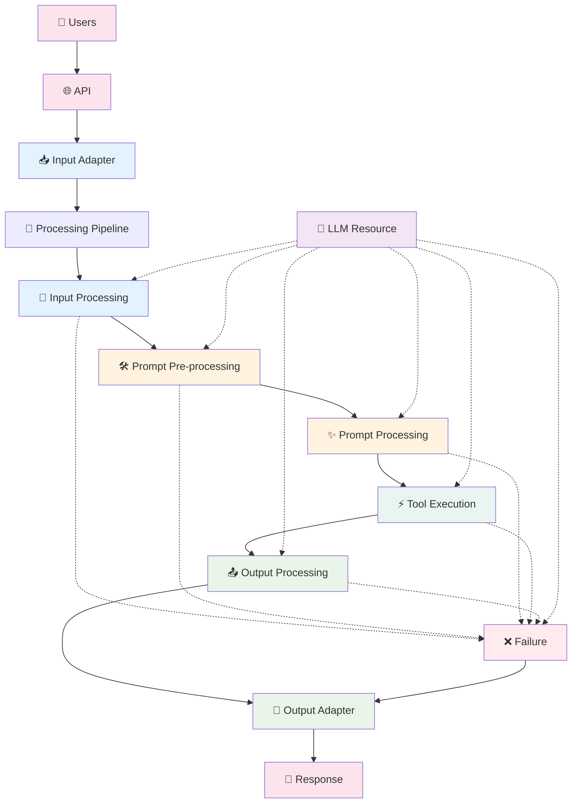
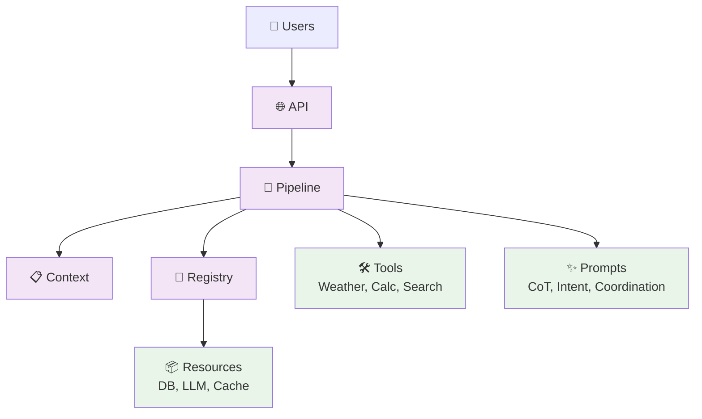
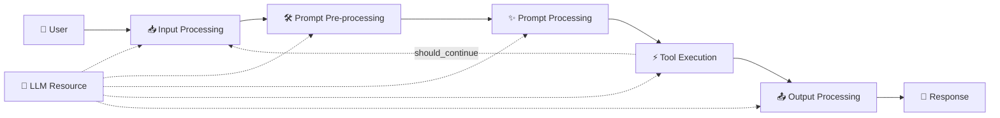
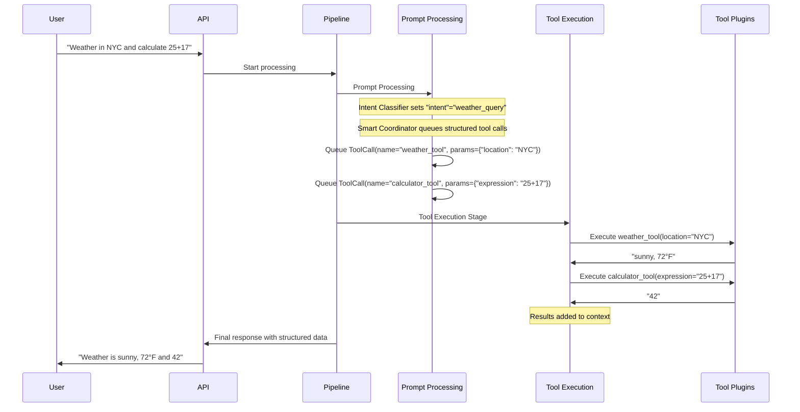

# Entity Pipeline Framework Architecture Summary

## 🎯 Vision
A **pipeline-based plugin framework** for AI agents that processes requests through configurable stages, inspired by Bevy's plugin architecture. Composable, extensible, and configuration-driven.

## 🏗️ Core Architecture

### Stage-Based Processing Pipeline with LLM as Shared Resource

```mermaid
flowchart TD
    Users[👤 Users] --> API[🌐 API]
    API --> IA[📥 Input Adapter]
    IA --> Pipeline[🔄 Processing Pipeline]
    
    Pipeline --> Stage1[🔄 Input Processing]
    Stage1 --> Stage2[🛠️ Prompt Pre-processing] 
    Stage2 --> Stage3[✨ Prompt Processing]
    Stage3 --> Stage4[⚡ Tool Execution]
    Stage4 --> Stage5[📤 Output Processing]
    
    Stage5 --> OA[📮 Output Adapter]
    OA --> Response[📱 Response]
    
    %% Error handling flow
    Stage1 -.-> FailureStage[❌ Failure]
    Stage2 -.-> FailureStage
    Stage3 -.-> FailureStage
    Stage4 -.-> FailureStage
    Stage5 -.-> FailureStage
    FailureStage --> OA
    
    %% LLM Resource Available Throughout Pipeline
    LLM[🧠 LLM Resource] -.-> Stage1
    LLM -.-> Stage2
    LLM -.-> Stage3
    LLM -.-> Stage4
    LLM -.-> Stage5
    LLM -.-> FailureStage
    
    %% Styling
    classDef input fill:#e3f2fd
    classDef processing fill:#fff3e0
    classDef llm fill:#f3e5f5
    classDef output fill:#e8f5e8
    classDef endpoints fill:#fce4ec
    classDef tools fill:#e8f5f0
    classDef error fill:#ffebee
    
    class Users,API,Response endpoints
    class IA,Stage1 input
    class Stage2,Stage3 processing
    class LLM llm
    class Stage4 tools
    class Stage5,OA output
    class FailureStage error
```

### Pipeline Execution Model

The pipeline follows a **centralized tool execution pattern** with structured tool calls, standardized results, and comprehensive error handling:

1. **Linear Pipeline Execution**: All stages run once in order
2. **LLM Resource Access**: Any stage can call the LLM when needed
3. **Structured Tool System**: Stages can queue structured tool calls, executed in tool_execution stage
4. **Standardized Results**: Explicit result keys with no fallback chains
5. **Input Reprocessing**: Plugins can signal `reprocess_input` to restart the pipeline with updated context
6. **Fail-Fast Error Handling**: Plugin failures route to dedicated failure stage for user communication
7. **Iteration Limit**: `max_iterations` prevents infinite loops (for complex patterns like ReAct)

```python
async def execute_pipeline(request):
    context = PipelineContext(
        conversation=[ConversationEntry(content=str(request), role="user", timestamp=datetime.now())],
        _stage_results={},
        pending_tool_calls=[],
        executed_tool_results={},
        resources=resource_registry,
        metadata={},
        should_continue=False,
        pipeline_id=generate_pipeline_id(),
        max_iterations=config.max_iterations
    )
    
    for iteration in range(context.max_iterations):
        # Execute each pipeline stage in sequence
        await execute_stage("input_processing", context)
        await execute_stage("prompt_preprocessing", context) 
        await execute_stage("prompt_processing", context)
        await execute_stage("tool_execution", context)      # ONLY stage that executes tools
        await execute_stage("output_processing", context)
        
        if context.should_continue and context.response is None:
            continue  # Run another pipeline iteration
        else:
            break
    
    return context.response

async def execute_stage(stage_name: str, context: PipelineContext):
    # 1. Execute all plugins registered for this stage
    stage_plugins = plugin_registry.get_plugins_for_stage(stage_name)
    
    for plugin in stage_plugins:
        await plugin.execute(context)
    
    # 2. Execute tools ONLY in the tool_execution stage
    if stage_name == "tool_execution" and context.pending_tool_calls:
        tool_results = await execute_stage_tools(context.pending_tool_calls)
        context.executed_tool_results.update(tool_results)
        
        # Add tool results to conversation for subsequent stages
        for tool_call, result in tool_results.items():
            context.add_conversation_entry(
                content=f"Tool result: {result}",
                role="system",
                metadata={"tool_name": tool_call.name}
            )
        
        context.pending_tool_calls.clear()
```

### Three-Layer Plugin System

#### **Resource Plugins** (Infrastructure - Enables System Function)
- **Database**: PostgreSQL, SQLite connections
- **LLM**: Ollama, OpenAI, Claude servers  
- **Memory**: Vector databases, Redis cache
- **Storage**: File systems, cloud storage
- **Logging**: Structured logging, metrics, tracing
- **Monitoring**: Health checks, performance metrics

**Default Stages**: `["*"]` (can run in any stage when needed)

#### **Tool Plugins** (Functionality - Performs Tasks for Users)
- **Weather**: Get current conditions, forecasts
- **Calculator**: Mathematical computations
- **Search**: Web search, document search
- **File Operations**: Read, write, process files
- **API Integrations**: Slack, email, custom APIs

**Tool Execution Model**: Tools are registered during system initialization as static capabilities. During any stage, plugins can queue structured tool calls to the context. Only the tool_execution stage actually executes tools, with results available to subsequent stages.

**Default Stages**: `["tool_execution"]` (tools only execute in dedicated stage)

#### **Prompt Plugins** (Processing - Controls Request Flow)
- **Strategies**: ReAct, Chain-of-Thought, Direct Response
- **Personality**: Sarcasm, loyalty, wit injection
- **Memory**: Context retrieval and storage
- **Output**: Formatting, validation, filtering
- **Tool Coordination**: Queue structured tool calls during processing

**Default Stages**: `["prompt_processing"]` (main processing stage)

#### **Adapter Plugins** (Input/Output - Interface Handling)
- **Input Adapters**: HTTP, WebSocket, CLI interfaces
- **Output Adapters**: HTTP responses, TTS, formatted output
  - **TTS**: Text-to-speech services

**Default Stages**: `["input_processing", "output_processing"]` (interface boundary stages)

#### **Failure Plugins** (Error Communication - User-Facing Error Handling)
- **Error Formatters**: Convert technical errors to user-friendly messages
- **Error Loggers**: Record failures for debugging and monitoring
- **Notification Systems**: Alert administrators of critical failures

**Default Stages**: `["failure"]` (dedicated error handling stage)

**Note**: Plugin use is discouraged in the failure stage to maintain reliability. Keep failure stage plugins minimal and ensure static fallback responses are available.

### Plugin Stage Assignment System

The framework uses a **hybrid approach** for assigning plugins to pipeline stages, balancing ease of evolution with flexibility:

#### **Default Stage Assignment via Base Classes**
```python
class ResourcePlugin(BasePlugin):
    default_stages = ["*"]  # Can run in any stage when needed

class ToolPlugin(BasePlugin):
    default_stages = ["tool_execution"]  # Tools only execute in dedicated stage

class PromptPlugin(BasePlugin):
    default_stages = ["prompt_processing"]  # Main processing stage

class AdapterPlugin(BasePlugin):
    default_stages = ["input_processing", "output_processing"]  # Interface boundaries

class FailurePlugin(BasePlugin):
    default_stages = ["failure"]  # Dedicated error handling stage
```

#### **Explicit Stage Override for Multi-Stage Plugins**
```python
class MemoryRetrievalPlugin(PromptPlugin):
    # Override default - runs in multiple stages
    stages = ["input_processing", "prompt_processing"]

class DebugLoggingPlugin(ResourcePlugin):
    # Explicit override - runs in all stages for debugging
    stages = ["*"]

class ContextEnhancerPlugin(PromptPlugin):
    # Override - only runs early in pipeline
    stages = ["input_processing"]
```

#### **YAML Configuration Order = Execution Order**
Plugins execute within each stage in the **exact order** they appear in the YAML configuration:

```yaml
prompts:
  # Execution order within prompt_processing stage:
  # 1. intent_classifier → 2. memory_retrieval → 3. chain_of_thought → 4. smart_coordinator
  intent_classifier:
    type: intent_classifier
    confidence_threshold: 0.8
  
  memory_retrieval:
    type: memory_retrieval
    max_context_length: 4000
    # This plugin runs in input_processing AND prompt_processing stages
  
  chain_of_thought:
    type: chain_of_thought
    enable_reasoning: true
  
  smart_tool_coordinator:
    type: smart_tool_coordinator
```

#### **Stage Registration Process**
```python
def register_plugin_for_stages(plugin_instance, plugin_name):
    """Register plugin for appropriate stages based on class definition"""
    # Use explicit stages if defined, otherwise use class default
    stages = getattr(plugin_instance.__class__, 'stages', plugin_instance.__class__.default_stages)
    
    for stage in stages:
        if stage == "*":
            # Register for all pipeline stages
            for pipeline_stage in ["input_processing", "prompt_preprocessing", "prompt_processing", "tool_execution", "output_processing", "failure"]:
                plugin_registry.register_plugin_for_stage(plugin_instance, pipeline_stage, plugin_name)
        else:
            plugin_registry.register_plugin_for_stage(plugin_instance, stage, plugin_name)
```

## 🔧 Key Components

### Error Handling and Failure Recovery

The framework implements a **fail-fast error handling strategy** with dedicated failure communication:

#### **Failure Information Structure**
```python
@dataclass
class FailureInfo:
    stage: str                    # Stage where failure occurred
    plugin_name: str              # Plugin that caused the failure
    error_type: str               # "plugin_error", "tool_error", "system_error"
    error_message: str            # Human-readable error description
    original_exception: Exception # Original exception for debugging
    context_snapshot: Dict[str, Any] = None  # Context state when failure occurred
    timestamp: datetime = field(default_factory=datetime.now)

class PipelineContext:
    # ... existing fields ...
    failure_info: Optional[FailureInfo] = None
    
    def add_failure(self, failure: FailureInfo):
        """Add failure information and prepare for failure stage routing"""
        self.failure_info = failure
        self.logger.error(
            "Pipeline failure detected",
            stage=failure.stage,
            plugin=failure.plugin_name,
            error_type=failure.error_type,
            error_message=failure.error_message,
            pipeline_id=self.pipeline_id
        )
```

#### **Error Handling Flow**
1. **Plugin Failures**: Caught during stage execution, added to context, routed to failure stage
2. **Tool Failures**: Captured in tool results, detected after tool execution, routed to failure stage  
3. **System Failures**: Unexpected exceptions caught at pipeline level, routed to failure stage
4. **Failure Stage**: Processes all failures through dedicated plugins for user communication
5. **Static Fallback**: If failure stage plugins fail, return static error response

#### **Tool Retry Configuration**
```python
class ToolPlugin(BasePlugin):
    default_stages = ["tool_execution"]
    
    def __init__(self, config: Dict):
        self.max_retries = config.get("max_retries", 1)  # Default sensible retry count
        self.retry_delay = config.get("retry_delay", 1.0)  # Seconds between retries
    
    async def execute_function_with_retry(self, params: Dict) -> str:
        """Execute tool function with configured retry logic"""
        for attempt in range(self.max_retries + 1):
            try:
                return await self.execute_function(params)
            except Exception as e:
                if attempt == self.max_retries:
                    raise e  # Final attempt failed
                await asyncio.sleep(self.retry_delay)
        
    async def execute_function(self, params: Dict) -> str:
        """Override this method in tool implementations"""
        raise NotImplementedError("Tool plugins must implement execute_function")
```

#### **Static Error Fallback**
```python
# Used when failure stage plugins themselves fail
STATIC_ERROR_RESPONSE = {
    "error": "System error occurred",
    "message": "An unexpected error prevented processing your request. Please try again or contact support.",
    "error_id": None,  # Will be populated with pipeline_id
    "timestamp": None,  # Will be populated with current time
    "type": "static_fallback"
}

def create_static_error_response(pipeline_id: str) -> Dict[str, Any]:
    """Create fallback error response when failure stage fails"""
    response = STATIC_ERROR_RESPONSE.copy()
    response["error_id"] = pipeline_id
    response["timestamp"] = datetime.now().isoformat()
    return response
```
```python
@dataclass
class ConversationEntry:
    content: str
    role: str  # "user", "assistant", "system"
    timestamp: datetime
    metadata: Dict[str, Any] = field(default_factory=dict)

@dataclass
class ToolCall:
    name: str
    params: Dict[str, Any]
    result_key: str
    source: str  # "static" | "dynamic" | "llm_generated"

class PipelineContext:
    # Structured conversation history
    conversation: List[ConversationEntry]
    
    # Final response
    response: Any
    
    # Current prompt being built
    prompt: str
    
    # Results from pipeline stages (no fallbacks)
    _stage_results: Dict[str, Any]
    
    # Tool call management
    pending_tool_calls: List[ToolCall]
    executed_tool_results: Dict[str, Any]
    
    # System resources and metadata
    resources: ResourceRegistry
    metadata: Dict[str, Any]
    should_continue: bool
    pipeline_id: str
    metrics: MetricsCollector
    max_iterations: int
    
    # Stage result methods (no fallbacks)
    def set_stage_result(self, key: str, value: Any):
        if key in self._stage_results:
            raise ValueError(f"Stage result '{key}' already set by another plugin")
        self._stage_results[key] = value
    
    def get_stage_result(self, key: str) -> Any:
        if key not in self._stage_results:
            raise KeyError(f"Required result '{key}' not available")
        return self._stage_results[key]
    
    def has_stage_result(self, key: str) -> bool:
        return key in self._stage_results
    
    # Tool call management
    def add_tool_call(self, tool_call: ToolCall):
        self.pending_tool_calls.append(tool_call)
    
    def add_conversation_entry(self, content: str, role: str, metadata: Dict = None):
        entry = ConversationEntry(
            content=content,
            role=role,
            timestamp=datetime.now(),
            metadata=metadata or {}
        )
        self.conversation.append(entry)
    
    def add_failure(self, failure: FailureInfo):
        """Add failure information and prepare for failure stage routing"""
        self.failure_info = failure
```

### Tool Execution (No Templates)
```python
async def execute_stage_tools(tool_calls: List[ToolCall]) -> Dict[str, Any]:
    """Execute tools and return results mapped by result_key"""
    results = {}
    
    # Execute tools (can be parallel or sequential based on config)
    for tool_call in tool_calls:
        try:
            tool_plugin = tool_registry.get_tool(tool_call.name)
            # Use retry logic if configured
            if hasattr(tool_plugin, 'execute_function_with_retry'):
                result = await tool_plugin.execute_function_with_retry(tool_call.params)
            else:
                result = await tool_plugin.execute_function(tool_call.params)
            results[tool_call.result_key] = result
        except Exception as e:
            results[tool_call.result_key] = f"Error: {e}"
    
    return results
```

### Error Communication Plugin Example
```python
class ErrorFormatterPlugin(FailurePlugin):
    """Formats technical errors into user-friendly messages"""
    dependencies = ["logging"]
    # Uses default_stages = ["failure"] from base class
    
    @classmethod
    def validate_config(cls, config: Dict) -> ValidationResult:
        return ValidationResult.success()  # Minimal config validation
    
    async def _execute_impl(self, context: PipelineContext):
        if not context.failure_info:
            return  # No failure to process
            
        failure = context.failure_info
        
        # Format error based on type
        if failure.error_type == "tool_error":
            user_message = f"I encountered an issue while trying to help you. The {failure.plugin_name} service is currently unavailable. Please try again in a moment."
        elif failure.error_type == "plugin_error":
            user_message = f"I'm having trouble processing your request right now. Please try rephrasing your question or try again later."
        else:  # system_error
            user_message = "I'm experiencing technical difficulties. Please try again or contact support if the problem persists."
        
        # Set formatted response
        context.response = {
            "error": True,
            "message": user_message,
            "error_id": context.pipeline_id,
            "timestamp": datetime.now().isoformat()
        }
        
        # Log detailed error for debugging
        logger = context.resources.get("logging")
        if logger:
            logger.error(
                "Formatted error response",
                pipeline_id=context.pipeline_id,
                original_error=failure.error_message,
                formatted_message=user_message,
                error_type=failure.error_type
            )
```

### Plugin Observability & Logging
```python
class BasePlugin:
    def __init__(self):
        self.logger = None  # Injected during initialization
        
    async def execute(self, context: PipelineContext):
        # Automatic logging with pipeline ID
        self.logger.info(
            "Plugin execution started",
            plugin=self.__class__.__name__,
            pipeline_id=context.pipeline_id,
            stage=self.get_stage()
        )
        
        start_time = time.time()
        try:
            result = await self._execute_impl(context)
            
            # Automatic metrics collection
            context.metrics.record_plugin_duration(
                plugin=self.__class__.__name__,
                duration=time.time() - start_time
            )
            
            return result
        except Exception as e:
            self.logger.error(
                "Plugin execution failed",
                plugin=self.__class__.__name__,
                pipeline_id=context.pipeline_id,
                error=str(e),
                exc_info=True
            )
            raise
```

### Plugin Validation System
```python
class ValidationResult:
    success: bool
    error_message: str = None
    warnings: List[str] = []

class BasePlugin:
    dependencies = []  # List of registry keys that this plugin depends on
    
    @classmethod
    def validate_config(cls, config: Dict) -> ValidationResult:
        """
        Pure configuration validation - no external dependencies.
        Validates:
        - Required config keys exist
        - Values are correct types/formats
        - URLs are well-formed
        - Numeric ranges are valid
        - No registry or cross-plugin concerns
        """
        return ValidationResult(success=True)
    
    @classmethod
    def validate_dependencies(cls, registry: ClassRegistry) -> ValidationResult:
        """
        Dependency validation - checks that declared dependencies exist in registry.
        Validates:
        - All items in cls.dependencies exist in registry
        - No circular dependency chains (using topological sort)
        - Plugin execution order can be determined
        
        Uses registry keys (YAML config names) for dependencies.
        """
        # Check all dependencies exist
        for dep in cls.dependencies:
            if not registry.has_plugin(dep):
                available = registry.list_plugins()
                return ValidationResult.error(f"{cls.__name__} requires '{dep}' but it's not registered. Available: {available}")
        
        return ValidationResult.success()
    
    @classmethod
    def validate_all(cls, config: Dict, registry: ClassRegistry) -> ValidationResult:
        """Convenience method for complete validation (config + dependencies)"""
        config_result = cls.validate_config(config)
        if not config_result.success:
            return config_result
        return cls.validate_dependencies(registry)
    
    @classmethod
    def from_dict(cls, config: Dict) -> 'Self':
        """
        Create plugin from config with CONFIG VALIDATION ONLY.
        
        WARNING: This does NOT validate dependencies. Use only for:
        - Testing with mocked dependencies
        - Development/prototyping
        - When dependencies are guaranteed to exist
        
        For production systems, use four-phase initialization.
        """
        result = cls.validate_config(config)
        if not result.success:
            raise ConfigurationError(f"{cls.__name__} config validation failed: {result.error_message}")
        return cls(config)
    
    @classmethod
    def from_yaml(cls, yaml_content: str) -> 'Self':
        """Parse YAML then delegate to from_dict (config validation only)"""
        config = yaml.safe_load(yaml_content)
        return cls.from_dict(config)
    
    @classmethod
    def from_json(cls, json_content: str) -> 'Self':
        """Parse JSON then delegate to from_dict (config validation only)"""
        config = json.loads(json_content)
        return cls.from_dict(config)
```

### Plugin Capabilities
- **Read/Write Context**: Plugins can modify any part of the request/response
- **Resource Access**: `context.resources.get("llm")` - request what you need
- **Short Circuit**: Skip remaining pipeline stages by setting `context.response`
- **Input Reprocessing**: Signal `context.reprocess_input = True` to restart pipeline with updated context
- **Structured Tools**: Queue structured tool calls during any stage
- **LLM Access**: Any plugin can call the LLM resource when needed
- **Standardized Results**: Set and get standardized results with explicit dependencies
- **Error Signaling**: Add failure information with `context.add_failure()` to route to failure stage
- **Tool Retry Logic**: Configure retry behavior for individual tools with `max_retries` and `retry_delay`

## ⚙️ Configuration

### Four-Phase System Initialization
```python
# Phase 1: Class Registration (Metadata Only - Order Independent)
# Phase 2: Static Validation (All Classes Available - Fail Fast)
# Phase 3: Resource Initialization (Dependency Order with Cleanup)
# Phase 4: Plugin Instantiation (Everything Ready)

class SystemInitializer:
    @classmethod
    def from_yaml(cls, yaml_path: str) -> 'SystemInitializer':
        """
        Load entire system configuration from single YAML file.
        Handles environment variable interpolation at system level for security.
        """
        # 1. Load YAML content
        with open(yaml_path, 'r') as file:
            yaml_content = file.read()
        
        # 2. Interpolate ALL environment variables at system level (security)
        config = cls._interpolate_env_vars(yaml.safe_load(yaml_content))
        
        # 3. Return SystemInitializer with fully resolved config
        return cls(config)
    
    def get_resource_config(self, name: str) -> Dict:
        """Explicitly extract resource configuration"""
        return self.config["plugins"]["resources"][name]
    
    def get_tool_config(self, name: str) -> Dict:
        """Explicitly extract tool configuration"""
        return self.config["plugins"]["tools"][name]
    
    def get_adapter_config(self, name: str) -> Dict:
        """Explicitly extract adapter configuration"""
        return self.config["plugins"]["adapters"][name]
    
    def get_prompt_config(self, name: str) -> Dict:
        """Explicitly extract prompt configuration"""
        return self.config["plugins"]["prompts"][name]

    def initialize(self):
        with initialization_cleanup_context():
            # Phase 1: Register all plugin classes and extract dependency graph
            registry = ClassRegistry()
            dependency_graph = {}
            
            # Register resources
            for resource_name, resource_config in self.config["plugins"]["resources"].items():
                resource_class = import_plugin_class(resource_config.get("type", resource_name))
                registry.register_class(resource_class, resource_config, resource_name)
                dependency_graph[resource_name] = resource_class.dependencies
            
            # Register tools, adapters, prompts...
            for plugin_type in ["tools", "adapters", "prompts"]:
                for plugin_name, plugin_config in self.config["plugins"].get(plugin_type, {}).items():
                    plugin_class = import_plugin_class(plugin_config.get("type", plugin_name))
                    registry.register_class(plugin_class, plugin_config, plugin_name)
                    dependency_graph[plugin_name] = plugin_class.dependencies
            
            # Phase 2: Validate dependencies exist and detect circular dependencies
            self._validate_dependency_graph(registry, dependency_graph)
            
            # Phase 2 continued: Config validation for all plugins
            for plugin_class, config in registry.all_plugin_classes():
                config_result = plugin_class.validate_config(config)
                if not config_result.success:
                    raise SystemError(f"Config validation failed for {plugin_class.__name__}: {config_result.error_message}")
            
            # Phase 3: Initialize resources in dependency order (no validation needed - already done!)
            resource_registry = ResourceRegistry()
            for resource_class, config in registry.resource_classes():
                instance = resource_class(config)  # Direct instantiation
                await instance.initialize()
                resource_registry.add_resource(instance)
            
            # Phase 3.5: Register tools as static system capabilities
            tool_registry = ToolRegistry()
            for tool_class, config in registry.tool_classes():
                instance = tool_class(config)  # Direct instantiation
                tool_registry.add_tool(instance)
            
            # Phase 4: Instantiate prompt and adapter plugins (no validation needed - already done!)
            plugin_registry = PluginRegistry()
            for plugin_class, config in registry.non_resource_non_tool_classes():
                instance = plugin_class(config)  # Direct instantiation
                plugin_registry.add_plugin(instance)
            
            return plugin_registry, resource_registry, tool_registry
    
    def _validate_dependency_graph(self, registry: ClassRegistry, dep_graph: Dict[str, List[str]]):
        """
        Validate dependency graph: check existence and detect circular dependencies.
        Uses registry keys (YAML config names) for dependency resolution.
        """
        # 1. Check all dependencies exist
        for plugin_name, deps in dep_graph.items():
            for dep in deps:
                if not registry.has_plugin(dep):
                    available = registry.list_plugins()
                    raise SystemError(f"Plugin '{plugin_name}' requires '{dep}' but it's not registered. Available: {available}")
        
        # 2. Detect circular dependencies using topological sort (Kahn's algorithm)
        in_degree = {node: 0 for node in dep_graph}
        for node in dep_graph:
            for neighbor in dep_graph[node]:
                if neighbor in in_degree:  # Only count registered plugins
                    in_degree[neighbor] += 1
        
        queue = [node for node, degree in in_degree.items() if degree == 0]
        processed = []
        
        while queue:
            current = queue.pop(0)
            processed.append(current)
            
            for neighbor in dep_graph[current]:
                if neighbor in in_degree:
                    in_degree[neighbor] -= 1
                    if in_degree[neighbor] == 0:
                        queue.append(neighbor)
        
        # If we didn't process all nodes, there's a cycle
        if len(processed) != len(in_degree):
            cycle_nodes = [node for node in in_degree if node not in processed]
            raise SystemError(f"Circular dependency detected involving: {cycle_nodes}")
        
    @staticmethod
    def _interpolate_env_vars(config: Any) -> Any:
        """Recursively interpolate environment variables in configuration"""
        if isinstance(config, dict):
            return {k: SystemInitializer._interpolate_env_vars(v) for k, v in config.items()}
        elif isinstance(config, list):
            return [SystemInitializer._interpolate_env_vars(item) for item in config]
        elif isinstance(config, str) and config.startswith("${") and config.endswith("}"):
            env_var = config[2:-1]
            value = os.environ.get(env_var)
            if value is None:
                raise EnvironmentError(f"Required environment variable {env_var} not found")
            return value
        else:
            return config
```

### Hierarchical YAML Configuration
```yaml
entity:
  entity_id: "jade"
  max_iterations: 500  # Prevent infinite pipeline loops
  name: "Jade"
  server:
    host: "0.0.0.0"
    port: 8000
    reload: false
    log_level: "info"

plugins:
  resources:
    database:
      type: postgres
      host: "192.168.1.104"
      port: 5432
      name: "memory"
      username: "${DB_USERNAME}"      # Environment variable interpolation
      password: "${DB_PASSWORD}"      # Resolved at system level for security
      db_schema: "entity"
      history_table: "chat_history"
      min_pool_size: 2
      max_pool_size: 10
      init_on_startup: true
    
    ollama:
      type: ollama_llm
      base_url: "http://192.168.1.110:11434"
      model: "llama3:8b-instruct-q6_K"
      temperature: 0.7
      top_p: 0.9
      top_k: 40
      repeat_penalty: 1.1
    
    logging:
      type: structured_logging
      level: "DEBUG"
      format: "%(asctime)s - %(name)s - %(levelname)s - %(message)s"
      file_enabled: true
      file_path: "logs/entity.log"
      max_file_size: 10485760
      backup_count: 5
  
  tools:
    weather:
      type: weather_api
      api_key: "${WEATHER_API_KEY}"
      base_url: "https://api.weather.com"
      timeout: 30
      max_retries: 3          # Tool-specific retry configuration
      retry_delay: 2.0        # Seconds between retries
    
    calculator:
      type: calculator
      precision: 10
      max_retries: 1          # Simple tools may need fewer retries
  
  adapters:
    tts:
      type: speech_synthesis
      base_url: "http://192.168.1.110:8888"
      voice_name: "bf_emma"
      voice_sample_path: "voice_samples/ai_mee.wav"
      output_format: "wav"
      speed: 0.3
      cfg_weight: 0.9
      exaggeration: 0.5
      sample_rates: [44100, 48000, 22050, 16000, 8000]
      fade_out_samples: 2000
  
  prompts:
    chain_of_thought:
      type: chain_of_thought
      enable_reasoning: true
      max_steps: 5
    
    memory_retrieval:
      type: memory_retrieval
      max_context_length: 4000
      similarity_threshold: 0.7
    
    intent_classifier:
      type: intent_classifier
      confidence_threshold: 0.8
```

## 🚀 Key Benefits

### For Users
- **No Code Changes**: New strategies via config only
- **Mix and Match**: Combine multiple prompt strategies
- **Resource Flexibility**: Works with/without optional resources
- **Easy Experimentation**: Swap plugins to test approaches
- **Order Independent**: Plugin configuration order doesn't matter

### For Developers  
- **Plugin Ecosystem**: Share and discover community plugins
- **Clean Testing**: Mock resources, test plugins in isolation
- **Extensible**: Add new resources and strategies without core changes
- **Composable**: Plugins build on each other's work
- **Separated Validation**: Test config parsing independently from dependency resolution
- **Performance-Optimized**: Structured execution and parallel tool execution for better performance
- **Structured Tools**: Clean separation between intent and execution
- **Simple Mental Model**: "Linear pipeline with structured data flow"
- **Flexible LLM Usage**: Any plugin can call LLM when needed
- **Predictable Tool Execution**: All tools execute at a single, well-defined stage
- **Easier Debugging**: Tool failures have clear location and context
- **Simpler Testing**: Tool execution can be tested in isolation
- **Fail-Fast Development**: Plugin failures caught early in development cycle
- **Graceful Error Communication**: Dedicated failure stage for user-friendly error messages
- **Reliable Fallback**: Static error responses ensure users always receive feedback

### For Operations
- **Configuration-Driven**: Different setups for dev/staging/prod
- **Fail Fast**: Static validation catches issues early
- **Observable**: Rich metadata from each plugin
- **Scalable**: Resources shared across all plugins
- **Environment Security**: Centralized environment variable interpolation
- **Explicit Configuration**: Clear, transparent config extraction

## 🔌 Plugin Examples

### Chain of Thought with Structured Results
```python
class ChainOfThoughtPlugin(PromptPlugin):
    dependencies = ["database", "logging", "ollama"]
    
    @classmethod
    def validate_config(cls, config: Dict) -> ValidationResult:
        max_steps = config.get("max_steps", 5)
        if not isinstance(max_steps, int) or max_steps <= 0:
            return ValidationResult.error("max_steps must be a positive integer")
        
        return ValidationResult.success()
    
    async def _execute_impl(self, context: PipelineContext):
        if not self.config.get("enable_reasoning", True):
            return
            
        llm = context.resources.get("ollama")
        
        # Get clean conversation history for LLM
        conversation_text = self._get_conversation_text(context.conversation)
        
        # Step 1: Break down the problem
        breakdown_prompt = f"Break this problem into logical steps: {conversation_text}"
        breakdown = await llm.generate(breakdown_prompt)
        
        # Add reasoning to conversation
        context.add_conversation_entry(
            content=f"Problem breakdown: {breakdown.content}",
            role="assistant",
            metadata={"reasoning_step": "breakdown"}
        )
        
        # Step 2: Reason through each step
        reasoning_steps = []
        for step_num in range(self.config.get("max_steps", 5)):
            reasoning_prompt = f"Reason through step {step_num + 1} of solving: {conversation_text}"
            reasoning = await llm.generate(reasoning_prompt, conversation_history=self._get_conversation_text(context.conversation))
            reasoning_steps.append(reasoning.content)
            
            context.add_conversation_entry(
                content=f"Reasoning step {step_num + 1}: {reasoning.content}",
                role="assistant",
                metadata={"reasoning_step": step_num + 1}
            )
            
            # Check if we have enough reasoning
            if "final answer" in reasoning.content.lower() or "conclusion" in reasoning.content.lower():
                break
        
        # Step 3: Set standardized results for other plugins
        context.set_stage_result("reasoning_complete", True)
        context.set_stage_result("reasoning_steps", reasoning_steps)
        context.set_stage_result("needs_tools", self._needs_tools(reasoning_steps))
        
        # Step 4: Queue tool calls if needed (executed later in tool_execution stage)
        if context.get_stage_result("needs_tools"):
            context.add_tool_call(ToolCall(
                name="analysis_tool",
                params={"data": conversation_text, "reasoning": reasoning_steps},
                result_key="analysis_result",
                source="dynamic"
            ))
            # Signal that we need to reprocess after tools execute
            context.reprocess_input = True
    
    def _needs_tools(self, reasoning_steps: List[str]) -> bool:
        """Determine if reasoning indicates need for tools"""
        tool_indicators = ["need to calculate", "should look up", "requires analysis", "need data"]
        reasoning_text = " ".join(reasoning_steps).lower()
        return any(indicator in reasoning_text for indicator in tool_indicators)
    
    def _get_conversation_text(self, conversation: List[ConversationEntry]) -> str:
        """Extract clean conversation text for LLM processing"""
        user_entries = [entry.content for entry in conversation if entry.role == "user"]
        return user_entries[-1] if user_entries else ""
```

### Intent Classification with Standardized Results
```python
class IntentClassifierPlugin(PromptPlugin):
    dependencies = ["ollama"]
    
    @classmethod
    def validate_config(cls, config: Dict) -> ValidationResult:
        confidence_threshold = config.get("confidence_threshold", 0.8)
        if not isinstance(confidence_threshold, (int, float)) or confidence_threshold < 0 or confidence_threshold > 1:
            return ValidationResult.error("confidence_threshold must be between 0 and 1")
        
        return ValidationResult.success()
    
    async def _execute_impl(self, context: PipelineContext):
        llm = context.resources.get("ollama")
        
        # Get latest user message
        user_messages = [entry.content for entry in context.conversation if entry.role == "user"]
        if not user_messages:
            return
        
        latest_message = user_messages[-1]
        
        # Classify intent
        classification_prompt = f"""
        Classify the intent of this message: "{latest_message}"
        
        Possible intents: weather_query, calculation, general_chat, task_planning, information_lookup
        
        Respond with just the intent name and confidence (0-1):
        Intent: <intent>
        Confidence: <confidence>
        """
        
        response = await llm.generate(classification_prompt)
        intent, confidence = self._parse_classification(response.content)
        
        # Set standardized results if confidence is high enough
        threshold = self.config.get("confidence_threshold", 0.8)
        if confidence >= threshold:
            context.set_stage_result("intent", intent)
            context.set_stage_result("intent_confidence", confidence)
            
            # Add to conversation for debugging
            context.add_conversation_entry(
                content=f"Intent classified as: {intent} (confidence: {confidence:.2f})",
                role="system",
                metadata={"intent": intent, "confidence": confidence}
            )
    
    def _parse_classification(self, response_text: str) -> Tuple[str, float]:
        """Parse LLM response to extract intent and confidence"""
        intent = "general_chat"  # default
        confidence = 0.0
        
        for line in response_text.split('\n'):
            if line.startswith("Intent:"):
                intent = line.split(":", 1)[1].strip()
            elif line.startswith("Confidence:"):
                try:
                    confidence = float(line.split(":", 1)[1].strip())
                except ValueError:
                    confidence = 0.0
        
        return intent, confidence
```

### Memory Retrieval Plugin (Multi-Stage Example)
```python
class MemoryRetrievalPlugin(PromptPlugin):
    """Retrieves relevant context in multiple stages"""
    dependencies = ["database", "ollama"]
    
    # Override default - runs in multiple stages
    stages = ["input_processing", "prompt_processing"]
    
    @classmethod
    def validate_config(cls, config: Dict) -> ValidationResult:
        max_context_length = config.get("max_context_length", 4000)
        if not isinstance(max_context_length, int) or max_context_length <= 0:
            return ValidationResult.error("max_context_length must be a positive integer")
        
        similarity_threshold = config.get("similarity_threshold", 0.7)
        if not isinstance(similarity_threshold, (int, float)) or similarity_threshold < 0 or similarity_threshold > 1:
            return ValidationResult.error("similarity_threshold must be between 0 and 1")
        
        return ValidationResult.success()
    
    async def _execute_impl(self, context: PipelineContext):
        # Determine current stage and behave accordingly
        current_stage = self._get_current_stage(context)
        
        if current_stage == "input_processing":
            # Early stage: Retrieve user profile and preferences
            await self._retrieve_user_context(context)
            
        elif current_stage == "prompt_processing":
            # Later stage: Retrieve conversation history and relevant memories
            await self._retrieve_conversation_memory(context)
    
    async def _retrieve_user_context(self, context: PipelineContext):
        """Retrieve user profile and preferences early in pipeline"""
        db = context.resources.get("database")
        
        # Add user context to conversation for LLM
        user_profile = await db.get_user_profile()
        if user_profile:
            context.add_conversation_entry(
                content=f"User preferences: {user_profile}",
                role="system",
                metadata={"memory_type": "user_profile", "stage": "input_processing"}
            )
    
    async def _retrieve_conversation_memory(self, context: PipelineContext):
        """Retrieve relevant conversation history during processing"""
        db = context.resources.get("database")
        llm = context.resources.get("ollama")
        
        # Get current conversation context
        user_messages = [entry.content for entry in context.conversation if entry.role == "user"]
        if not user_messages:
            return
            
        latest_message = user_messages[-1]
        
        # Retrieve similar conversations
        similar_conversations = await db.search_similar_conversations(
            latest_message, 
            limit=3,
            threshold=self.config.get("similarity_threshold", 0.7)
        )
        
        if similar_conversations:
            context.add_conversation_entry(
                content=f"Relevant past conversations: {similar_conversations}",
                role="system",
                metadata={"memory_type": "conversation_history", "stage": "prompt_processing"}
            )
            
            # Set result for other plugins
            context.set_stage_result("memory_retrieved", True)
            context.set_stage_result("memory_count", len(similar_conversations))
    
    def _get_current_stage(self, context: PipelineContext) -> str:
        """Determine which stage is currently executing (implementation detail)"""
        # This would be provided by the framework
        return getattr(context, '_current_stage', 'unknown')
```
```python
class WeatherToolPlugin(ToolPlugin):
    dependencies = ["weather_api"]
    
    @classmethod
    def validate_config(cls, config: Dict) -> ValidationResult:
        if not config.get("api_key"):
            return ValidationResult.error("Missing required config: api_key")
        
        base_url = config.get("base_url", "https://api.weather.com")
        if not cls._is_valid_url(base_url):
            return ValidationResult.error(f"Invalid base_url: {base_url}")
        
        timeout = config.get("timeout", 30)
        if not isinstance(timeout, int) or timeout <= 0:
            return ValidationResult.error("timeout must be a positive integer")
        
        return ValidationResult.success()
    
    @staticmethod
    def _is_valid_url(url: str) -> bool:
        return url.startswith(("http://", "https://"))
    
    def get_tool_name(self) -> str:
        return "weather_tool"
    
    async def execute_function(self, params: Dict) -> str:
        """Execute weather lookup - clean and simple"""
        api = self.resources.get("weather_api")
        location = params.get("location", "unknown")
        
        try:
            forecast = await api.get_forecast(location)
            return f"Weather in {location}: {forecast}"
        except Exception as e:
            return f"Error getting weather for {location}: {e}"

# Weather API Resource Plugin
class WeatherAPIResourcePlugin(ResourcePlugin):
    dependencies = []
    
    @classmethod
    def validate_config(cls, config: Dict) -> ValidationResult:
        if not config.get("api_key"):
            return ValidationResult.error("Weather API key not configured")
        
        base_url = config.get("base_url", "https://api.weather.com")
        if not cls._is_valid_url(base_url):
            return ValidationResult.error(f"Invalid base_url: {base_url}")
        
        return ValidationResult.success()
    
    @staticmethod
    def _is_valid_url(url: str) -> bool:
        return url.startswith(("http://", "https://"))
    
    def get_resource_name(self) -> str:
        return "weather_api"
    
    async def initialize(self, config) -> WeatherAPI:
        return WeatherAPI(config["api_key"], config.get("base_url"))
```

### Weather Tool Plugin (Structured)
```python
class WeatherToolPlugin(ToolPlugin):
    dependencies = ["weather_api"]
    # Uses default_stages = ["tool_execution"] from base class
    
    @classmethod
    def validate_config(cls, config: Dict) -> ValidationResult:
        if not config.get("api_key"):
            return ValidationResult.error("Missing required config: api_key")
        
        base_url = config.get("base_url", "https://api.weather.com")
        if not cls._is_valid_url(base_url):
            return ValidationResult.error(f"Invalid base_url: {base_url}")
        
        timeout = config.get("timeout", 30)
        if not isinstance(timeout, int) or timeout <= 0:
            return ValidationResult.error("timeout must be a positive integer")
        
        return ValidationResult.success()
    
    @staticmethod
    def _is_valid_url(url: str) -> bool:
        return url.startswith(("http://", "https://"))
    
    def get_tool_name(self) -> str:
        return "weather_tool"
    
    async def execute_function(self, params: Dict) -> str:
        """Execute weather lookup - clean and simple"""
        api = self.resources.get("weather_api")
        location = params.get("location", "unknown")
        
        try:
            forecast = await api.get_forecast(location)
            return f"Weather in {location}: {forecast}"
        except Exception as e:
            return f"Error getting weather for {location}: {e}"

# Weather API Resource Plugin
class WeatherAPIResourcePlugin(ResourcePlugin):
    dependencies = []
    # Uses default_stages = ["*"] from base class (can run in any stage)
    
    @classmethod
    def validate_config(cls, config: Dict) -> ValidationResult:
        if not config.get("api_key"):
            return ValidationResult.error("Weather API key not configured")
        
        base_url = config.get("base_url", "https://api.weather.com")
        if not cls._is_valid_url(base_url):
            return ValidationResult.error(f"Invalid base_url: {base_url}")
        
        return ValidationResult.success()
    
    @staticmethod
    def _is_valid_url(url: str) -> bool:
        return url.startswith(("http://", "https://"))
    
    def get_resource_name(self) -> str:
        return "weather_api"
    
    async def initialize(self, config) -> WeatherAPI:
        return WeatherAPI(config["api_key"], config.get("base_url"))
```
```python
class SmartToolCoordinatorPlugin(PromptPlugin):
    """Analyzes intent and queues appropriate tool calls for execution"""
    dependencies = ["ollama"]
    
    @classmethod
    def validate_config(cls, config: Dict) -> ValidationResult:
        return ValidationResult.success()  # No specific config needed
    
    async def _execute_impl(self, context: PipelineContext):
        # Only run if we have intent classification
        if not context.has_stage_result("intent"):
            return
            
        intent = context.get_stage_result("intent")
        
        # Get latest user message
        user_messages = [entry.content for entry in context.conversation if entry.role == "user"]
        if not user_messages:
            return
            
        latest_message = user_messages[-1]
        
        # Queue tools based on intent (executed later in tool_execution stage)
        if intent == "weather_query":
            location = await self._extract_location(context, latest_message)
            context.add_tool_call(ToolCall(
                name="weather_tool",
                params={"location": location},
                result_key="weather_info",
                source="intent_based"
            ))
            
        elif intent == "calculation":
            expression = await self._extract_expression(context, latest_message)
            context.add_tool_call(ToolCall(
                name="calculator_tool",
                params={"expression": expression},
                result_key="calculation_result",
                source="intent_based"
            ))
            
        elif intent == "information_lookup":
            query = await self._extract_search_query(context, latest_message)
            context.add_tool_call(ToolCall(
                name="search_tool",
                params={"query": query},
                result_key="search_results",
                source="intent_based"
            ))
            
        # Signal reprocessing if any tools were queued
        if context.pending_tool_calls:
            context.reprocess_input = True
    
    async def _extract_location(self, context: PipelineContext, message: str) -> str:
        """Extract location from user message"""
        llm = context.resources.get("ollama")
        prompt = f"Extract the location from this message: '{message}'. Return just the location name."
        response = await llm.generate(prompt)
        return response.content.strip()
    
    async def _extract_expression(self, context: PipelineContext, message: str) -> str:
        """Extract mathematical expression from user message"""
        llm = context.resources.get("ollama")
        prompt = f"Extract the mathematical expression from this message: '{message}'. Return just the expression."
        response = await llm.generate(prompt)
        return response.content.strip()
    
    async def _extract_search_query(self, context: PipelineContext, message: str) -> str:
        """Extract search query from user message"""
        llm = context.resources.get("ollama")
        prompt = f"Extract the main search query from this message: '{message}'. Return just the search terms."
        response = await llm.generate(prompt)
        return response.content.strip()
```

## 🎨 Design Principles

1. **Configuration Over Code**: Behavior defined in YAML, not hardcoded
2. **Plugin Composition**: Multiple plugins work together seamlessly  
3. **Resource Agnostic**: Plugins work with/without optional dependencies
4. **Explicit Dependencies**: Missing requirements cause immediate, clear errors
5. **Pipeline Control**: Plugins can short-circuit by setting response or trigger reprocessing
6. **Structured Communication**: Rich context object for plugin collaboration
7. **Fail-Fast Validation**: All plugin dependencies validated statically before instantiation
8. **Observable by Design**: Structured logging, metrics, and tracing built into every plugin
9. **Order Independence**: Plugin configuration order doesn't matter - validation handles dependencies
10. **Configuration Flexibility**: Multiple config formats (YAML, JSON, Dict) with secure env interpolation
11. **Separation of Concerns**: Clear distinction between config validation and dependency validation
12. **Load-Time Validation**: Validation should be done at load time, reducing runtime errors
13. **Intuitive Mental Models**: Mental models should be intensely easy to understand
14. **LLM as Resource**: LLM available throughout pipeline for flexible usage patterns
15. **Linear Pipeline Flow**: Simple, predictable execution order with clear stage responsibilities
16. **Structured Tool Calls**: Clean separation between intent and execution
17. **Static Tool Registration**: Tools registered once at system initialization, not per-request
18. **Centralized Tool Execution**: All tools execute at a single, well-defined stage for predictable debugging
19. **Input Reprocessing Control**: Single, clear mechanism for triggering pipeline iterations
20. **Hybrid Stage Assignment**: Default stages via base classes with explicit override capability
21. **YAML Execution Ordering**: Plugin execution order within stages determined by YAML configuration order
22. **Fail-Fast Error Handling**: Plugin failures are caught early and routed to dedicated failure stage
23. **Error Communication**: Technical failures are converted to user-friendly messages
24. **Static Error Fallback**: Reliable fallback responses when error handling itself fails
25. **Standardized Results**: Explicit result keys with no fallback mechanisms

## 🌟 Real-World Usage

```yaml
# Development: Simple setup with execution order control
entity:
  entity_id: "dev_agent"
  name: "Development Agent"
  max_iterations: 50

plugins:
  resources:
    database:
      type: sqlite
      file_path: "dev.db"
    ollama:
      type: ollama_llm
      base_url: "http://localhost:11434"
      model: "llama3:8b"

  prompts:
    # Execution order within prompt_processing stage:
    # 1. intent_classifier → 2. smart_tool_coordinator
    intent_classifier:
      type: intent_classifier
      confidence_threshold: 0.7
    
    smart_tool_coordinator:
      type: smart_tool_coordinator

  # Failure handling plugins (minimal, discouraged)
  failure:
    error_formatter:
      type: error_formatter
      user_friendly_messages: true

# Production: Full stack with observability and multi-stage plugins
entity:
  entity_id: "prod_agent"
  name: "Production Agent"
  max_iterations: 100

plugins:
  resources:
    database:
      type: postgresql
      host: "db.company.com"
      username: "${DB_USERNAME}"
      password: "${DB_PASSWORD}"
    openai:
      type: openai_llm
      api_key: "${OPENAI_API_KEY}"
      model: "gpt-4"
    logging:
      type: structured_logging
      level: "INFO"
      output: "elasticsearch"
      format: "json"
    metrics:
      type: prometheus_metrics
      port: 9090
    tracing:
      type: jaeger_tracing
      endpoint: "http://jaeger:14268"

  prompts:
    # Execution order within stages:
    # input_processing: memory_retrieval
    # prompt_processing: memory_retrieval → intent_classifier → chain_of_thought → smart_coordinator
    memory_retrieval:
      type: memory_retrieval  # Runs in input_processing AND prompt_processing
      max_context_length: 4000
      similarity_threshold: 0.7
    
    intent_classifier:
      type: intent_classifier
      confidence_threshold: 0.9
    
    chain_of_thought:
      type: chain_of_thought
      enable_reasoning: true
      max_steps: 5
    
    smart_tool_coordinator:
      type: smart_tool_coordinator

  # Comprehensive error handling for production
  failure:
    error_formatter:
      type: error_formatter
      user_friendly_messages: true
    
    error_logger:
      type: error_logger
      log_level: "ERROR"
      include_context: true

# Experimentation: A/B testing different reasoning strategies with explicit ordering
plugins:
  prompts:
    # Order matters - intent classification must come before reasoning
    intent_classifier:
      type: intent_classifier
      confidence_threshold: 0.8
    
    reasoning:
      type: "chain_of_thought"    # Strategy A
      # type: "react"             # Strategy B (commented out)
      enable_reasoning: true
      max_steps: 5
    
    tool_coordinator:
      type: smart_tool_coordinator  # Must come after reasoning
```

## Project Structure

```txt
entity/
├── README.md
├── pyproject.toml
├── requirements.txt
├── setup.py

├── .gitignore
├── .github/
│   └── workflows/
│       ├── ci.yml
│       └── release.yml
│
├── entity/
│   ├── __init__.py
│   ├── version.py
│   │
│   ├── core/
│   │   ├── __init__.py
│   │   ├── context.py              # PipelineContext class
│   │   ├── pipeline.py             # Main pipeline processing engine
│   │   ├── registry.py             # ClassRegistry, ResourceRegistry, PluginRegistry
│   │   ├── system.py               # SystemInitializer, four-phase initialization
│   │   ├── exceptions.py           # ConfigurationError, SystemError, etc.
│   │   └── cleanup.py              # initialization_cleanup_context
│   │
│   ├── plugins/
│   │   ├── __init__.py
│   │   ├── base.py                 # BasePlugin, ValidationResult
│   │   ├── resource.py             # ResourcePlugin base class
│   │   ├── tool.py                 # ToolPlugin base class
│   │   ├── prompt.py               # PromptPlugin base class
│   │   ├── adapter.py              # AdapterPlugin base class
│   │   │
│   │   ├── resources/
│   │   │   ├── __init__.py
│   │   │   ├── database/
│   │   │   │   ├── __init__.py
│   │   │   │   ├── postgres.py     # PostgresResourcePlugin
│   │   │   │   ├── sqlite.py       # SQLiteResourcePlugin
│   │   │   │   └── models.py       # Database models, schemas
│   │   │   ├── llm/
│   │   │   │   ├── __init__.py
│   │   │   │   ├── ollama.py       # OllamaLLMResourcePlugin
│   │   │   │   ├── openai.py       # OpenAIResourcePlugin
│   │   │   │   ├── claude.py       # ClaudeResourcePlugin
│   │   │   │   └── base.py         # BaseLLMResource
│   │   │   ├── memory/
│   │   │   │   ├── __init__.py
│   │   │   │   ├── vector.py       # VectorDatabaseResourcePlugin
│   │   │   │   ├── redis.py        # RedisResourcePlugin
│   │   │   │   └── cache.py        # CacheResourcePlugin
│   │   │   ├── storage/
│   │   │   │   ├── __init__.py
│   │   │   │   ├── filesystem.py   # FileSystemResourcePlugin
│   │   │   │   ├── s3.py           # S3ResourcePlugin
│   │   │   │   └── gcs.py          # GoogleCloudStorageResourcePlugin
│   │   │   ├── logging/
│   │   │   │   ├── __init__.py
│   │   │   │   ├── structured.py   # StructuredLoggingResourcePlugin
│   │   │   │   ├── elasticsearch.py # ElasticsearchLoggingResourcePlugin
│   │   │   │   └── formatters.py   # Log formatters
│   │   │   ├── monitoring/
│   │   │   │   ├── __init__.py
│   │   │   │   ├── prometheus.py   # PrometheusResourcePlugin
│   │   │   │   ├── jaeger.py       # JaegerTracingResourcePlugin
│   │   │   │   └── health.check.py # HealthCheckResourcePlugin
│   │   │   └── tts/
│   │   │       ├── __init__.py
│   │   │       ├── speech_synthesis.py # SpeechSynthesisResourcePlugin
│   │   │       └── elevenlabs.py   # ElevenLabsResourcePlugin
│   │   │
│   │   ├── tools/
│   │   │   ├── __init__.py
│   │   │   ├── weather.py          # WeatherToolPlugin
│   │   │   ├── calculator.py       # CalculatorToolPlugin
│   │   │   ├── search/
│   │   │   │   ├── __init__.py
│   │   │   │   ├── web.py          # WebSearchToolPlugin
│   │   │   │   └── document.py     # DocumentSearchToolPlugin
│   │   │   ├── file_operations.py  # FileOperationsToolPlugin
│   │   │   └── integrations/
│   │   │       ├── __init__.py
│   │   │       ├── slack.py        # SlackToolPlugin
│   │   │       ├── email.py        # EmailToolPlugin
│   │   │       └── api.py          # CustomAPIToolPlugin
│   │   │
│   │   ├── prompts/
│   │   │   ├── __init__.py
│   │   │   ├── strategies/
│   │   │   │   ├── __init__.py
│   │   │   │   ├── react.py        # ReActPromptPlugin
│   │   │   │   ├── chain_of_thought.py # ChainOfThoughtPromptPlugin
│   │   │   │   ├── direct.py       # DirectResponsePromptPlugin
│   │   │   │   ├── intent_classifier.py # IntentClassifierPromptPlugin
│   │   │   │   └── smart_tool_coordinator.py # SmartToolCoordinatorPromptPlugin
│   │   │   ├── personality/
│   │   │   │   ├── __init__.py
│   │   │   │   ├── sarcasm.py      # SarcasmPromptPlugin
│   │   │   │   ├── loyalty.py      # LoyaltyPromptPlugin
│   │   │   │   └── wit.py          # WitPromptPlugin
│   │   │   ├── memory/
│   │   │   │   ├── __init__.py
│   │   │   │   ├── retrieval.py    # MemoryRetrievalPromptPlugin
│   │   │   │   └── context.py      # ContextPromptPlugin
│   │   │   └── output/
│   │   │       ├── __init__.py
│   │   │       ├── formatting.py   # FormattingPromptPlugin
│   │   │       ├── validation.py   # ValidationPromptPlugin
│   │   │       └── filtering.py    # FilteringPromptPlugin
│   │   │
│   │   └── adapters/
│   │       ├── __init__.py
│   │       ├── input/
│   │       │   ├── __init__.py
│   │       │   ├── http.py         # HTTPInputAdapterPlugin
│   │       │   ├── websocket.py    # WebSocketInputAdapterPlugin
│   │       │   └── cli.py          # CLIInputAdapterPlugin
│   │       └── output/
│   │           ├── __init__.py
│   │           ├── http.py         # HTTPOutputAdapterPlugin
│   │           ├── websocket.py    # WebSocketOutputAdapterPlugin
│   │           ├── tts.py          # TTSOutputAdapterPlugin
│   │           └── cli.py          # CLIOutputAdapterPlugin
│   │
│   ├── api/
│   │   ├── __init__.py
│   │   ├── server.py               # FastAPI server setup
│   │   ├── routes/
│   │   │   ├── __init__.py
│   │   │   ├── chat.py             # Chat endpoints
│   │   │   ├── health.py           # Health check endpoints
│   │   │   └── admin.py            # Admin endpoints
│   │   ├── middleware/
│   │   │   ├── __init__.py
│   │   │   ├── logging.py          # Request logging middleware
│   │   │   ├── metrics.py          # Metrics collection middleware
│   │   │   └── cors.py             # CORS middleware
│   │   └── models/
│   │       ├── __init__.py
│   │       ├── request.py          # Request models
│   │       ├── response.py         # Response models
│   │       └── config.py           # API configuration models
│   │
│   ├── config/
│   │   ├── __init__.py
│   │   ├── loader.py               # YAML/JSON config loading
│   │   ├── validator.py            # Configuration validation
│   │   ├── interpolation.py        # Environment variable interpolation
│   │   └── schema.py               # Configuration schema definitions
│   │
│   ├── utils/
│   │   ├── __init__.py
│   │   ├── logging.py              # Logging utilities
│   │   ├── metrics.py              # Metrics collection utilities
│   │   ├── tracing.py              # Distributed tracing utilities
│   │   ├── dependency_graph.py     # Dependency graph validation
│   │   ├── import_utils.py         # Dynamic plugin import utilities
│   │   └── testing.py              # Testing utilities and fixtures
│   │
│   └── cli/
│       ├── __init__.py
│       ├── main.py                 # Main CLI entry point
│       ├── commands/
│       │   ├── __init__.py
│       │   ├── run.py              # Run server command
│       │   ├── validate.py         # Validate configuration command
│       │   ├── init.py             # Initialize project command
│       │   └── plugin.py           # Plugin management commands
│       └── templates/
│           ├── config.yaml         # Default configuration template
│           ├── dev.yaml            # Development configuration template
│           └── prod.yaml           # Production configuration template
│
├── tests/
│   ├── __init__.py
│   ├── conftest.py                 # pytest fixtures and configuration
│   ├── unit/
│   │   ├── __init__.py
│   │   ├── core/
│   │   │   ├── test_context.py
│   │   │   ├── test_pipeline.py
│   │   │   ├── test_registry.py
│   │   │   └── test_system.py
│   │   ├── plugins/
│   │   │   ├── test_base.py
│   │   │   ├── resources/
│   │   │   │   ├── test_database.py
│   │   │   │   ├── test_llm.py
│   │   │   │   └── test_logging.py
│   │   │   ├── tools/
│   │   │   │   ├── test_weather.py
│   │   │   │   └── test_calculator.py
│   │   │   └── prompts/
│   │   │       ├── test_chain_of_thought.py
│   │   │       ├── test_intent_classifier.py
│   │   │       └── test_memory_retrieval.py
│   │   ├── config/
│   │   │   ├── test_loader.py
│   │   │   └── test_validator.py
│   │   └── utils/
│   │       ├── test_dependency_graph.py
│   │       └── test_import_utils.py
│   ├── integration/
│   │   ├── __init__.py
│   │   ├── test_full_pipeline.py
│   │   ├── test_plugin_composition.py
│   │   └── test_system_initialization.py
│   ├── fixtures/
│   │   ├── configs/
│   │   │   ├── minimal.yaml
│   │   │   ├── full.yaml
│   │   │   └── invalid.yaml
│   │   └── data/
│   │       ├── sample_requests.json
│   │       └── expected_responses.json
│   └── e2e/
│       ├── __init__.py
│       ├── test_api_endpoints.py
│       └── test_cli_commands.py
│
├── examples/
│   ├── README.md
│   ├── minimal/
│   │   ├── config.yaml
│   │   ├── run.py
│   │   └── README.md
│   ├── development/
│   │   ├── config.yaml
│   │   └── README.md
│   ├── production/
│   │   ├── config.yaml
│   │   └── README.md
│   ├── custom_plugins/
│   │   ├── my_custom_tool.py
│   │   ├── my_custom_resource.py
│   │   └── README.md
│   └── advanced/
│       ├── multi_agent_config.yaml
│       ├── a_b_testing_config.yaml
│       └── README.md
│
├── docs/
│   ├── README.md
│   ├── getting_started.md
│   ├── configuration.md
│   ├── plugin_development.md
│   ├── architecture.md
│   ├── api_reference.md
│   ├── deployment_guide.md
│   ├── troubleshooting.md
│   └── examples/
│       ├── creating_custom_plugins.md
│       ├── configuration_patterns.md
│       └── testing_strategies.md
│
├── scripts/
│   ├── setup_dev.sh
│   ├── run_tests.sh
│   ├── deploy.sh
│   └── benchmark.py
│
└── benchmarks/
    ├── __init__.py
    ├── performance/
    │   ├── test_plugin_overhead.py
    │   ├── test_system_initialization.py
    │   └── test_memory_usage.py
    └── load_testing/
        ├── locustfile.py
        └── scenarios/
            ├── basic_chat.py
            └── complex_workflow.py
```

## 🎯 Bottom Line

**Entity Pipeline Framework = Bevy for AI Agents**

- **Three Plugin Types**: Resources (infrastructure), Tools (user functions), Prompts (processing)
- **Infrastructure**: Clean separation between enabling vs performing
- **Composable**: Mix and match capabilities via configuration  
- **Testable**: Clean separation, easy mocking, isolated testing
- **Production-Ready**: Explicit dependencies, rich observability
- **Developer-Friendly**: Clear patterns, shared community plugins
- **Performance-Optimized**: Structured execution and parallel tool execution for better performance
- **Linear Pipeline**: Simple, predictable execution flow with structured data

**Result**: Build AI agents like assembling LEGO blocks - flexible, reusable, and fun! 🧩

### Updated Pipeline Flow


```mermaid
graph TB
    %% Simplified System Architecture
    Users[👤 Users] --> API[🌐 API]
    API --> PL[🔄 Pipeline]
    PL --> CTX[📋 Context]
    PL --> RR[🏪 Registry]
    
    %% Three Plugin Layers
    RR --> Resources[📦 Resources<br/>DB, LLM, Cache]
    PL --> Tools[🛠️ Tools<br/>Weather, Calc, Search]
    PL --> Prompts[✨ Prompts<br/>CoT, Intent, Coordination]
    
    %% Styling
    classDef core fill:#f3e5f5
    classDef plugins fill:#e8f5e8
    
    class API,PL,CTX,RR core
    class Resources,Tools,Prompts plugins
```

### Structured Execution Flow


```mermaid
flowchart LR
    %% Updated Linear Pipeline Flow
    User[👤 User] --> Input[📥 Input Processing]
    Input --> PrePrompt[🛠️ Prompt Pre-processing]
    PrePrompt --> Prompt[✨ Prompt Processing]
    Prompt --> ToolExec[⚡ Tool Execution]
    ToolExec --> Output[📤 Output Processing]
    Output --> Response[📱 Response]
    
    %% LLM Resource available to all stages
    LLM[🧠 LLM Resource] -.-> Input
    LLM -.-> PrePrompt
    LLM -.-> Prompt
    LLM -.-> ToolExec
    LLM -.-> Output
    
    %% Optional continuation for complex patterns
    ToolExec -.-> |should_continue| Input
```

### Structured Tool Flow


```mermaid
sequenceDiagram
    participant U as User
    participant A as API
    participant P as Pipeline
    participant PP as Prompt Processing
    participant T as Tool Execution
    participant Tools as Tool Plugins
    
    U->>A: "Weather in NYC and calculate 25+17"
    A->>P: Start processing
    P->>PP: Prompt Processing
    Note over PP: Intent Classifier sets "intent"="weather_query"
    Note over PP: Smart Coordinator queues structured tool calls
    PP->>PP: Queue ToolCall(name="weather_tool", params={"location": "NYC"})
    PP->>PP: Queue ToolCall(name="calculator_tool", params={"expression": "25+17"})
    P->>T: Tool Execution Stage
    T->>Tools: Execute weather_tool(location="NYC")
    Tools->>T: "sunny, 72°F"
    T->>Tools: Execute calculator_tool(expression="25+17")
    Tools->>T: "42"
    Note over T: Results added to context
    P->>A: Final response with structured data
    A->>U: "Weather is sunny, 72°F and 42"
```
