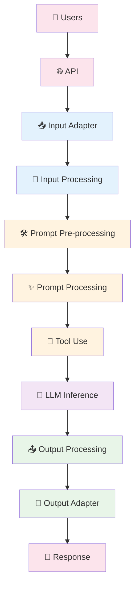
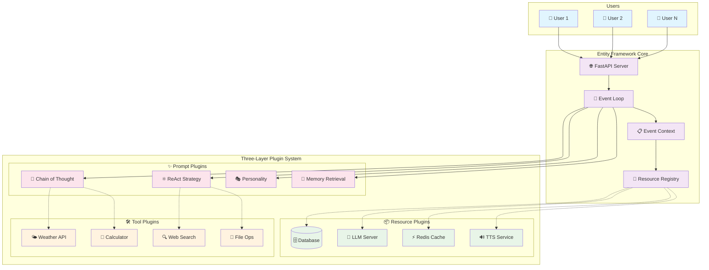
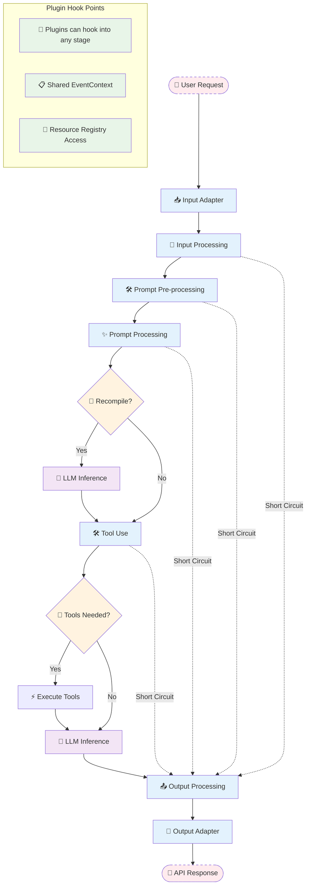
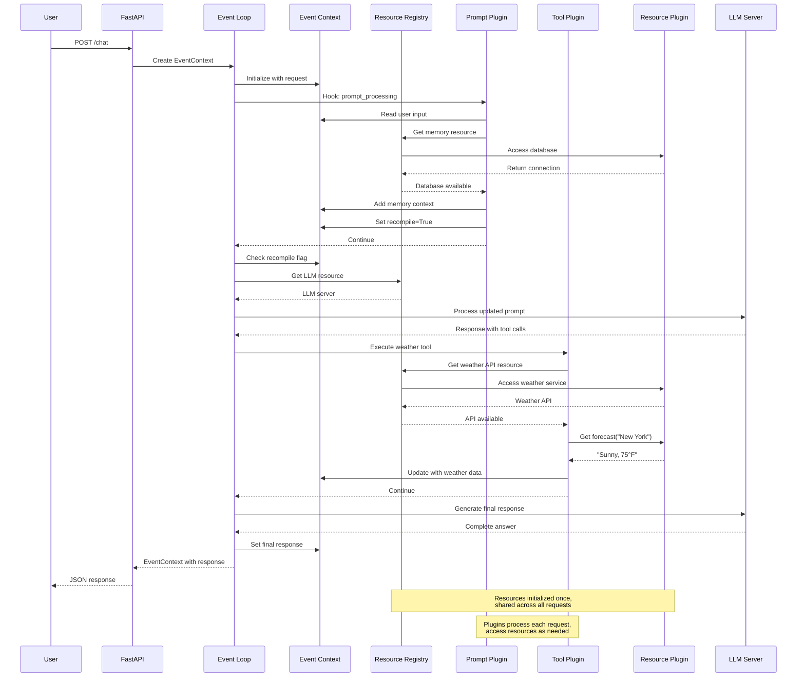
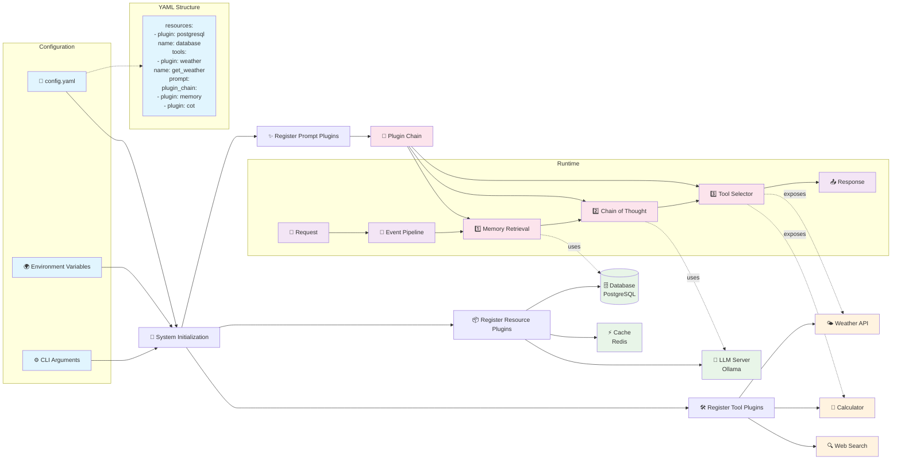

# Entity Framework Architecture Summary

## 🎯 Vision
A **Bevy-inspired plugin framework** for AI agents that's composable, extensible, and configuration-driven.

## 🏗️ Core Architecture

### Event Loop Pipeline

```mermaid
flowchart TD
    Users[👤 Users] --> API[🌐 API]
    API --> IA[📥 Input Adapter]
    IA --> IP[🔄 Input Processing]
    IP --> PPP[🛠️ Prompt Pre-processing]
    PPP --> PP[✨ Prompt Processing]
    PP --> TU[🔧 Tool Use]
    TU --> LLM[🧠 LLM Inference]
    LLM --> OP[📤 Output Processing]
    OP --> OA[📮 Output Adapter]
    OA --> Response[📱 Response]
    
    %% Styling
    classDef input fill:#e3f2fd
    classDef processing fill:#fff3e0
    classDef llm fill:#f3e5f5
    classDef output fill:#e8f5e8
    classDef endpoints fill:#fce4ec
    
    class Users,API,Response endpoints
    class IA,IP input
    class PPP,PP,TU processing
    class LLM llm
    class OP,OA output
```

### Three-Layer Plugin System

#### **Resource Plugins** (Infrastructure - Enables System Function)
- **Database**: PostgreSQL, SQLite connections
- **LLM**: Ollama, OpenAI, Claude servers  
- **Memory**: Vector databases, Redis cache
- **TTS**: Text-to-speech services
- **Storage**: File systems, cloud storage
- **Logging**: Structured logging, metrics, tracing
- **Monitoring**: Health checks, performance metrics

#### **Tool Plugins** (Functionality - Performs Tasks for Users)
- **Weather**: Get current conditions, forecasts
- **Calculator**: Mathematical computations
- **Search**: Web search, document search
- **File Operations**: Read, write, process files
- **API Integrations**: Slack, email, custom APIs

#### **Prompt Plugins** (Processing - Controls Request Flow)
- **Strategies**: ReAct, Chain-of-Thought, Direct Response
- **Personality**: Sarcasm, loyalty, wit injection
- **Memory**: Context retrieval and storage
- **Output**: Formatting, validation, filtering

## 🔧 Key Components

### Shared Context
```python
class EventContext:
    request: Any              # User input
    response: Any             # Final output
    prompt: str               # Current prompt
    memory_context: str       # Retrieved context
    metadata: Dict            # Plugin data
    recompile: bool           # Trigger LLM reprocessing
    resources: ResourceRegistry  # Access to all resources
    trace_id: str             # Unique request identifier for logging
    metrics: MetricsCollector # Performance and usage metrics
```

### Plugin Observability & Logging
```python
class BasePlugin:
    def __init__(self):
        self.logger = None  # Injected during initialization
        
    async def execute(self, context: EventContext):
        # Automatic logging with trace ID
        self.logger.info(
            "Plugin execution started",
            plugin=self.__class__.__name__,
            trace_id=context.trace_id,
            stage=self.get_stage()
        )
        
        start_time = time.time()
        try:
            result = await self._execute_impl(context)
            
            # Automatic metrics collection
            context.metrics.record_plugin_duration(
                plugin=self.__class__.__name__,
                duration=time.time() - start_time
            )
            
            return result
        except Exception as e:
            self.logger.error(
                "Plugin execution failed",
                plugin=self.__class__.__name__,
                trace_id=context.trace_id,
                error=str(e),
                exc_info=True
            )
            raise
```

### Plugin Validation System
```python
class ValidationResult:
    success: bool
    error_message: str = None
    warnings: List[str] = []

class BasePlugin:
    @classmethod
    def validate_static(cls, registry: ClassRegistry, config: Dict) -> ValidationResult:
        """
        Validate plugin requirements before instantiation (static validation).
        Check for:
        - Required resource classes exist in registry
        - Required plugin classes are present for correct pipeline stages
        - Configuration parameters are valid (API keys, URLs, etc.)
        - Dependencies can be resolved without circular references
        
        System will fail-fast if any plugin validation fails.
        No side effects - pure validation of metadata and configuration.
        """
        return ValidationResult(success=True)
```

### Plugin Capabilities
- **Read/Write Context**: Plugins can modify any part of the request/response
- **Resource Access**: `context.resources.get("llm")` - request what you need
- **Short Circuit**: Skip remaining pipeline stages (like `continue` in loops)
- **Recompile**: Force LLM reprocessing after prompt changes

## ⚙️ Configuration

### Four-Phase System Initialization
```python
# Phase 1: Class Registration (Metadata Only - Order Independent)
# Phase 2: Static Validation (All Classes Available - Fail Fast)
# Phase 3: Resource Initialization (Dependency Order with Cleanup)
# Phase 4: Plugin Instantiation (Everything Ready)

class SystemInitializer:
    def initialize(self, config: Config):
        with initialization_cleanup_context():
            # Phase 1: Register all plugin classes and configurations
            registry = ClassRegistry()
            for plugin_config in config.all_plugins():
                plugin_class = import_plugin_class(plugin_config.type)
                registry.register_class(plugin_class, plugin_config)
            
            # Phase 2: Static validation - FAIL FAST (no instantiation yet)
            for plugin_class, config in registry.all_plugin_classes():
                result = plugin_class.validate_static(registry, config)
                if not result.success:
                    raise SystemError(f"Static validation failed for {plugin_class.__name__}: {result.error_message}")
            
            # Phase 3: Initialize resources in dependency order
            resource_registry = ResourceRegistry()
            for resource_class, config in registry.resource_classes():
                instance = resource_class(config)
                await instance.initialize()
                resource_registry.add_resource(instance)
            
            # Phase 4: Instantiate tool and prompt plugins
            plugin_registry = PluginRegistry()
            for plugin_class, config in registry.non_resource_classes():
                instance = plugin_class(config, resource_registry)
                plugin_registry.add_plugin(instance)
            
            return plugin_registry, resource_registry
```

### Simple YAML Setup
```yaml
entity:
  # 1. Initialize Infrastructure
  resources:
    - plugin: "postgresql"
      name: "database"
      config: { host: "localhost", port: 5432 }
    - plugin: "ollama_llm" 
      name: "llm"
      config: { model: "llama3:8b" }
    - plugin: "redis_cache"
      name: "cache"
      config: { host: "localhost", port: 6379 }
    - plugin: "structured_logging"
      name: "logger"
      config: { level: "INFO", output: "console", format: "json" }
    - plugin: "prometheus_metrics"
      name: "metrics"
      config: { port: 9090, endpoint: "/metrics" }
  
  # 2. Register User Functions
  tools:
    - plugin: "weather_api"
      name: "get_weather"
      config: { api_key: "${WEATHER_API_KEY}" }
    - plugin: "calculator"
      name: "calculate"
    - plugin: "web_search"
      name: "search_web"
      config: { engine: "google" }
  
  # 3. Define Processing Pipeline (order matters!)
  prompt:
    plugin_chain:
      - plugin: "memory_retrieval"     # Uses database resource
        stages: ["prompt_preprocessing"]
      - plugin: "chain_of_thought"     # Adds reasoning structure
        stages: ["prompt_processing"]
      - plugin: "tool_selector"        # Exposes tools to LLM
        stages: ["tool_use"]
```

## 🚀 Key Benefits

### For Users
- **No Code Changes**: New strategies via config only
- **Mix and Match**: Combine multiple prompt strategies
- **Resource Flexibility**: Works with/without optional resources
- **Easy Experimentation**: Swap plugins to test approaches
- **Order Independent**: Plugin configuration order doesn't matter

### For Developers  
- **Plugin Ecosystem**: Share and discover community plugins
- **Clean Testing**: Mock resources, test plugins in isolation
- **Extensible**: Add new resources and strategies without core changes
- **Composable**: Plugins build on each other's work

### For Operations
- **Configuration-Driven**: Different setups for dev/staging/prod
- **Graceful Degradation**: Missing resources don't break the system
- **Observable**: Rich metadata from each plugin
- **Scalable**: Resources shared across all plugins

## 🔌 Plugin Examples

### Custom Weather Integration
```python
# 1. Create Tool Plugin (performs user tasks)
class WeatherToolPlugin(ToolPlugin):
    @classmethod
    def validate_static(cls, registry: ClassRegistry, config: Dict) -> ValidationResult:
        # Check required resource classes exist
        if not registry.has_resource_class("weather_api"):
            available = registry.list_resource_classes()
            return ValidationResult.error(f"Requires 'weather_api' resource class. Available: {available}")
        
        # Check configuration without instantiation
        if not config.get("api_key"):
            return ValidationResult.error("Missing required config: api_key")
        
        return ValidationResult.success()
    
    def get_tool_name(self) -> str:
        return "get_weather"
    
    async def execute(self, location: str) -> str:
        # Uses weather API resource for infrastructure
        api = self.resources.get("weather_api")
        return await api.get_forecast(location)
    
    def get_tool_schema(self):
        return {
            "name": "get_weather",
            "description": "Get current weather for a location",
            "parameters": {"location": {"type": "string"}}
        }

# 2. Create Resource Plugin (provides infrastructure)
class WeatherAPIResourcePlugin(ResourcePlugin):
    @classmethod
    def validate_static(cls, registry: ClassRegistry, config: Dict) -> ValidationResult:
        # Pure configuration validation
        if not config.get("api_key"):
            return ValidationResult.error("Weather API key not configured")
        
        # Validate URL format without making requests
        base_url = config.get("base_url", "https://api.weather.com")
        if not cls._is_valid_url(base_url):
            return ValidationResult.error(f"Invalid base_url: {base_url}")
        
        return ValidationResult.success()
    
    @staticmethod
    def _is_valid_url(url: str) -> bool:
        # Simple URL validation without network calls
        return url.startswith(("http://", "https://"))
    
    def get_resource_name(self) -> str:
        return "weather_api"
    
    async def initialize(self, config) -> WeatherAPI:
        return WeatherAPI(config["api_key"], config.get("base_url"))

# 3. Create Logging Resource Plugin (provides observability)
class StructuredLoggingResourcePlugin(ResourcePlugin):
    @classmethod
    def validate_static(cls, registry: ClassRegistry, config: Dict) -> ValidationResult:
        # Validate log level without instantiation
        valid_levels = ["DEBUG", "INFO", "WARN", "ERROR"]
        level = config.get("level", "INFO")
        if level not in valid_levels:
            return ValidationResult.error(f"Invalid log level '{level}'. Must be one of: {valid_levels}")
        
        # Validate output configuration
        valid_outputs = ["console", "file", "elasticsearch"]
        output = config.get("output", "console")
        if output not in valid_outputs:
            return ValidationResult.error(f"Invalid output '{output}'. Must be one of: {valid_outputs}")
        
        # If file output, check path is writable (without creating file)
        if output == "file" and not config.get("file_path"):
            return ValidationResult.error("file_path required when output is 'file'")
        
        return ValidationResult.success()
    
    def get_resource_name(self) -> str:
        return "logger"
    
    async def initialize(self, config) -> StructuredLogger:
        return StructuredLogger(
            level=config.get("level", "INFO"),
            output=config.get("output", "console"),
            format=config.get("format", "json"),
            service_name="entity-framework",
            file_path=config.get("file_path")
        )
```

## 🎨 Design Principles

1. **Configuration Over Code**: Behavior defined in YAML, not hardcoded
2. **Plugin Composition**: Multiple plugins work together seamlessly  
3. **Resource Agnostic**: Plugins work with/without optional dependencies
4. **Fail Gracefully**: Missing resources don't crash the system
5. **Pipeline Control**: Plugins can short-circuit or trigger reprocessing
6. **Shared State**: Rich context object for plugin collaboration
7. **Fail-Fast Validation**: All plugin dependencies validated statically before instantiation
8. **Observable by Design**: Structured logging, metrics, and tracing built into every plugin
9. **Order Independence**: Plugin configuration order doesn't matter - validation handles dependencies

## 🌟 Real-World Usage

```yaml
# Development: Simple setup
resources:
  - plugin: "sqlite"
    name: "database"
  - plugin: "local_llm"
    name: "llm"

# Production: Full stack with observability
resources:
  - plugin: "postgresql" 
    name: "database"
  - plugin: "openai_gpt4"
    name: "llm"
  - plugin: "redis_cache"
    name: "cache"
  - plugin: "elasticsearch"
    name: "memory"
  - plugin: "structured_logging"
    name: "logger"
    config: { level: "INFO", output: "elasticsearch", format: "json" }
  - plugin: "prometheus_metrics"
    name: "metrics"
  - plugin: "jaeger_tracing"
    name: "tracing"

# Experimentation: A/B testing
prompt:
  plugin_chain:
    - plugin: "chain_of_thought"    # Strategy A
    # - plugin: "direct_response"   # Strategy B (commented out)
```

## 🎯 Bottom Line

**Entity Framework = Bevy for AI Agents**

- **Three Plugin Types**: Resources (infrastructure), Tools (user functions), Prompts (processing)
- **Infrastructure**: Clean separation between enabling vs performing
- **Composable**: Mix and match capabilities via configuration  
- **Testable**: Clean separation, easy mocking, isolated testing
- **Production-Ready**: Graceful degradation, rich observability
- **Developer-Friendly**: Clear patterns, shared community plugins

**Result**: Build AI agents like assembling LEGO blocks - flexible, reusable, and fun! 🧩



```mermaid
graph TB
    %% High-Level System Architecture
    subgraph "Users"
        U1[👤 User 1]
        U2[👤 User 2]
        U3[👤 User N]
    end
    
    subgraph "Entity Framework Core"
        API[🌐 FastAPI Server]
        EL[🔄 Event Loop]
        CTX[📋 Event Context]
        RR[🏪 Resource Registry]
    end
    
    subgraph "Three-Layer Plugin System"
        subgraph "📦 Resource Plugins"
            DB[(🗄️ Database)]
            LLM[🧠 LLM Server]
            CACHE[⚡ Redis Cache]
            TTS[🔊 TTS Service]
        end
        
        subgraph "🛠️ Tool Plugins"
            WEATHER[🌤️ Weather API]
            CALC[🧮 Calculator]
            SEARCH[🔍 Web Search]
            FILE[📁 File Ops]
        end
        
        subgraph "✨ Prompt Plugins"
            COT[🧩 Chain of Thought]
            REACT[⚛️ ReAct Strategy]
            PERS[🎭 Personality]
            MEM[🧠 Memory Retrieval]
        end
    end
    
    %% Connections
    U1 --> API
    U2 --> API
    U3 --> API
    API --> EL
    EL --> CTX
    CTX --> RR
    
    %% Plugin connections
    RR -.-> DB
    RR -.-> LLM
    RR -.-> CACHE
    RR -.-> TTS
    
    EL --> COT
    EL --> REACT
    EL --> PERS
    EL --> MEM
    
    COT -.-> WEATHER
    COT -.-> CALC
    REACT -.-> SEARCH
    REACT -.-> FILE
    
    %% Styling
    classDef users fill:#e1f5fe
    classDef core fill:#f3e5f5
    classDef resources fill:#e8f5e8
    classDef tools fill:#fff3e0
    classDef prompts fill:#fce4ec
    
    class U1,U2,U3 users
    class API,EL,CTX,RR core
    class DB,LLM,CACHE,TTS resources
    class WEATHER,CALC,SEARCH,FILE tools
    class COT,REACT,PERS,MEM prompts
```


```mermaid
flowchart TD
    %% User Request Flow
    START([👤 User Request]) --> IA[📥 Input Adapter]
    IA --> IP[🔄 Input Processing]
    
    %% Prompt Processing Chain
    IP --> PPP[🛠️ Prompt Pre-processing]
    PPP --> PP[✨ Prompt Processing]
    
    %% Decision Point
    PP --> RECOMPILE{🔄 Recompile?}
    RECOMPILE -->|Yes| LLM1[🧠 LLM Inference]
    RECOMPILE -->|No| TU[🛠️ Tool Use]
    LLM1 --> TU
    
    %% Tool Usage
    TU --> TOOLS{🔧 Tools Needed?}
    TOOLS -->|Yes| EXEC[⚡ Execute Tools]
    TOOLS -->|No| LLM2[🧠 LLM Inference]
    EXEC --> LLM2
    
    %% Output Processing
    LLM2 --> OP[📤 Output Processing]
    OP --> OA[📮 Output Adapter]
    
    %% Short Circuit Option
    IP -.->|Short Circuit| OP
    PPP -.->|Short Circuit| OP
    PP -.->|Short Circuit| OP
    TU -.->|Short Circuit| OP
    
    %% Final Response
    OA --> END([📱 API Response])
    
    %% Plugin Hook Points
    subgraph "Plugin Hook Points"
        HOOKS[🔌 Plugins can hook into any stage]
        SHARED[📋 Shared EventContext]
        RESOURCES[🏪 Resource Registry Access]
    end
    
    %% Styling
    classDef stages fill:#e3f2fd
    classDef decision fill:#fff3e0
    classDef llm fill:#f3e5f5
    classDef plugins fill:#e8f5e8
    classDef shortcut fill:#ffebee,stroke-dasharray: 5 5
    
    class IA,IP,PPP,PP,TU,OP,OA stages
    class RECOMPILE,TOOLS decision
    class LLM1,LLM2 llm
    class HOOKS,SHARED,RESOURCES plugins
    class START,END shortcut
```


```mermaid
sequenceDiagram
    participant User
    participant API as FastAPI
    participant EL as Event Loop
    participant CTX as Event Context
    participant RR as Resource Registry
    participant PP as Prompt Plugin
    participant TP as Tool Plugin
    participant RP as Resource Plugin
    participant LLM as LLM Server
    
    %% Request Flow
    User->>API: POST /chat
    API->>EL: Create EventContext
    EL->>CTX: Initialize with request
    
    %% Plugin Processing
    EL->>PP: Hook: prompt_processing
    PP->>CTX: Read user input
    PP->>RR: Get memory resource
    RR->>RP: Access database
    RP-->>RR: Return connection
    RR-->>PP: Database available
    PP->>CTX: Add memory context
    PP->>CTX: Set recompile=True
    PP-->>EL: Continue
    
    %% LLM Recompile
    EL->>CTX: Check recompile flag
    EL->>RR: Get LLM resource
    RR-->>EL: LLM server
    EL->>LLM: Process updated prompt
    LLM-->>EL: Response with tool calls
    
    %% Tool Execution
    EL->>TP: Execute weather tool
    TP->>RR: Get weather API resource
    RR->>RP: Access weather service
    RP-->>RR: Weather API
    RR-->>TP: API available
    TP->>RP: Get forecast("New York")
    RP-->>TP: "Sunny, 75°F"
    TP->>CTX: Update with weather data
    TP-->>EL: Continue
    
    %% Final Response
    EL->>LLM: Generate final response
    LLM-->>EL: Complete answer
    EL->>CTX: Set final response
    EL-->>API: EventContext with response
    API-->>User: JSON response
    
    %% Resource Lifecycle
    Note over RR,RP: Resources initialized once,<br/>shared across all requests
    Note over PP,TP: Plugins process each request,<br/>access resources as needed
```


```mermaid
flowchart LR
    %% Configuration Sources
    subgraph "Configuration"
        YAML[📄 config.yaml]
        ENV[🌍 Environment Variables]
        CLI[⚙️ CLI Arguments]
    end
    
    %% Initialization Flow
    YAML --> INIT[🚀 System Initialization]
    ENV --> INIT
    CLI --> INIT
    
    %% Plugin Registration
    INIT --> RPI[📦 Register Resource Plugins]
    INIT --> TPI[🛠️ Register Tool Plugins]
    INIT --> PPI[✨ Register Prompt Plugins]
    
    %% Resource Initialization
    RPI --> DB[(🗄️ Database<br/>PostgreSQL)]
    RPI --> LLM[🧠 LLM Server<br/>Ollama]
    RPI --> CACHE[⚡ Cache<br/>Redis]
    
    %% Tool Registration
    TPI --> WEATHER[🌤️ Weather API]
    TPI --> CALC[🧮 Calculator]
    TPI --> SEARCH[🔍 Web Search]
    
    %% Prompt Chain Setup
    PPI --> CHAIN[🔗 Plugin Chain]
    CHAIN --> P1[1️⃣ Memory Retrieval]
    CHAIN --> P2[2️⃣ Chain of Thought]
    CHAIN --> P3[3️⃣ Tool Selector]
    
    %% Runtime Access
    subgraph "Runtime"
        REQ[📨 Request] --> PIPELINE[🔄 Event Pipeline]
        PIPELINE --> P1
        P1 --> P2
        P2 --> P3
        P3 --> RESP[📤 Response]
    end
    
    %% Resource Access
    P1 -.->|uses| DB
    P2 -.->|uses| LLM
    P3 -.->|exposes| WEATHER
    P3 -.->|exposes| CALC
    
    %% Config Examples
    subgraph "YAML Structure"
        CONF[resources:<br/>- plugin: postgresql<br/>  name: database<br/>tools:<br/>- plugin: weather<br/>  name: get_weather<br/>prompt:<br/>  plugin_chain:<br/>  - plugin: memory<br/>  - plugin: cot]
    end
    
    YAML -.-> CONF
    
    %% Styling
    classDef config fill:#e1f5fe
    classDef resources fill:#e8f5e8
    classDef tools fill:#fff3e0
    classDef prompts fill:#fce4ec
    classDef runtime fill:#f3e5f5
    
    class YAML,ENV,CLI,CONF config
    class DB,LLM,CACHE resources
    class WEATHER,CALC,SEARCH tools
    class P1,P2,P3,CHAIN prompts
    class REQ,PIPELINE,RESP runtime
```


```mermaid
graph TB
    %% Core Framework
    subgraph "Entity Framework Core"
        CORE[🏛️ Core Engine]
        REG[🏪 Plugin Registry]
        HOOKS[🔌 Hook System]
    end
    
    %% Built-in Plugins
    subgraph "📦 Built-in Resource Plugins"
        PG[PostgreSQL]
        SQLITE[SQLite]
        OLLAMA[Ollama LLM]
        OPENAI[OpenAI GPT]
        REDIS[Redis Cache]
    end
    
    subgraph "🛠️ Built-in Tool Plugins"
        CALC_B[Calculator]
        FILE_B[File Operations]
        HTTP_B[HTTP Requests]
        TIME_B[Date/Time]
    end
    
    subgraph "✨ Built-in Prompt Plugins"
        REACT_B[ReAct Strategy]
        COT_B[Chain of Thought]
        DIRECT_B[Direct Response]
        MEMORY_B[Memory Retrieval]
    end
    
    %% Community Plugins
    subgraph "🌍 Community Plugins"
        MONGO[MongoDB Resource]
        ELASTIC[Elasticsearch]
        WEATHER_T[Weather Tool]
        SLACK_T[Slack Integration]
        CUSTOM_P[Custom Reasoning]
        PERSONA_P[Personality Injector]
    end
    
    %% User Plugins
    subgraph "👤 User Custom Plugins"
        COMPANY_R[Company Database]
        API_T[Internal API Tools]
        DOMAIN_P[Domain-Specific Logic]
    end
    
    %% Plugin Development
    subgraph "🔨 Plugin Development"
        SDK[Plugin SDK]
        TEMPLATE[Plugin Templates]
        DOCS[Documentation]
        EXAMPLES[Example Plugins]
    end
    
    %% Connections
    CORE --> REG
    REG --> HOOKS
    
    %% Built-in registrations
    REG -.-> PG
    REG -.-> SQLITE
    REG -.-> OLLAMA
    REG -.-> OPENAI
    REG -.-> REDIS
    REG -.-> CALC_B
    REG -.-> FILE_B
    REG -.-> HTTP_B
    REG -.-> TIME_B
    REG -.-> REACT_B
    REG -.-> COT_B
    REG -.-> DIRECT_B
    REG -.-> MEMORY_B
    
    %% Community registrations
    REG -.-> MONGO
    REG -.-> ELASTIC
    REG -.-> WEATHER_T
    REG -.-> SLACK_T
    REG -.-> CUSTOM_P
    REG -.-> PERSONA_P
    
    %% User registrations
    REG -.-> COMPANY_R
    REG -.-> API_T
    REG -.-> DOMAIN_P
    
    %% Development flow
    SDK --> COMPANY_R
    SDK --> API_T
    SDK --> DOMAIN_P
    TEMPLATE --> SDK
    DOCS --> SDK
    EXAMPLES --> SDK
    
    %% Usage Examples
    subgraph "🎯 Usage Scenarios"
        DEV[Development:<br/>SQLite + Local LLM]
        PROD[Production:<br/>PostgreSQL + OpenAI]
        CUSTOM[Enterprise:<br/>Custom DB + Domain Tools]
    end
    
    DEV -.-> SQLITE
    DEV -.-> OLLAMA
    PROD -.-> PG
    PROD -.-> OPENAI
    CUSTOM -.-> COMPANY_R
    CUSTOM -.-> API_T
    
    %% Styling
    classDef core fill:#f3e5f5
    classDef builtin fill:#e8f5e8
    classDef community fill:#e1f5fe
    classDef user fill:#fff3e0
    classDef dev fill:#fce4ec
    classDef scenarios fill:#f1f8e9
    
    class CORE,REG,HOOKS core
    class PG,SQLITE,OLLAMA,OPENAI,REDIS,CALC_B,FILE_B,HTTP_B,TIME_B,REACT_B,COT_B,DIRECT_B,MEMORY_B builtin
    class MONGO,ELASTIC,WEATHER_T,SLACK_T,CUSTOM_P,PERSONA_P community
    class COMPANY_R,API_T,DOMAIN_P user
    class SDK,TEMPLATE,DOCS,EXAMPLES dev
    class DEV,PROD,CUSTOM scenarios
```