# Entity Pipeline Framework Architecture Summary

## 🎯 Vision
A **pipeline-based plugin framework** for AI agents that processes requests through configurable stages, inspired by Bevy's plugin architecture. Composable, extensible, and configuration-driven.

## 🏗️ Core Architecture

### Stage-Based Processing Pipeline with LLM as Shared Resource

```mermaid
flowchart TD
    Users[👤 Users] --> API[🌐 API]
    API --> IA[📥 Input Adapter]
    IA --> Pipeline[🔄 Processing Pipeline]
    
    Pipeline --> Stage1[🔄 Parse]
    Stage1 --> Stage2[🧠 Think] 
    Stage2 --> Stage3[⚡ Do]
    Stage3 --> Stage4[🔍 Review]
    Stage4 --> Stage5[📤 Deliver]
    
    Stage5 --> OA[📮 Output Adapter]
    OA --> Response[📱 Response]
    
    %% Error handling flow
    Stage1 -.-> ErrorStage[❌ Error]
    Stage2 -.-> ErrorStage
    Stage3 -.-> ErrorStage
    Stage4 -.-> ErrorStage
    Stage5 -.-> ErrorStage
    ErrorStage --> OA
    
    %% LLM Resource Available Throughout Pipeline
    LLM[🧠 LLM Resource] -.-> Stage1
    LLM -.-> Stage2
    LLM -.-> Stage3
    LLM -.-> Stage4
    LLM -.-> Stage5
    LLM -.-> ErrorStage
    
    %% Styling
    classDef input fill:#e3f2fd
    classDef processing fill:#fff3e0
    classDef llm fill:#f3e5f5
    classDef output fill:#e8f5e8
    classDef endpoints fill:#fce4ec
    classDef tools fill:#e8f5f0
    classDef error fill:#ffebee
    
    class Users,API,Response endpoints
    class IA,Stage1 input
    class Stage2 processing
    class LLM llm
    class Stage3 tools
    class Stage4,Stage5,OA output
    class ErrorStage error
```


### Pipeline Execution Model

The pipeline follows a **single-execution pattern** with tools and resources available throughout all stages:

1. **Single Pipeline Execution**: Each request runs through the pipeline once with a guaranteed response
2. **Structured LLM Access**: Any stage can call the LLM when needed with automatic observability
3. **Distributed Tool System**: Any stage can execute tools immediately when needed
4. **Standardized Results**: Explicit result keys with no fallback chains
5. **Plugin-Level Iteration**: Complex reasoning patterns handle iteration internally within plugins
6. **Dynamic Configuration Updates**: Runtime configuration changes without application restart via plugin reconfiguration
7. **Fail-Fast Error Handling**: Plugin failures route to dedicated error stage for user communication
8. **Explicit Multi-Turn Support**: Multi-iteration scenarios handled explicitly through delegation or conversation management

```python
from enum import Enum, auto
from dataclasses import dataclass, field
from typing import Dict, List, Any, Optional
from datetime import datetime
import asyncio
import time

class PipelineStage(Enum):
    PARSE = auto()
    THINK = auto() 
    DO = auto()
    REVIEW = auto()
    DELIVER = auto()
    ERROR = auto()
    
    def __str__(self):
        return self.name.lower()
    
    @classmethod
    def from_str(cls, stage_name: str) -> 'PipelineStage':
        """Convert string to enum with validation"""
        try:
            return cls[stage_name.upper()]
        except KeyError:
            valid_stages = [stage.name.lower() for stage in cls]
            raise ValueError(f"Invalid stage '{stage_name}'. Valid stages: {valid_stages}")

async def execute_pipeline(request):
    """Main pipeline execution with layered context"""
    state = PipelineState(
        conversation=[ConversationEntry(content=str(request), role="user", timestamp=datetime.now())],
        response=None,
        prompt="",
        stage_results={},
        pending_tool_calls=[],
        metadata={},
        pipeline_id=generate_pipeline_id(),
        current_stage=None,
        metrics=MetricsCollector()
    )
    
    registries = SystemRegistries(
        resources=resource_registry,
        tools=tool_registry,
        plugins=plugin_registry
    )
    
    # Single pipeline execution - always produces a response
    await execute_stage(PipelineStage.PARSE, state, registries)
    await execute_stage(PipelineStage.THINK, state, registries)
    await execute_stage(PipelineStage.DO, state, registries)
    await execute_stage(PipelineStage.REVIEW, state, registries)
    await execute_stage(PipelineStage.DELIVER, state, registries)
    
    # Guaranteed response - error stage provides fallback if needed
    return state.response or create_default_response("No response generated", state.pipeline_id)

async def execute_stage(stage: PipelineStage, state: PipelineState, registries: SystemRegistries):
    """Execute a pipeline stage with controlled plugin access"""
    state.current_stage = stage
    
    # Create clean plugin context
    plugin_context = PluginContext(state, registries)
    
    # Execute plugins with controlled access
    stage_plugins = registries.plugins.get_for_stage(stage)
    for plugin in stage_plugins:
        try:
            await plugin.execute(plugin_context)  # Plugin sees clean interface
            
            # Execute pending tools (framework handles this)
            if state.pending_tool_calls:
                tool_results = await execute_pending_tools(state, registries)
                
                # Add tool results to conversation
                for tool_call, result in tool_results.items():
                    plugin_context.add_conversation_entry(
                        content=f"Tool result: {result}",
                        role="system",
                        metadata={"tool_name": tool_call.name, "stage": str(stage)}
                    )
                
                state.pending_tool_calls.clear()
        
        except Exception as e:
            # Handle plugin failure - route to error stage
            failure_info = FailureInfo(
                stage=str(stage),
                plugin_name=plugin.__class__.__name__,
                error_type="plugin_error",
                error_message=str(e),
                original_exception=e,
                context_snapshot={"pipeline_id": state.pipeline_id},
                timestamp=datetime.now()
            )
            plugin_context.add_failure(failure_info)
            
            # Route to error stage if not already there
            if stage != PipelineStage.ERROR:
                await execute_stage(PipelineStage.ERROR, state, registries)
                return

def create_default_response(message: str, pipeline_id: str) -> Dict[str, Any]:
    """Create default response when no plugin sets a response"""
    return {
        "message": message,
        "pipeline_id": pipeline_id,
        "timestamp": datetime.now().isoformat(),
        "type": "default_response"
    }

def generate_pipeline_id() -> str:
    """Generate unique pipeline ID for tracking"""
    import uuid
    return str(uuid.uuid4())
```

### Multi-Turn and Complex Reasoning Patterns

The framework supports complex reasoning and multi-turn scenarios through explicit mechanisms:

#### **Plugin-Level Iteration for Complex Reasoning**
```python
class ReActPlugin(PromptPlugin):
    stages = [PipelineStage.THINK]
    
    async def _execute_impl(self, context: PluginContext):
        max_steps = self.config.get("max_steps", 5)
        
        # Internal plugin iteration - no pipeline loops needed
        for step in range(max_steps):
            # Think
            thought_prompt = f"Think about step {step + 1} of solving this problem..."
            thought = await self.call_llm(context, thought_prompt, purpose=f"react_thought_{step}")
            
            # Act (execute tools immediately)
            if self._should_take_action(thought.content):
                action_name, params = self._parse_action_from_thought(thought.content)
                result_key = context.execute_tool(action_name, params)
                # Tool result immediately available
            
            # Decide if done
            if self._should_conclude(thought.content):
                context.set_response(self._extract_final_answer(thought.content))
                return
        
        context.set_response("Reached reasoning limit without conclusion.")
```

#### **Explicit Pipeline Delegation for Multi-Step Workflows**
```python
class MultiStepWorkflowPlugin(PromptPlugin):
    async def _execute_impl(self, context: PluginContext):
        if self._needs_more_processing(context):
            # Explicitly delegate back to pipeline for another pass
            context.set_response({
                "type": "continue_processing",
                "message": "I need to search for more information about X",
                "internal": True,
                "workflow_state": {"step": 2, "data": "..."}
            })

# Agent-level conversation management
class ConversationManager:
    async def process_request(self, user_message: str) -> str:
        response = await execute_pipeline(user_message)
        
        # Handle multi-step workflows
        while response.get("type") == "continue_processing":
            follow_up = response["message"]
            response = await execute_pipeline(follow_up)
        
        return response

### Plugin Validation System
```python
@dataclass
class ValidationResult:
    success: bool
    error_message: str = None
    warnings: List[str] = field(default_factory=list)
    
    @classmethod
    def success_result(cls) -> 'ValidationResult':
        return cls(success=True)
    
    @classmethod
    def error(cls, message: str) -> 'ValidationResult':
        return cls(success=False, error_message=message)

@dataclass
class ReconfigResult:
    success: bool
    error_message: str = None
    requires_restart: bool = False
    warnings: List[str] = field(default_factory=list)

class BasePlugin:
    dependencies: List[str] = []  # List of registry keys that this plugin depends on
    stages: List[PipelineStage]  # Always explicit, always required
    
    @classmethod
    def validate_config(cls, config: Dict) -> ValidationResult:
        """
        Pure configuration validation - no external dependencies.
        Validates:
        - Required config keys exist
        - Values are correct types/formats
        - URLs are well-formed
        - Numeric ranges are valid
        - No registry or cross-plugin concerns
        """
        return ValidationResult.success_result()
    
    @classmethod
    def validate_dependencies(cls, registry: 'ClassRegistry') -> ValidationResult:
        """
        Dependency validation - checks that declared dependencies exist in registry.
        Validates:
        - All items in cls.dependencies exist in registry
        - No circular dependency chains (using topological sort)
        - Plugin execution order can be determined
        
        Uses registry keys (YAML config names) for dependencies.
        """
        # Check all dependencies exist
        for dep in cls.dependencies:
            if not registry.has_plugin(dep):
                available = registry.list_plugins()
                return ValidationResult.error(f"{cls.__name__} requires '{dep}' but it's not registered. Available: {available}")
        
        return ValidationResult.success_result()
    
    @classmethod
    def validate_all(cls, config: Dict, registry: 'ClassRegistry') -> ValidationResult:
        """Convenience method for complete validation (config + dependencies)"""
        config_result = cls.validate_config(config)
        if not config_result.success:
            return config_result
        return cls.validate_dependencies(registry)
    
    def supports_runtime_reconfiguration(self) -> bool:
        """Can this plugin be reconfigured without restart?"""
        return True  # Override in plugins that can't handle runtime reconfiguration
    
    async def reconfigure(self, new_config: Dict) -> ReconfigResult:
        """
        Update plugin configuration at runtime.
        Returns success/failure and whether restart is required.
        """
        # Validate new configuration first
        validation_result = self.validate_config(new_config)
        if not validation_result.success:
            return ReconfigResult(
                success=False,
                error_message=f"Configuration validation failed: {validation_result.error_message}"
            )
        
        # Check if plugin supports runtime reconfiguration
        if not self.supports_runtime_reconfiguration():
            return ReconfigResult(
                success=False,
                requires_restart=True,
                error_message="This plugin requires application restart for configuration changes"
            )
        
        # Apply new configuration
        try:
            old_config = self.config
            self.config = new_config
            await self._handle_reconfiguration(old_config, new_config)
            return ReconfigResult(success=True)
        except Exception as e:
            # Restore old configuration on failure
            self.config = old_config
            return ReconfigResult(
                success=False,
                error_message=f"Reconfiguration failed: {str(e)}"
            )
    
    async def on_dependency_reconfigured(self, dependency_name: str, old_config: Dict, new_config: Dict) -> bool:
        """
        Called when a dependency's configuration changes.
        Returns True if successfully handled, False if restart required.
        """
        # Default implementation: no action needed
        return True
    
    async def _handle_reconfiguration(self, old_config: Dict, new_config: Dict):
        """
        Override this method to handle configuration changes.
        Called after validation passes and config is updated.
        """
        pass  # Default: no special handling needed
    
    @classmethod
    def from_dict(cls, config: Dict) -> 'BasePlugin':
        """
        Create plugin from config with CONFIG VALIDATION ONLY.
        
        WARNING: This does NOT validate dependencies. Use only for:
        - Testing with mocked dependencies
        - Development/prototyping
        - When dependencies are guaranteed to exist
        
        For production systems, use four-phase initialization.
        """
        from .exceptions import ConfigurationError
        
        result = cls.validate_config(config)
        if not result.success:
            raise ConfigurationError(f"{cls.__name__} config validation failed: {result.error_message}")
        return cls(config)
    
    @classmethod
    def from_yaml(cls, yaml_content: str) -> 'BasePlugin':
        """Parse YAML then delegate to from_dict (config validation only)"""
        import yaml
        config = yaml.safe_load(yaml_content)
        return cls.from_dict(config)
    
    @classmethod
    def from_json(cls, json_content: str) -> 'BasePlugin':
        """Parse JSON then delegate to from_dict (config validation only)"""
        import json
        config = json.loads(json_content)
        return cls.from_dict(config)
```

### Dynamic Configuration Management

The framework supports runtime configuration updates without application restart through a **fail-fast, cascading reconfiguration system**:

#### **Configuration Update Flow**
```python
async def update_plugin_configuration(plugin_name: str, new_config: Dict) -> 'ConfigUpdateResult':
    """
    Update plugin configuration at runtime with cascading dependency updates.
    Implements fail-fast behavior - any failure aborts the entire update.
    """
    # 1. Wait for in-flight pipelines to complete
    await wait_for_pipeline_completion()
    
    # 2. Validate new configuration
    plugin_instance = plugin_registry.get_plugin(plugin_name)
    validation_result = plugin_instance.validate_config(new_config)
    if not validation_result.success:
        return ConfigUpdateResult.failure(f"Validation failed: {validation_result.error_message}")
    
    # 3. Attempt reconfiguration
    reconfig_result = await plugin_instance.reconfigure(new_config)
    if not reconfig_result.success:
        if reconfig_result.requires_restart:
            return ConfigUpdateResult.restart_required(reconfig_result.error_message)
        else:
            return ConfigUpdateResult.failure(reconfig_result.error_message)
    
    # 4. Cascade to dependent plugins (automatic)
    dependent_plugins = plugin_registry.get_dependents(plugin_name)
    for dependent_plugin in dependent_plugins:
        cascade_success = await dependent_plugin.on_dependency_reconfigured(
            plugin_name, old_config, new_config
        )
        if not cascade_success:
            # Fail-fast: abort entire update if any dependent plugin fails
            return ConfigUpdateResult.failure(
                f"Dependency cascade failed for plugin: {dependent_plugin.name}"
            )
    
    # 5. Success - all plugins reconfigured
    return ConfigUpdateResult.success()

async def wait_for_pipeline_completion(timeout_seconds: int = 30):
    """Wait for all in-flight pipelines to complete before reconfiguration"""
    start_time = time.time()
    while pipeline_manager.has_active_pipelines():
        if time.time() - start_time > timeout_seconds:
            raise TimeoutError("Timeout waiting for pipelines to complete")
        await asyncio.sleep(0.1)  # Check every 100ms
```

#### **Plugin Reconfiguration Examples**
```python
class LLMResourcePlugin(ResourcePlugin):
    stages = [PipelineStage.PARSE, PipelineStage.THINK, 
             PipelineStage.DO, PipelineStage.REVIEW, 
             PipelineStage.DELIVER, PipelineStage.ERROR]
    
    def supports_runtime_reconfiguration(self) -> bool:
        return True  # Can change temperature, model parameters
    
    async def _handle_reconfiguration(self, old_config: Dict, new_config: Dict):
        """Handle LLM configuration changes"""
        # Update temperature, top_p, etc.
        if old_config.get("model") != new_config.get("model"):
            # Model change requires reconnection
            await self._reconnect_with_new_model(new_config["model"])
        
        # Update generation parameters
        self.llm_client.update_generation_params({
            "temperature": new_config.get("temperature", 0.7),
            "top_p": new_config.get("top_p", 0.9),
            "top_k": new_config.get("top_k", 40)
        })

class DatabaseResourcePlugin(ResourcePlugin):
    stages = [PipelineStage.PARSE, PipelineStage.THINK, 
             PipelineStage.DO, PipelineStage.REVIEW, 
             PipelineStage.DELIVER, PipelineStage.ERROR]
    
    def supports_runtime_reconfiguration(self) -> bool:
        return True  # Can change pool sizes, timeouts
    
    async def _handle_reconfiguration(self, old_config: Dict, new_config: Dict):
        """Handle database configuration changes"""
        # Update connection pool settings
        if old_config.get("max_pool_size") != new_config.get("max_pool_size"):
            await self.connection_pool.resize(new_config["max_pool_size"])
        
        if old_config.get("host") != new_config.get("host"):
            # Host change requires restart
            raise RuntimeError("Database host changes require application restart")

class IntentClassifierPlugin(PromptPlugin):
    stages = [PipelineStage.THINK]
    
    def supports_runtime_reconfiguration(self) -> bool:
        return True  # Can change thresholds
    
    async def on_dependency_reconfigured(self, dependency_name: str, old_config: Dict, new_config: Dict) -> bool:
        """React to LLM configuration changes"""
        if dependency_name == "ollama":
            # LLM model changed - might need to adjust confidence thresholds
            if old_config.get("model") != new_config.get("model"):
                self.logger.info(f"LLM model changed from {old_config.get('model')} to {new_config.get('model')}")
                # Could automatically adjust thresholds based on new model
                return True
        return True  # Successfully handled
```

#### **Configuration Update Results**
```python
@dataclass
class ConfigUpdateResult:
    success: bool
    error_message: str = None
    requires_restart: bool = False
    updated_plugins: List[str] = field(default_factory=list)
    
    @classmethod
    def success(cls, updated_plugins: List[str] = None) -> 'ConfigUpdateResult':
        return cls(success=True, updated_plugins=updated_plugins or [])
    
    @classmethod
    def failure(cls, error_message: str) -> 'ConfigUpdateResult':
        return cls(success=False, error_message=error_message)
    
    @classmethod
    def restart_required(cls, error_message: str) -> 'ConfigUpdateResult':
        return cls(success=False, requires_restart=True, error_message=error_message)
```

### Plugin Capabilities
- **Read/Write Context**: Plugins can modify conversation and response through controlled interface
- **Resource Access**: `context.get_resource("llm")` - request what you need with validation
- **Tool Access**: `context.execute_tool("name", params)` - execute tools when needed with immediate results
- **Short Circuit**: Skip remaining pipeline stages by setting `context.set_response()`
- **Plugin-Level Iteration**: Handle complex reasoning patterns with internal loops
- **Pipeline Delegation**: Explicitly request additional pipeline passes for multi-step workflows
- **Dynamic Reconfiguration**: Update configuration at runtime via `reconfigure()` method with cascading dependency notifications
- **Immediate Tool Execution**: Execute tools in any stage with immediate access to results
- **Structured LLM Access**: Any plugin can call the LLM resource with automatic observability via `self.call_llm()`
- **Standardized Results**: Set and get standardized results with explicit dependencies via controlled interface
- **Error Signaling**: Add failure information with `context.add_failure()` to route to error stage
- **Tool Retry Logic**: Configure retry behavior for individual tools with `max_retries` and `retry_delay`
- **Stage Awareness**: Access current execution stage with `context.current_stage` property
- **Controlled Access**: Clean interface prevents accidental system state corruption
- **Metadata Persistence**: Store plugin state across single pipeline execution via `context.get_metadata()` and `context.set_metadata()`

## ⚙️ Configuration

### Four-Phase System Initialization
```python
# Phase 1: Class Registration (Metadata Only - Order Independent)
# Phase 2: Static Validation (All Classes Available - Fail Fast)
# Phase 3: Resource Initialization (Dependency Order with Cleanup)
# Phase 4: Plugin Instantiation (Everything Ready)

class SystemInitializer:
    def __init__(self, config: Dict):
        self.config = config
    
    @classmethod
    def from_yaml(cls, yaml_path: str) -> 'SystemInitializer':
        """
        Load entire system configuration from single YAML file.
        Handles environment variable interpolation at system level for security.
        """
        import yaml
        import os
        
        # 1. Load YAML content
        with open(yaml_path, 'r') as file:
            yaml_content = file.read()
        
        # 2. Interpolate ALL environment variables at system level (security)
        config = cls._interpolate_env_vars(yaml.safe_load(yaml_content))
        
        # 3. Return SystemInitializer with fully resolved config
        return cls(config)
    
    def get_resource_config(self, name: str) -> Dict:
        """Explicitly extract resource configuration"""
        return self.config["plugins"]["resources"][name]
    
    def get_tool_config(self, name: str) -> Dict:
        """Explicitly extract tool configuration"""
        return self.config["plugins"]["tools"][name]
    
    def get_adapter_config(self, name: str) -> Dict:
        """Explicitly extract adapter configuration"""
        return self.config["plugins"]["adapters"][name]
    
    def get_prompt_config(self, name: str) -> Dict:
        """Explicitly extract prompt configuration"""
        return self.config["plugins"]["prompts"][name]

    async def initialize(self):
        """Initialize the entire system with proper cleanup on failure"""
        with initialization_cleanup_context():
            # Phase 1: Register all plugin classes and extract dependency graph
            registry = ClassRegistry()
            dependency_graph = {}
            
            # Register resources
            for resource_name, resource_config in self.config["plugins"]["resources"].items():
                resource_class = import_plugin_class(resource_config.get("type", resource_name))
                registry.register_class(resource_class, resource_config, resource_name)
                dependency_graph[resource_name] = resource_class.dependencies
            
            # Register tools, adapters, prompts...
            for plugin_type in ["tools", "adapters", "prompts"]:
                for plugin_name, plugin_config in self.config["plugins"].get(plugin_type, {}).items():
                    plugin_class = import_plugin_class(plugin_config.get("type", plugin_name))
                    registry.register_class(plugin_class, plugin_config, plugin_name)
                    dependency_graph[plugin_name] = plugin_class.dependencies
            
            # Phase 2: Validate dependencies exist and detect circular dependencies
            self._validate_dependency_graph(registry, dependency_graph)
            
            # Phase 2 continued: Config validation for all plugins
            for plugin_class, config in registry.all_plugin_classes():
                config_result = plugin_class.validate_config(config)
                if not config_result.success:
                    raise SystemError(f"Config validation failed for {plugin_class.__name__}: {config_result.error_message}")
            
            # Phase 3: Initialize resources in dependency order (no validation needed - already done!)
            resource_registry = ResourceRegistry()
            for resource_class, config in registry.resource_classes():
                instance = resource_class(config)  # Direct instantiation
                await instance.initialize()
                resource_registry.add_resource(instance)
            
            # Phase 3.5: Register tools as static system capabilities
            tool_registry = ToolRegistry()
            for tool_class, config in registry.tool_classes():
                instance = tool_class(config)  # Direct instantiation
                tool_registry.add_tool(instance)
            
            # Phase 4: Instantiate prompt and adapter plugins (no validation needed - already done!)
            plugin_registry = PluginRegistry()
            for plugin_class, config in registry.non_resource_non_tool_classes():
                instance = plugin_class(config)  # Direct instantiation
                plugin_registry.add_plugin(instance)
            
            return plugin_registry, resource_registry, tool_registry
    
    def _validate_dependency_graph(self, registry: 'ClassRegistry', dep_graph: Dict[str, List[str]]):
        """
        Validate dependency graph: check existence and detect circular dependencies.
        Uses registry keys (YAML config names) for dependency resolution.
        """
        # 1. Check all dependencies exist
        for plugin_name, deps in dep_graph.items():
            for dep in deps:
                if not registry.has_plugin(dep):
                    available = registry.list_plugins()
                    raise SystemError(f"Plugin '{plugin_name}' requires '{dep}' but it's not registered. Available: {available}")
        
        # 2. Detect circular dependencies using topological sort (Kahn's algorithm)
        in_degree = {node: 0 for node in dep_graph}
        for node in dep_graph:
            for neighbor in dep_graph[node]:
                if neighbor in in_degree:  # Only count registered plugins
                    in_degree[neighbor] += 1
        
        queue = [node for node, degree in in_degree.items() if degree == 0]
        processed = []
        
        while queue:
            current = queue.pop(0)
            processed.append(current)
            
            for neighbor in dep_graph[current]:
                if neighbor in in_degree:
                    in_degree[neighbor] -= 1
                    if in_degree[neighbor] == 0:
                        queue.append(neighbor)
        
        # If we didn't process all nodes, there's a cycle
        if len(processed) != len(in_degree):
            cycle_nodes = [node for node in in_degree if node not in processed]
            raise SystemError(f"Circular dependency detected involving: {cycle_nodes}")
        
    @staticmethod
    def _interpolate_env_vars(config: Any) -> Any:
        """Recursively interpolate environment variables in configuration"""
        import os
        
        if isinstance(config, dict):
            return {k: SystemInitializer._interpolate_env_vars(v) for k, v in config.items()}
        elif isinstance(config, list):
            return [SystemInitializer._interpolate_env_vars(item) for item in config]
        elif isinstance(config, str) and config.startswith("${") and config.endswith("}"):
            env_var = config[2:-1]
            value = os.environ.get(env_var)
            if value is None:
                raise EnvironmentError(f"Required environment variable {env_var} not found")
            return value
        else:
            return config

class ClassRegistry:
    """Registry for plugin classes during initialization"""
    def __init__(self):
        self._classes = {}
        self._configs = {}
    
    def register_class(self, plugin_class, config: Dict, name: str):
        self._classes[name] = plugin_class
        self._configs[name] = config
    
    def has_plugin(self, name: str) -> bool:
        return name in self._classes
    
    def list_plugins(self) -> List[str]:
        return list(self._classes.keys())
    
    def all_plugin_classes(self):
        for name, plugin_class in self._classes.items():
            yield plugin_class, self._configs[name]
    
    def resource_classes(self):
        for name, plugin_class in self._classes.items():
            if issubclass(plugin_class, ResourcePlugin):
                yield plugin_class, self._configs[name]
    
    def tool_classes(self):
        for name, plugin_class in self._classes.items():
            if issubclass(plugin_class, ToolPlugin):
                yield plugin_class, self._configs[name]
    
    def non_resource_non_tool_classes(self):
        for name, plugin_class in self._classes.items():
            if not issubclass(plugin_class, (ResourcePlugin, ToolPlugin)):
                yield plugin_class, self._configs[name]

def import_plugin_class(type_name: str):
    """Import a plugin class by type name"""
    # This would contain the actual import logic based on your plugin structure
    # For example: from myproject.plugins.resources import PostgreSQLPlugin
    pass

def initialization_cleanup_context():
    """Context manager for cleanup on initialization failure"""
    class CleanupContext:
        def __enter__(self):
            return self
        
        def __exit__(self, exc_type, exc_val, exc_tb):
            if exc_type:
                # Cleanup any partially initialized resources
                pass
    
    return CleanupContext()
```

### Hierarchical YAML Configuration
```yaml
entity:
  entity_id: "jade"
  name: "Jade"
  server:
    host: "0.0.0.0"
    port: 8000
    reload: false
    log_level: "info"

plugins:
  resources:
    database:
      type: postgres
      host: "192.168.1.104"
      port: 5432
      name: "memory"
      username: "${DB_USERNAME}"      # Environment variable interpolation
      password: "${DB_PASSWORD}"      # Resolved at system level for security
      db_schema: "entity"
      history_table: "chat_history"
      min_pool_size: 2
      max_pool_size: 10
      init_on_startup: true
    
    ollama:
      type: ollama_llm
      base_url: "http://192.168.1.110:11434"
      model: "llama3:8b-instruct-q6_K"
      temperature: 0.7
      top_p: 0.9
      top_k: 40
      repeat_penalty: 1.1
    
    logging:
      type: structured_logging
      level: "DEBUG"
      format: "%(asctime)s - %(name)s - %(levelname)s - %(message)s"
      file_enabled: true
      file_path: "logs/entity.log"
      max_file_size: 10485760
      backup_count: 5
  
  tools:
    weather:
      type: weather_api
      api_key: "${WEATHER_API_KEY}"
      base_url: "https://api.weather.com"
      timeout: 30
      max_retries: 3          # Tool-specific retry configuration
      retry_delay: 2.0        # Seconds between retries
    
    calculator:
      type: calculator
      precision: 10
      max_retries: 1          # Simple tools may need fewer retries
  
  adapters:
    tts:
      type: speech_synthesis
      base_url: "http://192.168.1.110:8888"
      voice_name: "bf_emma"
      voice_sample_path: "voice_samples/ai_mee.wav"
      output_format: "wav"
      speed: 0.3
      cfg_weight: 0.9
      exaggeration: 0.5
      sample_rates: [44100, 48000, 22050, 16000, 8000]
      fade_out_samples: 2000
  
  prompts:
    chain_of_thought:
      type: chain_of_thought
      enable_reasoning: true
      max_steps: 5
    
    memory_retrieval:
      type: memory_retrieval
      max_context_length: 4000
      similarity_threshold: 0.7
    
    intent_classifier:
      type: intent_classifier
      confidence_threshold: 0.8
```

## 🚀 Key Benefits

### For Users
- **No Code Changes**: New strategies via config only
- **Mix and Match**: Combine multiple prompt strategies
- **Resource Flexibility**: Works with/without optional resources
- **Easy Experimentation**: Swap plugins to test approaches
- **Explicit Configuration**: Clear understanding of plugin stage assignments

### For Developers  
- **Plugin Ecosystem**: Share and discover community plugins
- **Clean Testing**: Mock resources, test plugins in isolation
- **Extensible**: Add new resources and strategies without core changes
- **Composable**: Plugins build on each other's work
- **Separated Validation**: Test config parsing independently from dependency resolution
- **Natural Tool Integration**: Tools execute when needed without artificial staging constraints
- **Flexible LLM Usage**: Any plugin can call LLM when needed with structured observability
- **Natural Tool Execution**: Tools available throughout pipeline with immediate access to results
- **Easier Debugging**: Centralized tool logging regardless of execution location
- **Simpler Testing**: Tool execution can be tested in isolation or within natural plugin flows
- **Fail-Fast Development**: Plugin failures caught early in development cycle
- **Graceful Error Communication**: Dedicated error stage for user-friendly error messages
- **Reliable Fallback**: Static error responses ensure users always receive feedback
- **Stage Awareness**: Explicit stage context enables reliable plugin behavior
- **Framework Extension Points**: Base classes allow framework-wide capability additions without plugin changes
- **Plugin-Level Iteration**: Complex reasoning patterns work naturally without pipeline complexity
- **Controlled Plugin Interface**: Clean separation between plugin access and internal state prevents corruption
- **Better Testing**: Easy to mock controlled plugin interface for isolated testing
- **Access Validation**: Framework validates all plugin operations through controlled interface

### For Operations
- **Runtime Reconfiguration**: Update plugin configurations without restart for rapid development and tuning
- **Configuration-Driven**: Different setups for dev/staging/prod
- **Fail Fast**: Static validation catches issues early
- **Observable**: Rich metadata from each plugin
- **Scalable**: Resources shared across all plugins
- **Environment Security**: Centralized environment variable interpolation
- **Explicit Configuration**: Clear, transparent config extraction
- **Single Pipeline Execution**: Predictable performance and resource usage
- **Controlled Plugin Access**: Clean interfaces prevent accidental system corruption and improve debugging

## 🔌 Plugin Examples

### Chain of Thought with Controlled Context
```python
class ChainOfThoughtPlugin(PromptPlugin):
    dependencies = ["database", "logging", "ollama"]
    stages = [PipelineStage.THINK]  # Explicit stage assignment
    
    @classmethod
    def validate_config(cls, config: Dict) -> ValidationResult:
        max_steps = config.get("max_steps", 5)
        if not isinstance(max_steps, int) or max_steps <= 0:
            return ValidationResult.error("max_steps must be a positive integer")
        
        return ValidationResult.success_result()
    
    async def _execute_impl(self, context: PluginContext):
        if not self.config.get("enable_reasoning", True):
            return
            
        # Get clean conversation history through controlled interface
        conversation_text = self._get_conversation_text(context.get_conversation_history())
        
        # Step 1: Break down the problem using structured LLM access
        breakdown_prompt = f"Break this problem into logical steps: {conversation_text}"
        breakdown = await self.call_llm(context, breakdown_prompt, purpose="problem_breakdown")
        
        # Add reasoning to conversation through controlled interface
        context.add_conversation_entry(
            content=f"Problem breakdown: {breakdown.content}",
            role="assistant",
            metadata={"reasoning_step": "breakdown"}
        )
        
        # Step 2: Reason through each step
        reasoning_steps = []
        for step_num in range(self.config.get("max_steps", 5)):
            reasoning_prompt = f"Reason through step {step_num + 1} of solving: {conversation_text}"
            reasoning = await self.call_llm(
                context, 
                reasoning_prompt, 
                purpose=f"reasoning_step_{step_num + 1}"
            )
            reasoning_steps.append(reasoning.content)
            
            context.add_conversation_entry(
                content=f"Reasoning step {step_num + 1}: {reasoning.content}",
                role="assistant",
                metadata={"reasoning_step": step_num + 1}
            )
            
            # Check if we need tools during reasoning
            if self._needs_tools(reasoning.content):
                # Execute tool immediately and continue reasoning with results
                result_key = context.execute_tool(
                    "analysis_tool",
                    {"data": conversation_text, "reasoning_step": reasoning.content}
                )
                # Tool results will be available after this plugin completes
                
            # Check if we have enough reasoning
            if "final answer" in reasoning.content.lower() or "conclusion" in reasoning.content.lower():
                break
        
        # Step 3: Set standardized results for other plugins through controlled interface
        context.set_stage_result("reasoning_complete", True)
        context.set_stage_result("reasoning_steps", reasoning_steps)
    
    def _needs_tools(self, reasoning_text: str) -> bool:
        """Determine if current reasoning step indicates need for tools"""
        tool_indicators = ["need to calculate", "should look up", "requires analysis", "need data"]
        return any(indicator in reasoning_text.lower() for indicator in tool_indicators)
    
    def _get_conversation_text(self, conversation: List[ConversationEntry]) -> str:
        """Extract clean conversation text for LLM processing"""
        user_entries = [entry.content for entry in conversation if entry.role == "user"]
        return user_entries[-1] if user_entries else ""
```

### ReAct Plugin (Simplified with Immediate Tool Access)
```python
class ReActPlugin(PromptPlugin):
    """Natural ReAct implementation with immediate tool access and internal iteration"""
    dependencies = ["ollama"]
    stages = [PipelineStage.THINK]  # Explicit stage assignment
    
    @classmethod
    def validate_config(cls, config: Dict) -> ValidationResult:
        max_steps = config.get("max_steps", 5)
        if not isinstance(max_steps, int) or max_steps <= 0:
            return ValidationResult.error("max_steps must be a positive integer")
        
        return ValidationResult.success_result()
    
    async def _execute_impl(self, context: PluginContext):
        max_steps = self.config.get("max_steps", 5)
        
        # Get user question through controlled interface
        conversation = context.get_conversation_history()
        user_messages = [entry.content for entry in conversation if entry.role == "user"]
        question = user_messages[-1] if user_messages else "No question provided"
        
        # ReAct loop with immediate tool access - all within single plugin execution
        for step in range(max_steps):
            # Build context for this step
            step_context = self._build_step_context(context.get_conversation_history(), question)
            
            # Thought
            thought_prompt = f"""Think step by step about this problem:
            
            Context: {step_context}
            
            What should I think about next?"""
            
            thought = await self.call_llm(context, thought_prompt, purpose=f"react_thought_step_{step}")
            
            context.add_conversation_entry(
                content=f"Thought: {thought.content}",
                role="assistant",
                metadata={"react_step": step, "type": "thought"}
            )
            
            # Action decision
            action_prompt = f"""Based on my thought: "{thought.content}"
            
            Should I:
            1. Take an action (specify: search, calculate, etc.)
            2. Give a final answer
            
            Respond with either "Action: <action_name> <parameters>" or "Final Answer: <answer>"""
            
            action_decision = await self.call_llm(context, action_prompt, purpose=f"react_action_step_{step}")
            
            if action_decision.content.startswith("Final Answer:"):
                # We're done!
                final_answer = action_decision.content.replace("Final Answer:", "").strip()
                context.set_response(final_answer)
                return
            
            elif action_decision.content.startswith("Action:"):
                # Parse and execute action immediately
                action_text = action_decision.content.replace("Action:", "").strip()
                action_name, params = self._parse_action(action_text)
                
                context.add_conversation_entry(
                    content=f"Action: {action_text}",
                    role="assistant",
                    metadata={"react_step": step, "type": "action"}
                )
                
                # Execute tool immediately through controlled interface - result available for next thought
                result_key = context.execute_tool(action_name, params)
                # Tool executes immediately, result automatically added to conversation
        
        # If we've hit max steps without a final answer
        context.set_response("I've reached my reasoning limit without finding a definitive answer.")
    
    def _build_step_context(self, conversation: List[ConversationEntry], question: str) -> str:
        """Build context string for current ReAct step"""
        context_parts = [f"Question: {question}"]
        
        # Add recent conversation entries for context
        recent_entries = conversation[-10:]  # Last 10 entries for context
        for entry in recent_entries:
            if entry.role == "assistant" and entry.metadata.get("type") in ["thought", "action"]:
                context_parts.append(f"{entry.content}")
            elif entry.role == "system" and "Tool result:" in entry.content:
                context_parts.append(f"Observation: {entry.content.replace('Tool result: ', '')}")
        
        return "\n".join(context_parts)
    
    def _parse_action(self, action_text: str) -> tuple:
        """Parse action text into tool name and parameters"""
        parts = action_text.split(" ", 1)
        if len(parts) < 2:
            return "search_tool", {"query": action_text}
        
        action_name = parts[0].lower()
        params_text = parts[1]
        
        if action_name == "search":
            return "search_tool", {"query": params_text}
        elif action_name == "calculate":
            return "calculator_tool", {"expression": params_text}
        else:
            return "search_tool", {"query": action_text}  # fallback
```

### Memory Retrieval Plugin
```python
class MemoryRetrievalPlugin(PromptPlugin):
    """Retrieve relevant context from conversation history and external memory"""
    dependencies = ["database", "ollama"]
    stages = [PipelineStage.PARSE, PipelineStage.THINK]  # Multi-stage plugin
    
    @classmethod
    def validate_config(cls, config: Dict) -> ValidationResult:
        max_context = config.get("max_context_length", 4000)
        if not isinstance(max_context, int) or max_context <= 0:
            return ValidationResult.error("max_context_length must be a positive integer")
        
        threshold = config.get("similarity_threshold", 0.7)
        if not isinstance(threshold, (int, float)) or not 0 <= threshold <= 1:
            return ValidationResult.error("similarity_threshold must be a number between 0 and 1")
        
        return ValidationResult.success_result()
    
    async def _execute_impl(self, context: PluginContext):
        current_stage = context.current_stage
        
        if current_stage == PipelineStage.PARSE:
            await self._initial_context_retrieval(context)
        elif current_stage == PipelineStage.THINK:
            await self._reasoning_context_retrieval(context)
    
    async def _initial_context_retrieval(self, context: PluginContext):
        """Retrieve basic context during parse stage"""
        conversation = context.get_conversation_history()
        user_message = next((entry.content for entry in reversed(conversation) if entry.role == "user"), "")
        
        # Get relevant historical context
        db = context.get_resource("database")
        similar_conversations = await db.search_similar_conversations(
            query=user_message,
            limit=5,
            threshold=self.config.get("similarity_threshold", 0.7)
        )
        
        if similar_conversations:
            context_summary = self._summarize_context(similar_conversations)
            context.add_conversation_entry(
                content=f"Relevant context: {context_summary}",
                role="system",
                metadata={"type": "initial_context", "source": "memory_retrieval"}
            )
            
            context.set_stage_result("has_historical_context", True)
            context.set_stage_result("context_summary", context_summary)
    
    async def _reasoning_context_retrieval(self, context: PluginContext):
        """Retrieve additional context during reasoning stage"""
        # Check if we have reasoning steps that need more context
        conversation = context.get_conversation_history()
        reasoning_entries = [
            entry for entry in conversation 
            if entry.role == "assistant" and entry.metadata.get("reasoning_step")
        ]
        
        if reasoning_entries:
            latest_reasoning = reasoning_entries[-1].content
            
            # Use LLM to identify what additional context might be needed
            context_query_prompt = f"""
            Based on this reasoning step: "{latest_reasoning}"
            
            What additional context or information would be most helpful to continue reasoning?
            Respond with a search query or "NONE" if no additional context needed.
            """
            
            context_query = await self.call_llm(context, context_query_prompt, purpose="context_identification")
            
            if context_query.content.strip().upper() != "NONE":
                # Search for additional context
                db = context.get_resource("database")
                additional_context = await db.search_knowledge_base(
                    query=context_query.content,
                    limit=3
                )
                
                if additional_context:
                    context.add_conversation_entry(
                        content=f"Additional context for reasoning: {additional_context}",
                        role="system",
                        metadata={"type": "reasoning_context", "source": "memory_retrieval"}
                    )
    
    def _summarize_context(self, conversations: List[Dict]) -> str:
        """Summarize retrieved conversations into useful context"""
        if not conversations:
            return "No relevant historical context found."
        
        summaries = []
        for conv in conversations[:3]:  # Limit to top 3 most relevant
            summary = f"Previous topic: {conv.get('summary', conv.get('content', '')[:100])}"
            summaries.append(summary)
        
        return "; ".join(summaries)
```

### Weather Tool Plugin
```python
class WeatherToolPlugin(ToolPlugin):
    """Get current weather and forecasts"""
    dependencies = []
    stages = [PipelineStage.DO]  # Primary tool execution stage
    
    @classmethod
    def validate_config(cls, config: Dict) -> ValidationResult:
        api_key = config.get("api_key")
        if not api_key:
            return ValidationResult.error("api_key is required for weather tool")
        
        base_url = config.get("base_url")
        if not base_url or not base_url.startswith(("http://", "https://")):
            return ValidationResult.error("base_url must be a valid HTTP/HTTPS URL")
        
        return ValidationResult.success_result()
    
    async def execute_function(self, params: Dict) -> str:
        """Execute weather lookup"""
        location = params.get("location", "")
        if not location:
            return "Error: Location parameter is required"
        
        try:
            # Make API call to weather service
            weather_data = await self._fetch_weather(location)
            return self._format_weather_response(weather_data)
        
        except Exception as e:
            return f"Error fetching weather data: {str(e)}"
    
    async def _fetch_weather(self, location: str) -> Dict:
        """Fetch weather data from API"""
        import aiohttp
        
        url = f"{self.config['base_url']}/current"
        params = {
            "key": self.config["api_key"],
            "q": location,
            "aqi": "no"
        }
        
        timeout = aiohttp.ClientTimeout(total=self.config.get("timeout", 30))
        
        async with aiohttp.ClientSession(timeout=timeout) as session:
            async with session.get(url, params=params) as response:
                response.raise_for_status()
                return await response.json()
    
    def _format_weather_response(self, data: Dict) -> str:
        """Format weather data into readable response"""
        try:
            location = data["location"]["name"]
            current = data["current"]
            temp_c = current["temp_c"]
            temp_f = current["temp_f"]
            condition = current["condition"]["text"]
            humidity = current["humidity"]
            wind_kph = current["wind_kph"]
            
            return f"""Weather in {location}:
Temperature: {temp_c}°C ({temp_f}°F)
Conditions: {condition}
Humidity: {humidity}%
Wind: {wind_kph} km/h"""
        
        except KeyError as e:
            return f"Error parsing weather data: missing field {e}"
```

### Error Formatter Plugin
```python
class ErrorFormatterPlugin(FailurePlugin):
    """Convert technical errors into user-friendly messages"""
    dependencies = []
    stages = [PipelineStage.ERROR]
    
    @classmethod
    def validate_config(cls, config: Dict) -> ValidationResult:
        return ValidationResult.success_result()  # No specific config validation needed
    
    async def _execute_impl(self, context: PluginContext):
        # Check if we have failure information
        failure_info = context._state.failure_info
        if not failure_info:
            context.set_response("An unexpected error occurred. Please try again.")
            return
        
        # Generate user-friendly error message based on error type
        user_message = self._format_error_message(failure_info)
        
        # Log technical details for debugging
        self.logger.error(
            "Error occurred in pipeline",
            stage=failure_info.stage,
            plugin=failure_info.plugin_name,
            error_type=failure_info.error_type,
            technical_message=failure_info.error_message,
            pipeline_id=context.pipeline_id,
            exc_info=failure_info.original_exception
        )
        
        # Set user-friendly response
        context.set_response({
            "error": True,
            "message": user_message,
            "error_id": context.pipeline_id,
            "timestamp": datetime.now().isoformat()
        })
    
    def _format_error_message(self, failure_info: FailureInfo) -> str:
        """Convert technical error into user-friendly message"""
        error_mappings = {
            "plugin_error": {
                "default": "I encountered an issue while processing your request.",
                "ChainOfThoughtPlugin": "I had trouble with my reasoning process.",
                "MemoryRetrievalPlugin": "I couldn't access my memory properly.",
                "WeatherToolPlugin": "I couldn't get weather information right now."
            },
            "tool_error": {
                "default": "One of my tools isn't working properly.",
                "weather": "I can't get weather information at the moment.",
                "calculator": "I'm having trouble with calculations right now.",
                "search": "I can't search for information at the moment."
            },
            "system_error": {
                "default": "I'm experiencing technical difficulties."
            }
        }
        
        error_type = failure_info.error_type
        plugin_name = failure_info.plugin_name
        
        # Get specific message or fall back to default
        type_messages = error_mappings.get(error_type, {})
        specific_message = type_messages.get(plugin_name)
        default_message = type_messages.get("default", "Something went wrong.")
        
        user_message = specific_message or default_message
        
        # Add helpful context if configured
        if self.config.get("user_friendly_messages", True):
            user_message += " Please try again, or rephrase your request if the issue persists."
        
        return user_message
```

## 🎨 Design Principles

1. **Configuration Over Code**: Behavior defined in YAML, not hardcoded
2. **Plugin Composition**: Multiple plugins work together seamlessly  
3. **Resource Agnostic**: Plugins work with/without optional dependencies
4. **Explicit Dependencies**: Missing requirements cause immediate, clear errors
5. **Pipeline Control**: Plugins can short-circuit by setting response or trigger reprocessing
6. **Structured Communication**: Rich context object for plugin collaboration
7. **Fail-Fast Validation**: All plugin dependencies validated statically before instantiation
8. **Observable by Design**: Structured logging, metrics, and tracing built into every plugin
9. **Explicit Stage Assignment**: Plugin stages are always explicitly defined in the plugin class
10. **Configuration Flexibility**: Multiple config formats (YAML, JSON, Dict) with secure env interpolation
11. **Separation of Concerns**: Clear distinction between config validation and dependency validation
12. **Load-Time Validation**: Validation should be done at load time, reducing runtime errors
13. **Intuitive Mental Models**: Mental models should be intensely easy to understand
14. **Structured LLM Access**: LLM available throughout pipeline with automatic observability
15. **Linear Pipeline Flow**: Simple, predictable execution order with clear stage responsibilities
16. **Immediate Tool Access**: Tools available in any stage with immediate execution and result access
17. **Distributed Tool Execution**: Tools execute when needed with centralized logging for debugging
18. **Plugin-Level Iteration**: Complex reasoning patterns handle iteration internally within plugins
19. **Explicit Multi-Turn Support**: Multi-iteration scenarios handled explicitly through delegation or conversation management
20. **YAML Execution Ordering**: Plugin execution order within stages determined by YAML configuration order
21. **Fail-Fast Error Handling**: Plugin failures are caught early and routed to dedicated error stage
22. **Error Communication**: Technical failures are converted to user-friendly messages
23. **Static Error Fallback**: Reliable fallback responses when error handling itself fails
24. **Standardized Results**: Explicit result keys with no fallback mechanisms
25. **Stage Awareness**: Explicit stage context enables reliable multi-stage plugin behavior
26. **Framework Extension Points**: Base classes enable framework-wide capability additions without plugin changes
27. **Controlled Plugin Access**: Layered context architecture prevents accidental system state corruption
28. **Clear Interface Contracts**: Plugin capabilities explicitly defined through controlled access methods

## 🌟 Real-World Usage

```yaml
# Development: Simple setup with single pipeline execution
entity:
  entity_id: "dev_agent"
  name: "Development Agent"

plugins:
  resources:
    database:
      type: sqlite
      file_path: "dev.db"
    ollama:
      type: ollama_llm
      base_url: "http://localhost:11434"
      model: "llama3:8b"

  prompts:
    # Execution order within think stage:
    # 1. intent_classifier → 2. smart_tool_coordinator
    intent_classifier:
      type: intent_classifier
      confidence_threshold: 0.7
    
    smart_tool_coordinator:
      type: smart_tool_coordinator

  # Error handling plugins (minimal, discouraged)
  failure:
    error_formatter:
      type: error_formatter
      user_friendly_messages: true

# Production: Full stack with observability and single pipeline execution
entity:
  entity_id: "prod_agent"
  name: "Production Agent"

plugins:
  resources:
    database:
      type: postgresql
      host: "db.company.com"
      username: "${DB_USERNAME}"
      password: "${DB_PASSWORD}"
    openai:
      type: openai_llm
      api_key: "${OPENAI_API_KEY}"
      model: "gpt-4"
    logging:
      type: structured_logging
      level: "INFO"
      output: "elasticsearch"
      format: "json"
    metrics:
      type: prometheus_metrics
      port: 9090
    tracing:
      type: jaeger_tracing
      endpoint: "http://jaeger:14268"

  prompts:
    # Execution order within stages:
    # parse: memory_retrieval
    # think: memory_retrieval → intent_classifier → chain_of_thought → smart_coordinator
    memory_retrieval:
      type: memory_retrieval  # Runs in parse AND think
      max_context_length: 4000
      similarity_threshold: 0.7
    
    intent_classifier:
      type: intent_classifier
      confidence_threshold: 0.9
    
    chain_of_thought:
      type: chain_of_thought
      enable_reasoning: true
      max_steps: 5
    
    smart_tool_coordinator:
      type: smart_tool_coordinator

  # Comprehensive error handling for production
  failure:
    error_formatter:
      type: error_formatter
      user_friendly_messages: true
    
    error_logger:
      type: error_logger
      log_level: "ERROR"
      include_context: true

# Experimentation: A/B testing different reasoning strategies with explicit ordering
plugins:
  prompts:
    # Order matters - intent classification must come before reasoning
    intent_classifier:
      type: intent_classifier
      confidence_threshold: 0.8
    
    reasoning:
      type: "chain_of_thought"    # Strategy A
      # type: "react"             # Strategy B (commented out)
      enable_reasoning: true
      max_steps: 5
    
    tool_coordinator:
      type: smart_tool_coordinator  # Must come after reasoning
```

## 🎯 Bottom Line

**Entity Pipeline Framework = Bevy for AI Agents**

- **Five Plugin Types**: Resources (infrastructure), Tools (user functions), Prompts (processing), Adapters (input/output), Failure (error handling)
- **Explicit Stage Assignment**: All plugins explicitly declare their execution stages
- **Framework Extension Points**: Base classes enable framework-wide capabilities without plugin changes
- **Single Pipeline Execution**: Each request runs through pipeline once with guaranteed response
- **Plugin-Level Iteration**: Complex reasoning patterns handle loops internally
- **Immediate Tool Access**: Tools available throughout pipeline with instant execution and results
- **Controlled Plugin Interface**: Clean separation between plugin capabilities and internal framework state
- **Infrastructure**: Clean separation between enabling vs performing
- **Composable**: Mix and match capabilities via configuration  
- **Testable**: Clean separation, easy mocking, isolated testing
- **Production-Ready**: Explicit dependencies, rich observability
- **Developer-Friendly**: Clear patterns, shared community plugins
- **Natural Tool Integration**: Tools execute when needed without artificial staging constraints
- **Linear Pipeline**: Simple, predictable execution flow with structured data
- **Stage Awareness**: Explicit stage context for reliable plugin behavior
- **Intuitive Mental Model**: `parse → think → do → review → deliver → error`

**Result**: Build AI agents like assembling LEGO blocks - flexible, reusable, and fun! 🧩
```

#### **Multi-Turn Conversations (Application Level)**
```python
# Each user message triggers one pipeline execution
conversation_history = []

for user_message in conversation:
    # Add conversation history to context
    enhanced_request = {
        "message": user_message,
        "history": conversation_history[-10:]  # Last 10 messages
    }
    
    response = await execute_pipeline(enhanced_request)
    conversation_history.append({"user": user_message, "assistant": response})
```

### Five-Layer Plugin System

#### **Resource Plugins** (Infrastructure - Enables System Function)
- **Database**: PostgreSQL, SQLite connections
- **LLM**: Ollama, OpenAI, Claude servers  
- **Semantic Memory**: Vector databases, Redis cache
- **Storage**: File systems, cloud storage
- **Logging**: Structured logging, metrics, tracing
- **Monitoring**: Health checks, performance metrics

#### **Tool Plugins** (Functionality - Performs Tasks for Users)
- **Weather**: Get current conditions, forecasts
- **Calculator**: Mathematical computations
- **Search**: Web search, document search
- **File Operations**: Read, write, process files
- **API Integrations**: Slack, email, custom APIs

**Tool Execution Model**: Tools are registered during system initialization as static capabilities and are available throughout all pipeline stages. Any plugin in any stage can execute tools immediately when needed, with results available to subsequent plugins in the same stage or later stages.

#### **Prompt Plugins** (Processing - Controls Request Flow)
- **Strategies**: ReAct, Chain-of-Thought, Direct Response
- **Personality**: Sarcasm, loyalty, wit injection
- **Memory**: Context retrieval and storage
- **Output**: Formatting, validation, filtering
- **Tool Coordination**: Execute tools during processing with immediate access to results

#### **Adapter Plugins** (Input/Output - Interface Handling)
- **Input Adapters**: HTTP, WebSocket, CLI interfaces
- **Output Adapters**: HTTP responses, TTS, formatted output
  - **TTS**: Text-to-speech services

#### **Failure Plugins** (Error Communication - User-Facing Error Handling)
- **Error Formatters**: Convert technical errors to user-friendly messages
- **Error Loggers**: Record failures for debugging and monitoring
- **Notification Systems**: Alert administrators of critical failures

**Note**: Plugin use is discouraged in the error stage to maintain reliability. Keep error stage plugins minimal and ensure static fallback responses are available.

### Plugin Stage Assignment System

The framework uses **explicit stage assignment** for all plugins, with base classes serving as organizational categories and framework extension points:

#### **Explicit Stage Assignment (Required)**
```python
from abc import ABC, abstractmethod

class BasePlugin(ABC):
    stages: List[PipelineStage]  # Always explicit, always required
    
    @abstractmethod
    async def execute(self, context: PluginContext):
        pass

class ResourcePlugin(BasePlugin):
    """Organizational category + framework extension point for infrastructure plugins"""
    
    async def health_check(self) -> bool:
        """Framework-provided health monitoring for all resources"""
        return True  # Override for custom health logic
    
    def get_metrics(self) -> Dict[str, Any]:
        """Framework-provided metrics collection"""
        return {"status": "healthy"}

class ToolPlugin(BasePlugin):
    """Organizational category + framework extension point for tool plugins"""
    
    def validate_tool_params(self, params: Dict) -> bool:
        """Framework-provided validation for all tools"""
        return self._validate_required_params(params)
    
    async def execute_with_timeout(self, context, timeout=30):
        """Framework-provided timeout wrapper for all tools"""
        return await asyncio.wait_for(self.execute(context), timeout=timeout)

class PromptPlugin(BasePlugin):
    """Organizational category + framework extension point for processing plugins"""
    
    def get_token_usage(self) -> int:
        """Framework-provided token tracking for all prompt plugins"""
        return getattr(self, '_token_count', 0)

class AdapterPlugin(BasePlugin):
    """Organizational category + framework extension point for input/output plugins"""
    pass

class FailurePlugin(BasePlugin):
    """Organizational category + framework extension point for error handling plugins"""
    pass
```

#### **Example Plugin Implementations**
```python
class DatabaseResourcePlugin(ResourcePlugin):
    stages = [PipelineStage.PARSE, PipelineStage.THINK, 
             PipelineStage.DO, PipelineStage.REVIEW, 
             PipelineStage.DELIVER, PipelineStage.ERROR]  # Available in all stages

class WeatherToolPlugin(ToolPlugin):
    stages = [PipelineStage.DO]  # Primary tool execution stage

class ChainOfThoughtPlugin(PromptPlugin):
    stages = [PipelineStage.THINK]  # Main processing stage

class MemoryRetrievalPlugin(PromptPlugin):
    stages = [PipelineStage.PARSE, PipelineStage.THINK]  # Multi-stage plugin

class HTTPAdapterPlugin(AdapterPlugin):
    stages = [PipelineStage.PARSE, PipelineStage.DELIVER]  # Interface boundaries

class ErrorFormatterPlugin(FailurePlugin):
    stages = [PipelineStage.ERROR]  # Dedicated error handling stage
```

#### **YAML Configuration Order = Execution Order**
Plugins execute within each stage in the **exact order** they appear in the YAML configuration:

```yaml
prompts:
  # Execution order within think stage:
  # 1. intent_classifier → 2. memory_retrieval → 3. chain_of_thought → 4. smart_coordinator
  intent_classifier:
    type: intent_classifier
    confidence_threshold: 0.8
  
  memory_retrieval:
    type: memory_retrieval
    max_context_length: 4000
  
  chain_of_thought:
    type: chain_of_thought
    enable_reasoning: true
  
  smart_tool_coordinator:
    type: smart_tool_coordinator
```

#### **Stage Registration Process**
```python
def register_plugin_for_stages(plugin_instance, plugin_name):
    """Register plugin for stages defined in plugin class"""
    for stage in plugin_instance.stages:
        plugin_registry.register_plugin_for_stage(plugin_instance, stage, plugin_name)
```

## 🔧 Key Components

### Stage Definitions

#### **parse** - "Get ready to think"
- Input validation, format conversion
- Initial context setup
- Memory/context retrieval (first pass)
- Basic input sanitization

#### **think** - "Reason and plan"
- Intent classification and understanding
- Multi-step reasoning (chain-of-thought, ReAct)
- Planning tool usage and workflows
- Memory retrieval during reasoning (second pass)
- Decision making about actions

#### **do** - "Execute actions"
- Primary stage for complex tool orchestration
- Handle tool failures and retries
- Parse and validate tool results
- Coordinate multiple tool interactions

**Note**: While tools can execute in any stage, the DO stage remains the primary location for complex tool orchestration and multi-step tool workflows.

#### **review** - "Final processing and safety"
- Generate responses and apply formatting
- Privacy protection (PII scrubbing)
- Content filtering and safety checks
- Personality and tone adjustments
- Response quality validation
- Final security review

#### **deliver** - "Send the response"
- Pure output delivery (HTTP response, TTS, file write)
- No content modification - just transmission
- Handle delivery failures

#### **error** - "Handle failures gracefully"
- Convert technical errors to user-friendly messages
- Log errors for debugging
- Recovery strategies

### Error Handling and Failure Recovery

The framework implements a **fail-fast error handling strategy** with dedicated failure communication:

#### **Failure Information Structure**
```python
@dataclass
class FailureInfo:
    stage: str                    # Stage where failure occurred
    plugin_name: str              # Plugin that caused the failure
    error_type: str               # "plugin_error", "tool_error", "system_error"
    error_message: str            # Human-readable error description
    original_exception: Exception # Original exception for debugging
    context_snapshot: Dict[str, Any] = None  # Context state when failure occurred
    timestamp: datetime = field(default_factory=datetime.now)
```

#### **Error Handling Flow**
1. **Plugin Failures**: Caught during stage execution, added to context, routed to error stage
2. **Tool Failures**: Captured in tool results, detected after tool execution, routed to error stage  
3. **System Failures**: Unexpected exceptions caught at pipeline level, routed to error stage
4. **Error Stage**: Processes all failures through dedicated plugins for user communication
5. **Static Fallback**: If error stage plugins fail, return static error response

#### **Tool Retry Configuration**
```python
class ToolPlugin(BasePlugin):
    stages: List[PipelineStage]  # Must be explicitly defined
    
    def __init__(self, config: Dict):
        self.max_retries = config.get("max_retries", 1)  # Default sensible retry count
        self.retry_delay = config.get("retry_delay", 1.0)  # Seconds between retries
    
    async def execute_function_with_retry(self, params: Dict) -> str:
        """Execute tool function with configured retry logic"""
        for attempt in range(self.max_retries + 1):
            try:
                return await self.execute_function(params)
            except Exception as e:
                if attempt == self.max_retries:
                    raise e  # Final attempt failed
                await asyncio.sleep(self.retry_delay)
        
    async def execute_function(self, params: Dict) -> str:
        """Override this method in tool implementations"""
        raise NotImplementedError("Tool plugins must implement execute_function")
```

#### **Static Error Fallback**
```python
# Used when error stage plugins themselves fail
STATIC_ERROR_RESPONSE = {
    "error": "System error occurred",
    "message": "An unexpected error prevented processing your request. Please try again or contact support.",
    "error_id": None,  # Will be populated with pipeline_id
    "timestamp": None,  # Will be populated with current time
    "type": "static_fallback"
}

def create_static_error_response(pipeline_id: str) -> Dict[str, Any]:
    """Create fallback error response when error stage fails"""
    response = STATIC_ERROR_RESPONSE.copy()
    response["error_id"] = pipeline_id
    response["timestamp"] = datetime.now().isoformat()
    return response
```

### Context and Data Structures

The framework uses a **layered context architecture** with controlled access to ensure clean separation between plugin interfaces and internal pipeline state:

#### **Three-Layer Context System**

```python
@dataclass
class ConversationEntry:
    content: str
    role: str  # "user", "assistant", "system"
    timestamp: datetime
    metadata: Dict[str, Any] = field(default_factory=dict)

@dataclass
class ToolCall:
    name: str
    params: Dict[str, Any]
    result_key: str
    source: str  # "static" | "dynamic" | "llm_generated"

@dataclass
class LLMResponse:
    content: str
    metadata: Dict[str, Any] = field(default_factory=dict)

class MetricsCollector:
    def __init__(self):
        self.metrics = {}
    
    def record_plugin_duration(self, plugin: str, stage: str, duration: float):
        pass
    
    def record_tool_execution(self, tool_name: str, stage: str, pipeline_id: str, result_key: str, source: str):
        pass
    
    def record_tool_error(self, tool_name: str, stage: str, pipeline_id: str, error: str):
        pass
    
    def record_llm_call(self, plugin: str, stage: str, purpose: str):
        pass

# Layer 1: Internal Pipeline State (Framework Only)
@dataclass
class PipelineState:
    """Internal state - plugins never see this directly"""
    conversation: List[ConversationEntry]
    response: Any
    prompt: str
    stage_results: Dict[str, Any]
    pending_tool_calls: List[ToolCall]
    metadata: Dict[str, Any]  # Used for plugin state persistence within single pipeline execution
    pipeline_id: str
    current_stage: Optional[PipelineStage]
    metrics: MetricsCollector
    failure_info: Optional[FailureInfo] = None

# Layer 2: Plugin Interface (What Plugins See)
class PluginContext:
    """Clean, controlled interface for plugins"""
    
    def __init__(self, state: PipelineState, registries: 'SystemRegistries'):
        self._state = state  # Private - plugins can't access directly
        self._registries = registries
    
    # Read-only system info
    @property
    def pipeline_id(self) -> str:
        return self._state.pipeline_id
    
    @property
    def current_stage(self) -> PipelineStage:
        return self._state.current_stage
    
    # Controlled resource access
    def get_resource(self, name: str):
        """Access system resources (LLM, database, etc.)"""
        return self._registries.resources.get(name)
    
    def execute_tool(self, tool_name: str, params: Dict[str, Any], result_key: str = None) -> str:
        """Execute a tool immediately and return result key"""
        tool = self._registries.tools.get(tool_name)
        if not tool:
            raise ValueError(f"Tool '{tool_name}' not found")
        
        if result_key is None:
            result_key = f"{tool_name}_result_{len(self._state.pending_tool_calls)}"
        
        tool_call = ToolCall(
            name=tool_name,
            params=params,
            result_key=result_key,
            source="direct_execution"
        )
        self._state.pending_tool_calls.append(tool_call)
        return result_key
    
    # Controlled conversation access
    def add_conversation_entry(self, content: str, role: str, metadata: Dict = None):
        """Add entry to conversation history"""
        entry = ConversationEntry(
            content=content,
            role=role,
            timestamp=datetime.now(),
            metadata=metadata or {}
        )
        self._state.conversation.append(entry)
    
    def get_conversation_history(self, last_n: int = None) -> List[ConversationEntry]:
        """Get read-only access to conversation history"""
        if last_n is None:
            return self._state.conversation.copy()  # Defensive copy
        return self._state.conversation[-last_n:].copy()
    
    # Response control - only one plugin can set
    def set_response(self, response: Any):
        """Set the final response (can only be set once)"""
        if self._state.response is not None:
            raise ValueError(f"Response already set by another plugin")
        self._state.response = response
    
    def has_response(self) -> bool:
        """Check if response has been set"""
        return self._state.response is not None
    
    # Stage results with validation
    def set_stage_result(self, key: str, value: Any):
        """Set a stage result (can only be set once per key)"""
        if key in self._state.stage_results:
            raise ValueError(f"Stage result '{key}' already set by another plugin")
        self._state.stage_results[key] = value
    
    def get_stage_result(self, key: str) -> Any:
        """Get a stage result (raises if not available)"""
        if key not in self._state.stage_results:
            raise KeyError(f"Required result '{key}' not available")
        return self._state.stage_results[key]
    
    def has_stage_result(self, key: str) -> bool:
        """Check if stage result exists"""
        return key in self._state.stage_results
    
    # Plugin metadata access
    def get_metadata(self, key: str, default: Any = None) -> Any:
        """Get plugin metadata for state persistence"""
        return self._state.metadata.get(key, default)
    
    def set_metadata(self, key: str, value: Any):
        """Set plugin metadata for state persistence"""
        self._state.metadata[key] = value
    
    # Error handling
    def add_failure(self, failure: FailureInfo):
        """Add failure information for error stage routing"""
        self._state.failure_info = failure

# Layer 3: Framework Execution (Internal)
@dataclass
class SystemRegistries:
    """Container for all system registries"""
    resources: 'ResourceRegistry'
    tools: 'ToolRegistry'
    plugins: 'PluginRegistry'

class ResourceRegistry:
    def __init__(self):
        self._resources = {}
    
    def get(self, name: str):
        return self._resources.get(name)
    
    def add_resource(self, resource):
        self._resources[resource.name] = resource

class ToolRegistry:
    def __init__(self):
        self._tools = {}
    
    def get(self, name: str):
        return self._tools.get(name)
    
    def add_tool(self, tool):
        self._tools[tool.name] = tool

class PluginRegistry:
    def __init__(self):
        self._plugins_by_stage = {}
    
    def get_for_stage(self, stage: PipelineStage) -> List:
        return self._plugins_by_stage.get(stage, [])
    
    def register_plugin_for_stage(self, plugin, stage: PipelineStage, name: str):
        if stage not in self._plugins_by_stage:
            self._plugins_by_stage[stage] = []
        self._plugins_by_stage[stage].append(plugin)
```

### Tool Execution (Available Throughout Pipeline)
```python
async def execute_pending_tools(state: PipelineState, registries: SystemRegistries) -> Dict[str, Any]:
    """Execute tools immediately when requested by any plugin"""
    results = {}
    
    for tool_call in state.pending_tool_calls:
        try:
            tool_plugin = registries.tools.get(tool_call.name)
            
            # Use retry logic if configured
            if hasattr(tool_plugin, 'execute_function_with_retry'):
                result = await tool_plugin.execute_function_with_retry(tool_call.params)
            else:
                result = await tool_plugin.execute_function(tool_call.params)
            
            results[tool_call.result_key] = result
            
            # Centralized logging for debugging regardless of execution location
            state.metrics.record_tool_execution(
                tool_name=tool_call.name,
                stage=str(state.current_stage),
                pipeline_id=state.pipeline_id,
                result_key=tool_call.result_key,
                source=tool_call.source
            )
            
        except Exception as e:
            results[tool_call.result_key] = f"Error: {e}"
            state.metrics.record_tool_error(
                tool_name=tool_call.name,
                stage=str(state.current_stage),
                pipeline_id=state.pipeline_id,
                error=str(e)
            )
    
    return results
```

### Plugin Observability & Logging
```python
class BasePlugin:
    def __init__(self, config: Dict):
        self.config = config
        self.logger = None  # Injected during initialization
        
    async def execute(self, context: PluginContext):
        # Automatic logging with pipeline ID and stage
        self.logger.info(
            "Plugin execution started",
            plugin=self.__class__.__name__,
            pipeline_id=context.pipeline_id,
            stage=str(context.current_stage)
        )
        
        start_time = time.time()
        try:
            result = await self._execute_impl(context)
            
            # Automatic metrics collection
            context._state.metrics.record_plugin_duration(
                plugin=self.__class__.__name__,
                stage=str(context.current_stage),
                duration=time.time() - start_time
            )
            
            return result
        except Exception as e:
            self.logger.error(
                "Plugin execution failed",
                plugin=self.__class__.__name__,
                pipeline_id=context.pipeline_id,
                stage=str(context.current_stage),
                error=str(e),
                exc_info=True
            )
            raise
    
    async def _execute_impl(self, context: PluginContext):
        """Override this method in plugin implementations"""
        raise NotImplementedError("Plugins must implement _execute_impl")
    
    async def call_llm(self, context: PluginContext, prompt: str, purpose: str) -> LLMResponse:
        """Structured LLM access with automatic logging and metrics"""
        llm = context.get_resource("ollama")  # or configured LLM resource
        
        # Enhanced observability
        context._state.metrics.record_llm_call(
            plugin=self.__class__.__name__,
            stage=str(context.current_stage),
            purpose=purpose
        )
        
        start_time = time.time()
        response = await llm.generate(prompt)
        
        # Log with purpose for better debugging
        self.logger.info(
            "LLM call completed",
            plugin=self.__class__.__name__,
            stage=str(context.current_stage),
            purpose=purpose,
            prompt_length=len(prompt),
            response_length=len(response.content),
            duration=time.time() - start_time,
            pipeline_id=context.pipeline_id
        )
        
        return response
```