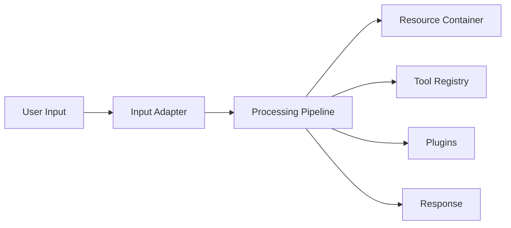

# Architecture Overview

The Entity Pipeline Framework uses a single execution pipeline with explicit
stages. Plugins implement each stage and provide reusable behavior.

## Pipeline Stages
- **parse** – validate input and load context
- **think** – reason and plan
- **do** – execute tools and actions
- **review** – format and validate responses
- **deliver** – send output to the user
- **error** – handle failures gracefully

After each pass through these stages, the pipeline examines `state.response`.
If the response is still empty, the stages repeat until a response exists or
`max_iterations` is hit. By default the framework allows five iterations. Once
this limit is exceeded, the pipeline jumps to the `error` stage.

## Plugin Layers
1. **Resource plugins** – databases, LLMs and storage backends
2. **Tool plugins** – execute tasks such as search or math
3. **Prompt plugins** – control reasoning strategies and memory
4. **Adapter plugins** – handle input and output interfaces
5. **Failure plugins** – present errors and log issues

Every resource is registered under a single name so configuration remains small
and mental models stay easy to grasp.

## Design Principles
1. Progressive disclosure: simple things stay simple, complex things are possible
2. Async-first with predictable execution order
3. Runtime reconfiguration with fail‑fast validation
4. Clear stage boundaries and structured logging
5. One canonical name per resource

A small example of structured logging lives in `examples/structured_logging_example.py`.
It initializes ``LoggingAdapter`` and emits one log entry.

## Network Architecture
All backend services communicate using gRPC streaming with Protobuf schemas.
Web interfaces may use WebSockets, but model services must expose gRPC
endpoints.

For additional diagrams and examples see the ADRs in `docs/adr/`.

## Framework Overview Diagram


## Benchmark Results
The performance suite currently fails to run due to circular import errors.
Example output:
```
ImportError: cannot import name 'Resource' from partially initialized module 'common_interfaces.resources'
```

Once the imports are resolved, the `pytest-benchmark` plugin can capture
timing metrics for each pipeline stage.
