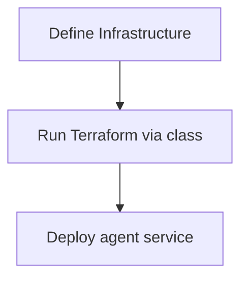

# AWS Deployment Guide

Deploying the Entity Pipeline Framework on AWS lets you scale reliably with managed services. This guide outlines required resources and provides a Python example that drives Terraform to create them.

## Required AWS Resources

- **Database**: Amazon RDS (PostgreSQL) or DynamoDB for durable state.
- **Storage**: S3 bucket for file uploads and static assets.
- **Compute**: ECS service or AWS Lambda function to run the agent.
- **Networking**: VPC, subnets and security groups to control access.
- **IAM Roles**: permissions for the compute layer to access the database and S3.

## Terraform with Python

The [python-terraform](https://github.com/beelit94/python-terraform) package lets you drive Terraform commands from Python. Keep your `.tf` files in an `infra/` directory and orchestrate them with a small helper class.

```python
from python_terraform import Terraform

class AwsDeployer:
    def __init__(self, working_dir: str):
        self.terraform = Terraform(working_dir=working_dir)

    def deploy(self) -> None:
        self.terraform.init()
        return_code, stdout, stderr = self.terraform.plan()
        if return_code != 0:
            raise RuntimeError(f"Plan failed: {stderr}")
        return_code, stdout, stderr = self.terraform.apply(auto_approve=True)
        if return_code != 0:
            raise RuntimeError(f"Apply failed: {stderr}")
```

Use Terraform configuration files in the chosen `working_dir` to define each AWS resource. A minimal example could look like:

```hcl
resource "aws_s3_bucket" "agent_storage" {
  bucket = "agent-files"
}

resource "aws_dynamodb_table" "agent_sessions" {
  name         = "agent-sessions"
  billing_mode = "PAY_PER_REQUEST"
  hash_key     = "session_id"

  attribute {
    name = "session_id"
    type = "S"
  }
}
```

Instantiate the deployer with the directory containing these files:

```python
deployer = AwsDeployer("./terraform")
deployer.deploy()
```

This approach keeps infrastructure management fully scripted while retaining the readability of Python.

## Deployment Mental Model

Infrastructure setup mirrors the plugin configuration approach. Define your environment in an `Infrastructure` class, then let it run Terraform to provision the resources before starting the agent service.



- **Define Infrastructure** – create an `Infrastructure` subclass describing resources such as VPCs and compute instances.
- **Run Terraform** – call the class to execute Terraform and apply the configuration.
- **Deploy Service** – once resources exist, launch the agent container or ECS task.
