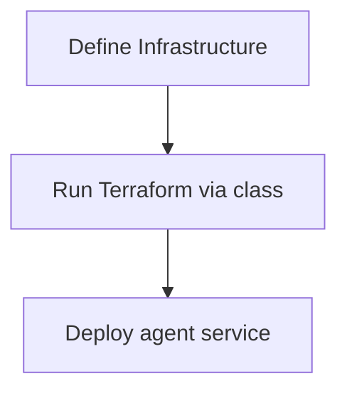

# Deploying to AWS

This guide outlines how to deploy an Entity agent using Amazon Web Services (AWS). The framework assumes you are familiar with basic AWS tools like Terraform and Docker.

## Deployment Mental Model

Infrastructure setup mirrors the plugin configuration approach. Define your environment in an `Infrastructure` class, then let it run Terraform to provision the resources before starting the agent service.

- **Define Infrastructure** – create an `Infrastructure` subclass describing resources such as VPCs and compute instances.
- **Run Terraform** – call the class to execute Terraform and apply the configuration.
- **Deploy Service** – once resources exist, launch the agent container or ECS task.
