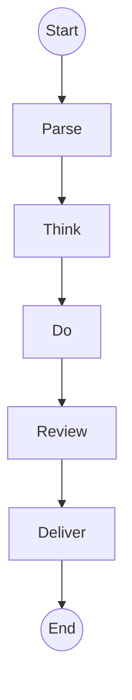

# SPIKE-CORE-002: Pipeline Lifecycle and Consolidation Study

## Summary
This spike documents the current pipeline lifecycle and attempts to gather
performance benchmarks. It also explores consolidating the core packages into a
single module.

## Lifecycle Overview
The framework runs requests through the following stages:



Each stage represents a plugin category. Resources and tools are initialized
before execution and torn down once the pipeline completes.

## Benchmark Results
Running the provided benchmark tests failed due to circular import errors in the
pipeline package. The test suite reported collection errors when invoking
`pytest`:

```
ERROR tests/performance/test_pipeline_benchmark.py
ImportError: cannot import name 'Resource' from partially initialized module 'common_interfaces.resources'
```

As a result no timing information was captured.

## Migration Strategy
Consolidating `pipeline`, `plugins` and `registry` into a single `core` package
would simplify imports and reduce circular dependencies. The migration could be
performed in stages:

1. Create a new `core` package and move shared classes there.
2. Update all imports to reference `core.*` modules.
3. Provide thin shims in the old locations that re-export the new paths.
4. Remove the shims after downstream projects update their imports.

Estimated effort is roughly one week including update of tests and examples.

## Pros and Cons of Consolidation

**Pros**
- Easier to reason about module layout.
- Fewer import cycles and simpler dependency graphs.
- Single package distribution improves packaging and versioning.

**Cons**
- Large refactor touching many files.
- Temporary shims increase maintenance burden.
- Downstream users must update imports when shims are removed.

## Recommendation
Begin with a small prototype moving only the registry classes into a new `core`
package. If this resolves the circular imports seen during benchmarking, proceed
with consolidating the remaining modules.
