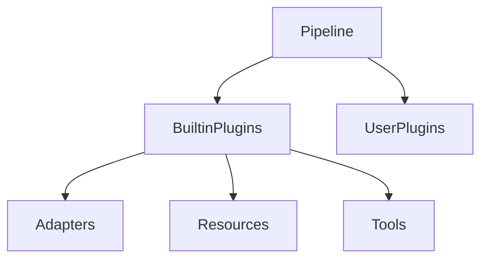
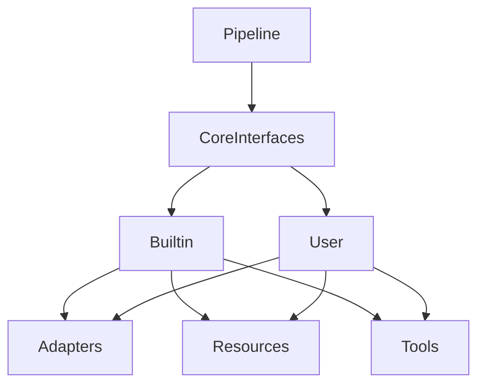

# SPIKE-CORE-003: Plugin Hierarchy Refactor

## Summary
This spike proposes reorganizing plugin modules into a clearer hierarchy. The goal is to separate core abstractions from builtin implementations so user-defined plugins have a stable interface.

## Current Hierarchy

## Proposed Hierarchy

## Interface Compatibility Matrix
| Interface | Current Module | Proposed Module | Backward Compatible |
|-----------|---------------|----------------|--------------------|
| BasePlugin | `pipeline.base_plugins` | `pipeline.core.base` | ❌ |
| AdapterPlugin | `pipeline.base_plugins` | `pipeline.core.adapter` | ❌ |
| ResourcePlugin | `pipeline.base_plugins` | `pipeline.core.resource` | ❌ |
| ToolPlugin | `pipeline.base_plugins` | `pipeline.core.tool` | ✅ (alias will exist) |

`BasePlugin`, `AdapterPlugin`, and `ResourcePlugin` move to new modules which breaks direct imports. `ToolPlugin` retains a compat alias to avoid immediate breakage.

## Breaking Change Assessment
Moving the plugin base classes will break imports for existing user plugins. Updating all plugins to import from the new modules is required. The framework will provide temporary aliases but they will be removed in a future major release.
