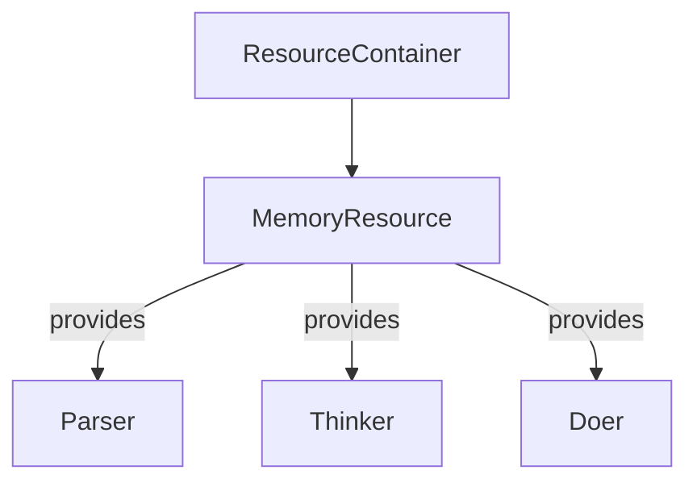

# SPIKE-MEM-001: Shared Memory Strategy

## Summary
This spike explores how multiple plugins can share the same memory resources without
introducing locking overhead. The goal is to keep mental models simple while
allowing different pipelines to reuse common state.

## Recommendation
Use a single `MemoryResource` instance stored in the `ResourceContainer` and pass
references to it during plugin initialization. Each plugin should hold only a
weak reference and access the resource through the container. This approach avoids
copying data and keeps lifetime management centralized.

The container is responsible for cleanup and can swap implementations (DuckDB,
SQLite, Redis) as needed. Plugins simply ask for `resource_container["memory"]`
when they run.
