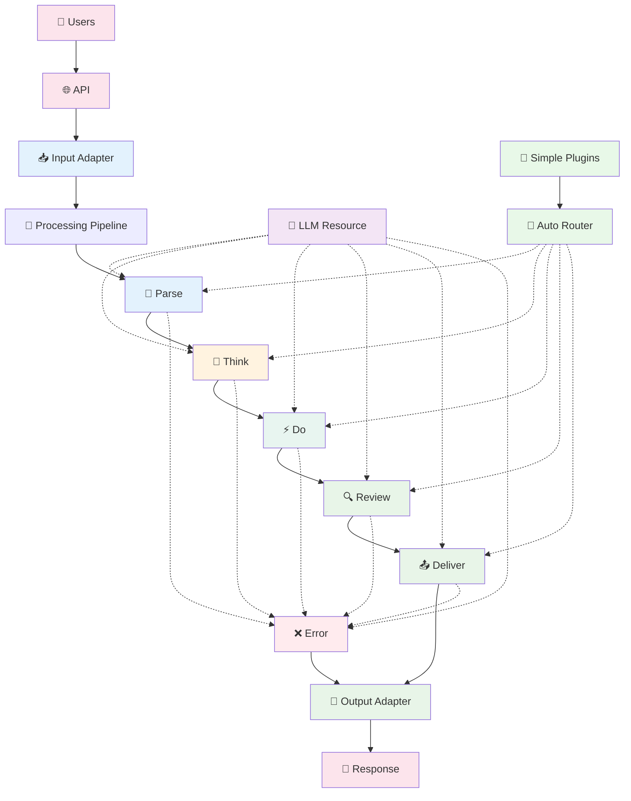

# Entity Pipeline Framework Architecture Summary

## 🎯 Vision
A **pipeline-based plugin framework** for AI agents that processes requests through configurable stages, inspired by Bevy's plugin architecture. **Progressive disclosure design**: dead simple for beginners, infinitely powerful for experts.

**Requires Python 3.11 or higher.**

## 🚀 The 15-Minute Experience (Layer 1: Dead Simple)

### Getting Started - Zero Config
```python
from entity import Agent

# Create an agent in one line
agent = Agent()

# Add functionality with decorators
@agent.plugin
def hello(context):
    return f"Hello {context.user}! How can I help?"

@agent.plugin  
def weather(context):
    if "weather" in context.message:
        return "It's sunny and 72°F today!"

@agent.plugin
def calculator(context):
    if "calculate" in context.message:
        # Built-in tools available automatically
        result = context.calculate("2 + 2")
        return f"The answer is {result}"

# Run the agent
agent.run_http()  # Automatically starts server on localhost:8000
```

The default setup registers a simple `CalculatorTool`, a `SearchTool`, and a
`UnifiedLLMResource` using the `echo` provider, so the example above works
without any configuration files.

```python
from entity.tools import SearchTool

# Add web search capability
agent.tool_registry.add("search", SearchTool())

@agent.plugin
async def lookup(context):
    result = await context.use_tool("search", query="Entity Pipeline")
    return result
```

### Running the Examples
The example scripts in the `examples` folder can be executed directly from the
repository root. Each script adjusts `sys.path` so the `src` directory is
discoverable:

```bash
python examples/servers/http_server.py
python examples/pipelines/pipeline_example.py
```

### Command Line Usage
Launch an agent from a YAML configuration file. Example configurations are
provided in `config/dev.yaml` and `config/prod.yaml`:

```bash
python src/cli.py --config config/dev.yaml
```

### One-Liner Context Operations
```python
@agent.plugin
def smart_assistant(context):
    # Dead simple context operations
    context.think("Let me analyze this request...")      # Internal reasoning
    context.say("I'm working on that...")                # User-visible response
    
    weather = context.use_tool("weather", city="SF")     # Returns result directly
    context.remember("user_location", "San Francisco")   # Auto-persistence
    
    # Conversation helpers
    if context.is_question():
        return context.ask_llm("Please answer: " + context.message)
    
    return "I understand!"
```

### Instant Plugin Discovery
The pipeline automatically registers plugin classes placed under
`src/pipeline/user_plugins`. Simply create a new plugin class that inherits from the
appropriate base class and it becomes available when the agent loads.

```python
# Framework auto-discovers plugins by naming convention
# functions must end with `_plugin`
# weather_plugin.py
def weather_plugin(context):
    return get_weather_data()

# calculator_plugin.py  
def calculator_plugin(context):
    return calculate_math(context.message)

# Just drop files in plugins/ folder - they work automatically
agent = Agent.from_directory("./plugins")  # Auto-loads everything
# Import errors are logged and remaining plugins still load
from pipeline import PromptPlugin, PipelineStage

class MyCustomPrompt(PromptPlugin):
    stages = [PipelineStage.THINK]

    async def _execute_impl(self, context):
        return "Hello from my plugin"

agent = Agent.from_package("pipeline.user_plugins")
agent.run_http()
```

### Multi-Turn and Complex Reasoning Patterns

The framework supports complex reasoning and multi-turn scenarios through explicit mechanisms:

#### **Plugin-Level Iteration for Complex Reasoning**
```python
class ReActPlugin(PromptPlugin):
    stages = [PipelineStage.THINK]
    
    async def _execute_impl(self, context: PluginContext):
        max_steps = self.config.get("max_steps", 5)
        
        # Internal plugin iteration - no pipeline loops needed
        for step in range(max_steps):
            # Think
            thought = await self.call_llm(context, thought_prompt, purpose=f"react_thought_{step}")
            
            # Act (execute tools immediately)
            if self._should_take_action(thought.content):
                action_name, params = self._parse_action_from_thought(thought.content)
                result_key = context.execute_tool(action_name, params)
                # Tool result immediately available
            
            # Decide if done
            if self._should_conclude(thought.content):
                context.set_response(self._extract_final_answer(thought.content))
                return
        
        context.set_response("Reached reasoning limit without conclusion.")
```

#### **Explicit Pipeline Delegation for Multi-Step Workflows**
```python
class MultiStepWorkflowPlugin(PromptPlugin):
    async def _execute_impl(self, context: PluginContext):
        if self._needs_more_processing(context):
            # Explicitly delegate back to pipeline for another pass
            context.set_response({
                "type": "continue_processing",
                "message": "I need to search for more information about X",
                "internal": True,
                "workflow_state": {"step": 2, "data": "..."}
            })

# Agent-level conversation management
class ConversationManager:
    async def process_request(self, user_message: str) -> str:
        response = await execute_pipeline(user_message)
        
        # Handle multi-step workflows
        while response.get("type") == "continue_processing":
            follow_up = response["message"]
            response = await execute_pipeline(follow_up)
        
        return response
```

#### **Multi-Turn Conversations (Application Level)**
```python
# Each user message triggers one pipeline execution
conversation_history = []

for user_message in conversation:
    # Add conversation history to context
    enhanced_request = {
        "message": user_message,
        "history": conversation_history[-10:]  # Last 10 messages
    }
    
    response = await execute_pipeline(enhanced_request)
    conversation_history.append({"user": user_message, "assistant": response})
```

The framework maintains its sophisticated five-stage pipeline underneath the simple interface, automatically routing simple plugins to appropriate stages.

### Detailed Pipeline Execution Model

The pipeline follows a **single-execution pattern** with tools and resources available throughout all stages:

1. **Single Pipeline Execution**: Each request runs through the pipeline once with a guaranteed response
2. **Structured LLM Access**: Any stage can call the LLM when needed with automatic observability
3. **Distributed Tool System**: Any stage can execute tools immediately when needed
4. **Standardized Results**: Explicit result keys with no fallback chains
5. **Plugin-Level Iteration**: Complex reasoning patterns handle iteration internally within plugins
6. **Dynamic Configuration Updates**: Runtime configuration changes without application restart via plugin reconfiguration
7. **Fail-Fast Error Handling**: Plugin failures route to dedicated error stage for user communication
8. **Explicit Multi-Turn Support**: Multi-iteration scenarios handled explicitly through delegation or conversation management

```python
from enum import Enum, auto
from dataclasses import dataclass, field
from typing import Dict, List, Any, Optional
from datetime import datetime

async def execute_pipeline(request):
    """Main pipeline execution with layered context"""
    state = PipelineState(
        conversation=[ConversationEntry(content=str(request), role="user", timestamp=datetime.now())],
        response=None,
        prompt="",
        stage_results={},
        pending_tool_calls=[],
        metadata={},
        pipeline_id=generate_pipeline_id(),
        current_stage=None,
        metrics=MetricsCollector()
    )
    
    registries = SystemRegistries(
        resources=resource_registry,
        tools=tool_registry,
        plugins=plugin_registry
    )
    
    # Single pipeline execution - always produces a response
    await execute_stage(PipelineStage.PARSE, state, registries)
    await execute_stage(PipelineStage.THINK, state, registries)
    await execute_stage(PipelineStage.DO, state, registries)
    await execute_stage(PipelineStage.REVIEW, state, registries)
    await execute_stage(PipelineStage.DELIVER, state, registries)
    
    # Guaranteed response - error stage provides fallback if needed
    return state.response or create_default_response("No response generated", state.pipeline_id)

async def execute_stage(stage: PipelineStage, state: PipelineState, registries: SystemRegistries):
    """Execute a pipeline stage with controlled plugin access"""
    state.current_stage = stage
    
    # Execute plugins with appropriate context layer
    stage_plugins = registries.user_plugins.get_for_stage(stage)
    for plugin in stage_plugins:
        if isinstance(plugin, AutoGeneratedPlugin):
            # Simple plugins get simple context
            simple_context = SimpleContext(state, registries)
            await plugin.execute(simple_context)
        else:
            # Advanced plugins get full context
            plugin_context = PluginContext(state, registries)
            await plugin.execute(plugin_context)
        
        # Execute pending tools (framework handles this)
        if state.pending_tool_calls:
            tool_results = await execute_pending_tools(state, registries)
            
            # Add tool results to conversation
            for tool_call, result in tool_results.items():
                if isinstance(plugin, AutoGeneratedPlugin):
                    # Simple context handles this automatically
                    pass
                else:
                    # Advanced context gets explicit control
                    plugin_context.add_conversation_entry(
                        content=f"Tool result: {result}",
                        role="system",
                        metadata={"tool_name": tool_call.name, "stage": str(stage)}
                    )
            
            state.pending_tool_calls.clear()

def create_default_response(message: str, pipeline_id: str) -> Dict[str, Any]:
    """Create default response when no plugin sets a response"""
    return {
        "message": message,
        "pipeline_id": pipeline_id,
        "timestamp": datetime.now().isoformat(),
        "type": "default_response"
    }
```


For detailed architecture diagrams and plugin descriptions see [ARCHITECTURE.md](ARCHITECTURE.md). The following design principles remain for historical reference.

## 🎯 Design Principles (Merged)

### **Progressive Disclosure Principles (New - Override Conflicts)**
1. **Progressive Disclosure**: Make simple things simple, complex things possible
2. **15-Minute Rule**: Working agent in 15 minutes or less  
3. **Zero Configuration Default**: Sensible defaults for everything (overrides "Configuration Over Code" for Layer 1)
4. **Convention Over Configuration**: Smart defaults based on analysis (overrides explicit config requirement for simple cases)
5. **Natural Graduation**: Smooth path from simple to sophisticated
6. **Immediate Gratification**: Instant feedback and results
7. **Preserve All Power**: Advanced users lose no capabilities
8. **Community-Friendly**: Easy to contribute and share simple plugins

### **Original Architecture Principles (Preserved)**
9. **Configuration Over Code**: Behavior defined in YAML, not hardcoded (Layer 2-3)
10. **Plugin Composition**: Multiple plugins work together seamlessly
11. **Resource Agnostic**: Plugins work with/without optional dependencies
12. **Explicit Dependencies**: Missing requirements cause immediate, clear errors
13. **Pipeline Control**: Plugins can short-circuit by setting response or trigger reprocessing
14. **Structured Communication**: Rich context object for plugin collaboration
15. **Fail-Fast Validation**: All plugin dependencies validated statically before instantiation
16. **Observable by Design**: Structured logging, metrics, and tracing built into every plugin
17. **Explicit Stage Assignment**: Plugin stages are always explicitly defined in the plugin class (Layer 2-3; Layer 1 uses smart auto-assignment)
18. **Configuration Flexibility**: Multiple config formats (YAML, JSON, Dict) with secure env interpolation
19. **Separation of Concerns**: Clear distinction between config validation and dependency validation
20. **Load-Time Validation**: Validation should be done at load time, reducing runtime errors
21. **Intuitive Mental Models**: Mental models should be intensely easy to understand
22. **Structured LLM Access**: LLM available throughout pipeline with automatic observability
23. **Linear Pipeline Flow**: Simple, predictable execution order with clear stage responsibilities
24. **Immediate Tool Access**: Tools available in any stage with immediate execution and result access
25. **Distributed Tool Execution**: Tools execute when needed with centralized logging for debugging
26. **Plugin-Level Iteration**: Complex reasoning patterns handle iteration internally within plugins
27. **Explicit Multi-Turn Support**: Multi-iteration scenarios handled explicitly through delegation or conversation management
28. **YAML Execution Ordering**: Plugin execution order within stages determined by YAML configuration order (Layer 2-3)
29. **Fail-Fast Error Handling**: Plugin failures are caught early and routed to dedicated error stage
30. **Error Communication**: Technical failures are converted to user-friendly messages
31. **Static Error Fallback**: Reliable fallback responses when error handling itself fails
32. **Standardized Results**: Explicit result keys with no fallback mechanisms
33. **Stage Awareness**: Explicit stage context enables reliable multi-stage plugin behavior
34. **Framework Extension Points**: Base classes enable framework-wide capability additions without plugin changes
35. **Controlled Plugin Access**: Layered context architecture prevents accidental system state corruption
36. **Clear Interface Contracts**: Plugin capabilities explicitly defined through controlled access methods

### **Principle Conflicts Resolved**
- **Configuration vs Convention**: Layer 1 uses convention over configuration for simplicity; Layers 2-3 preserve configuration over code
- **Explicit vs Auto Assignment**: Layer 1 uses smart auto-assignment; Layers 2-3 require explicit stage assignment  
- **Zero Config vs Explicit Config**: Layer 1 provides zero-config defaults; Layers 2-3 support full explicit configuration

## 🎨 Bottom Line

**Entity Pipeline Framework = Bevy for AI Agents + Amazing Developer Experience**

- **Three Layers**: Function decorators → Class plugins → Full pipeline control
- **15-Minute Success**: Working agent in minutes, not hours  
- **Zero Config**: Sensible defaults, auto-discovery, built-in tools
- **Preserve All Power**: Advanced users get complete sophisticated pipeline
- **Natural Progression**: Smooth path from beginner to expert
- **Community-Friendly**: Dead simple to contribute and share plugins
- **Production-Ready**: Graduates seamlessly from prototype to enterprise

**Result**: The easiest AI agent framework to start with, the most powerful to grow with! 🚀

**Framework Adoption Rating**: This progressive disclosure approach dramatically improves adoption potential from 3/5 to 5/5 by making the framework irresistibly easy to start with while preserving all sophisticated capabilities.

