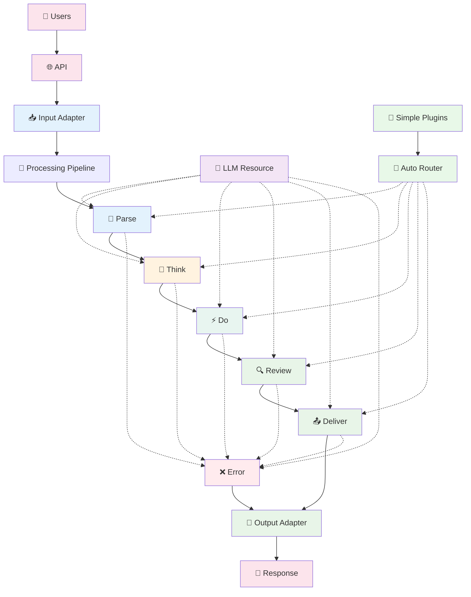

# Entity Pipeline Framework Architecture Summary

## 🎯 Vision
A **pipeline-based plugin framework** for AI agents that processes requests through configurable stages, inspired by Bevy's plugin architecture. **Progressive disclosure design**: dead simple for beginners, infinitely powerful for experts.

**Requires Python 3.11 or higher.**

## 🚀 The 15-Minute Experience (Layer 1: Dead Simple)

### Getting Started - Zero Config
```python
from entity import Agent

# Create an agent in one line
agent = Agent()

# Add functionality with decorators
@agent.plugin
def hello(context):
    return f"Hello {context.user}! How can I help?"

@agent.plugin  
def weather(context):
    if "weather" in context.message:
        return "It's sunny and 72°F today!"

@agent.plugin
def calculator(context):
    if "calculate" in context.message:
        # Built-in tools available automatically
        result = context.calculate("2 + 2")
        return f"The answer is {result}"

# Run the agent
agent.run_http()  # Automatically starts server on localhost:8000
```

The default setup registers a simple `CalculatorTool`, a `SearchTool`, and an
`EchoLLMResource`, so the example above works without any configuration files.

```python
from entity.tools import SearchTool

# Add web search capability
agent.tool_registry.add("search", SearchTool())

@agent.plugin
async def lookup(context):
    result = await context.use_tool("search", query="Entity Pipeline")
    return result
```

### Running the Examples
The example scripts in the `examples` folder can be executed directly from the
repository root. Each script adjusts `sys.path` so the `src` directory is
discoverable:

```bash
python examples/servers/http_server.py
python examples/pipelines/pipeline_example.py
```

### Command Line Usage
Launch an agent from a YAML configuration file. Example configurations are
provided in `config/dev.yaml` and `config/prod.yaml`:

```bash
python src/cli.py --config config/dev.yaml
```

### One-Liner Context Operations
```python
@agent.plugin
def smart_assistant(context):
    # Dead simple context operations
    context.think("Let me analyze this request...")      # Internal reasoning
    context.say("I'm working on that...")                # User-visible response
    
    weather = context.use_tool("weather", city="SF")     # Returns result directly
    context.remember("user_location", "San Francisco")   # Auto-persistence
    
    # Conversation helpers
    if context.is_question():
        return context.ask_llm("Please answer: " + context.message)
    
    return "I understand!"
```

### Instant Plugin Discovery
The pipeline automatically registers plugin classes placed under
`src/pipeline/plugins`. Simply create a new plugin class that inherits from the
appropriate base class and it becomes available when the agent loads.

```python
# Framework auto-discovers plugins by naming convention
# functions must end with `_plugin`
# weather_plugin.py
def weather_plugin(context):
    return get_weather_data()

# calculator_plugin.py  
def calculator_plugin(context):
    return calculate_math(context.message)

# Just drop files in plugins/ folder - they work automatically
agent = Agent.from_directory("./plugins")  # Auto-loads everything
# Import errors are logged and remaining plugins still load
from pipeline import PromptPlugin, PipelineStage

class MyCustomPrompt(PromptPlugin):
    stages = [PipelineStage.THINK]

    async def _execute_impl(self, context):
        return "Hello from my plugin"

agent = Agent.from_package("pipeline.plugins")
agent.run_http()
```

### Multi-Turn and Complex Reasoning Patterns

The framework supports complex reasoning and multi-turn scenarios through explicit mechanisms:

#### **Plugin-Level Iteration for Complex Reasoning**
```python
class ReActPlugin(PromptPlugin):
    stages = [PipelineStage.THINK]
    
    async def _execute_impl(self, context: PluginContext):
        max_steps = self.config.get("max_steps", 5)
        
        # Internal plugin iteration - no pipeline loops needed
        for step in range(max_steps):
            # Think
            thought = await self.call_llm(context, thought_prompt, purpose=f"react_thought_{step}")
            
            # Act (execute tools immediately)
            if self._should_take_action(thought.content):
                action_name, params = self._parse_action_from_thought(thought.content)
                result_key = context.execute_tool(action_name, params)
                # Tool result immediately available
            
            # Decide if done
            if self._should_conclude(thought.content):
                context.set_response(self._extract_final_answer(thought.content))
                return
        
        context.set_response("Reached reasoning limit without conclusion.")
```

#### **Explicit Pipeline Delegation for Multi-Step Workflows**
```python
class MultiStepWorkflowPlugin(PromptPlugin):
    async def _execute_impl(self, context: PluginContext):
        if self._needs_more_processing(context):
            # Explicitly delegate back to pipeline for another pass
            context.set_response({
                "type": "continue_processing",
                "message": "I need to search for more information about X",
                "internal": True,
                "workflow_state": {"step": 2, "data": "..."}
            })

# Agent-level conversation management
class ConversationManager:
    async def process_request(self, user_message: str) -> str:
        response = await execute_pipeline(user_message)
        
        # Handle multi-step workflows
        while response.get("type") == "continue_processing":
            follow_up = response["message"]
            response = await execute_pipeline(follow_up)
        
        return response
```

#### **Multi-Turn Conversations (Application Level)**
```python
# Each user message triggers one pipeline execution
conversation_history = []

for user_message in conversation:
    # Add conversation history to context
    enhanced_request = {
        "message": user_message,
        "history": conversation_history[-10:]  # Last 10 messages
    }
    
    response = await execute_pipeline(enhanced_request)
    conversation_history.append({"user": user_message, "assistant": response})
```

The framework maintains its sophisticated five-stage pipeline underneath the simple interface, automatically routing simple plugins to appropriate stages.

### Detailed Pipeline Execution Model

The pipeline follows a **single-execution pattern** with tools and resources available throughout all stages:

1. **Single Pipeline Execution**: Each request runs through the pipeline once with a guaranteed response
2. **Structured LLM Access**: Any stage can call the LLM when needed with automatic observability
3. **Distributed Tool System**: Any stage can execute tools immediately when needed
4. **Standardized Results**: Explicit result keys with no fallback chains
5. **Plugin-Level Iteration**: Complex reasoning patterns handle iteration internally within plugins
6. **Dynamic Configuration Updates**: Runtime configuration changes without application restart via plugin reconfiguration
7. **Fail-Fast Error Handling**: Plugin failures route to dedicated error stage for user communication
8. **Explicit Multi-Turn Support**: Multi-iteration scenarios handled explicitly through delegation or conversation management

```python
from enum import Enum, auto
from dataclasses import dataclass, field
from typing import Dict, List, Any, Optional
from datetime import datetime

async def execute_pipeline(request):
    """Main pipeline execution with layered context"""
    state = PipelineState(
        conversation=[ConversationEntry(content=str(request), role="user", timestamp=datetime.now())],
        response=None,
        prompt="",
        stage_results={},
        pending_tool_calls=[],
        metadata={},
        pipeline_id=generate_pipeline_id(),
        current_stage=None,
        metrics=MetricsCollector()
    )
    
    registries = SystemRegistries(
        resources=resource_registry,
        tools=tool_registry,
        plugins=plugin_registry
    )
    
    # Single pipeline execution - always produces a response
    await execute_stage(PipelineStage.PARSE, state, registries)
    await execute_stage(PipelineStage.THINK, state, registries)
    await execute_stage(PipelineStage.DO, state, registries)
    await execute_stage(PipelineStage.REVIEW, state, registries)
    await execute_stage(PipelineStage.DELIVER, state, registries)
    
    # Guaranteed response - error stage provides fallback if needed
    return state.response or create_default_response("No response generated", state.pipeline_id)

async def execute_stage(stage: PipelineStage, state: PipelineState, registries: SystemRegistries):
    """Execute a pipeline stage with controlled plugin access"""
    state.current_stage = stage
    
    # Execute plugins with appropriate context layer
    stage_plugins = registries.plugins.get_for_stage(stage)
    for plugin in stage_plugins:
        if isinstance(plugin, AutoGeneratedPlugin):
            # Simple plugins get simple context
            simple_context = SimpleContext(state, registries)
            await plugin.execute(simple_context)
        else:
            # Advanced plugins get full context
            plugin_context = PluginContext(state, registries)
            await plugin.execute(plugin_context)
        
        # Execute pending tools (framework handles this)
        if state.pending_tool_calls:
            tool_results = await execute_pending_tools(state, registries)
            
            # Add tool results to conversation
            for tool_call, result in tool_results.items():
                if isinstance(plugin, AutoGeneratedPlugin):
                    # Simple context handles this automatically
                    pass
                else:
                    # Advanced context gets explicit control
                    plugin_context.add_conversation_entry(
                        content=f"Tool result: {result}",
                        role="system",
                        metadata={"tool_name": tool_call.name, "stage": str(stage)}
                    )
            
            state.pending_tool_calls.clear()

def create_default_response(message: str, pipeline_id: str) -> Dict[str, Any]:
    """Create default response when no plugin sets a response"""
    return {
        "message": message,
        "pipeline_id": pipeline_id,
        "timestamp": datetime.now().isoformat(),
        "type": "default_response"
    }
```


### Progressive Five-Layer Plugin System

The framework maintains the sophisticated five-layer plugin architecture underneath the simple interface, with automatic classification for simple plugins:

#### **Resource Plugins** (Infrastructure - Enables System Function)
- **Database**: PostgreSQL, SQLite connections
- **LLM**: Ollama, OpenAI, Gemini, Claude servers
- **Semantic Memory**: Vector databases, Redis cache
- **Storage**: File systems, cloud storage
- **Logging**: Structured logging, metrics, tracing
- **Monitoring**: Health checks, performance metrics

#### **Tool Plugins** (Functionality - Performs Tasks for Users)
- **Weather**: Get current conditions, forecasts
- **Calculator**: Mathematical computations
- **SearchTool**: Web search, document search
- **File Operations**: Read, write, process files
- **API Integrations**: Slack, email, custom APIs

**Tool Execution Model**: Tools are registered during system initialization as static capabilities and are available throughout all pipeline stages. Any plugin in any stage can execute tools immediately when needed, with results available to subsequent plugins in the same stage or later stages.

#### **Prompt Plugins** (Processing - Controls Request Flow)
- **Strategies**: ReAct, Chain-of-Thought, Direct Response
- **Personality**: Sarcasm, loyalty, wit injection
- **Memory**: Context retrieval and storage
- **Output**: Formatting, validation, filtering
- **Tool Coordination**: Execute tools during processing with immediate access to results

#### **Adapter Plugins** (Input/Output - Interface Handling)
- **Input Adapters**: HTTP, WebSocket, CLI interfaces
- **Output Adapters**: HTTP responses, TTS, formatted output
  - **TTS**: Text-to-speech services

#### **Failure Plugins** (Error Communication - User-Facing Error Handling)
- **Error Formatters**: Convert technical errors to user-friendly messages
- **Error Loggers**: Record failures for debugging and monitoring
- **Notification Systems**: Alert administrators of critical failures

**Note**: Plugin use is discouraged in the error stage to maintain reliability. Keep error stage plugins minimal and ensure static fallback responses are available.

Plugin implementations live in `src/pipeline/plugins/<type>` directories. For example, error-handling plugins are located in `src/pipeline/plugins/failure`.

### Plugin Stage Assignment System

The framework uses **explicit stage assignment** for advanced plugins and **automatic stage assignment** for simple plugins, with base classes serving as organizational categories and framework extension points:

#### **Progressive Stage Assignment**
```python
from abc import ABC, abstractmethod
from enum import Enum, auto

class PipelineStage(Enum):
    PARSE = auto()
    THINK = auto() 
    DO = auto()
    REVIEW = auto()
    DELIVER = auto()
    ERROR = auto()
    
    def __str__(self):
        return self.name.lower()
    
    @classmethod
    def from_str(cls, stage_name: str) -> 'PipelineStage':
        """Convert string to enum with validation"""
        try:
            return cls[stage_name.upper()]
        except KeyError:
            valid_stages = [stage.name.lower() for stage in cls]
            raise ValueError(f"Invalid stage '{stage_name}'. Valid stages: {valid_stages}")

class BasePlugin(ABC):
    stages: List[PipelineStage]  # Explicit for Layer 2-3, auto-assigned for Layer 1
    
    @abstractmethod
    async def execute(self, context):
        pass

class ResourcePlugin(BasePlugin):
    """Organizational category + framework extension point for infrastructure plugins"""
    
    async def health_check(self) -> bool:
        """Framework-provided health monitoring for all resources"""
        return True  # Override for custom health logic
    
    def get_metrics(self) -> Dict[str, Any]:
        """Framework-provided metrics collection"""
        return {"status": "healthy"}

class ToolPlugin(BasePlugin):
    """Organizational category + framework extension point for tool plugins"""
    
    def validate_tool_params(self, params: Dict) -> bool:
        """Framework-provided validation for all tools"""
        return self._validate_required_params(params)
    
    async def execute_with_timeout(self, context, timeout=30):
        """Framework-provided timeout wrapper for all tools"""
        return await asyncio.wait_for(self.execute(context), timeout=timeout)

class PromptPlugin(BasePlugin):
    """Organizational category + framework extension point for processing plugins"""
    
    def get_token_usage(self) -> int:
        """Framework-provided token tracking for all prompt plugins"""
        return getattr(self, '_token_count', 0)

class AdapterPlugin(BasePlugin):
    """Organizational category + framework extension point for input/output plugins"""
    pass

class FailurePlugin(BasePlugin):
    """Organizational category + framework extension point for error handling plugins"""
    pass
```

#### **Layer 1: Function-Based Plugins (Auto-Classified)**
```python
# Framework automatically determines plugin type and stage placement
@agent.plugin
def weather_check(context):
    """Auto-classified as ToolPlugin, auto-routed to DO stage"""
    return get_weather()

@agent.plugin(stage="think")  # Optional explicit control
def reasoning_plugin(context):
    """Auto-classified as PromptPlugin, explicit stage assignment"""
    context.think("Analyzing the request...")

@agent.plugin(priority=10)  # Optional execution order
def high_priority_plugin(context):
    """Runs early in its stage"""
    pass

# Framework automatically generates appropriate plugin class:
class AutoGeneratedWeatherPlugin(ToolPlugin):
    stages = [PipelineStage.DO]  # Auto-determined
    priority = 50  # Default
    
    async def execute(self, context):
        return weather_check(context)  # Wraps user function
```

#### **Layer 2: Class-Based Plugins (Explicit Control)**
```python
class WeatherToolPlugin(ToolPlugin):
    stages = [PipelineStage.DO]  # Default to DO stage for tools
    priority = 50  # Default execution order
    dependencies = []  # Auto-detected from usage
    
    async def execute(self, context):
        if "weather" in context.message:
            weather = await self.get_weather(context.location)
            context.set_response(f"Weather: {weather}")
    
    async def get_weather(self, location):
        # Implementation details
        pass

class DatabaseResourcePlugin(ResourcePlugin):
    stages = [PipelineStage.PARSE, PipelineStage.THINK, 
             PipelineStage.DO, PipelineStage.REVIEW, 
             PipelineStage.DELIVER, PipelineStage.ERROR]  # Available in all stages

class ChainOfThoughtPromptPlugin(PromptPlugin):
    stages = [PipelineStage.THINK]  # Main processing stage

class HTTPAdapterPlugin(AdapterPlugin):
    stages = [PipelineStage.PARSE, PipelineStage.DELIVER]  # Interface boundaries

class ErrorFormatterFailurePlugin(FailurePlugin):
    stages = [PipelineStage.ERROR]  # Dedicated error handling stage
```

#### **Layer 3: Advanced Plugins (Full Sophisticated Control)**
```python
class ChainOfThoughtPlugin(PromptPlugin):
    # Full control over pipeline behavior
    stages = [PipelineStage.THINK]
    dependencies = ["database", "llm"]
    priority = 10
    
    async def execute(self, context):
        # Full sophisticated pipeline access
        conversation_text = self._get_conversation_text(context.get_conversation_history())
        
        # Step-by-step reasoning with full control
        reasoning_steps = []
        for step in range(self.config.get("max_steps", 5)):
            reasoning_prompt = f"Reason through step {step + 1}: {conversation_text}"
            reasoning = await self.call_llm(context, reasoning_prompt, purpose=f"reasoning_step_{step + 1}")
            reasoning_steps.append(reasoning.content)
            
            context.add_conversation_entry(
                content=f"Reasoning step {step + 1}: {reasoning.content}",
                role="assistant",
                metadata={"reasoning_step": step + 1}
            )
            
            if self._needs_tools(reasoning.content):
                result_key = context.execute_tool(
                    "analysis_tool",
                    {"data": conversation_text, "reasoning_step": reasoning.content}
                )
            
            if "final answer" in reasoning.content.lower():
                break
        
        context.set_stage_result("reasoning_complete", True)
        context.set_stage_result("reasoning_steps", reasoning_steps)
    
    def _needs_tools(self, reasoning_text: str) -> bool:
        tool_indicators = ["need to calculate", "should look up", "requires analysis"]
        return any(indicator in reasoning_text.lower() for indicator in tool_indicators)
    
    def _get_conversation_text(self, conversation: List[ConversationEntry]) -> str:
        user_entries = [entry.content for entry in conversation if entry.role == "user"]
        return user_entries[-1] if user_entries else ""
```

#### **Stage Registration Process**
```python
def register_plugin_for_stages(plugin_instance, plugin_name):
    """Register plugin for stages defined in plugin class"""
    for stage in plugin_instance.stages:
        plugin_registry.register_plugin_for_stage(plugin_instance, stage, plugin_name)
```

### Error Handling and Failure Recovery

The framework implements a **fail-fast error handling strategy** with dedicated failure communication:

#### **Failure Information Structure**
```python
@dataclass
class FailureInfo:
    stage: str                    # Stage where failure occurred
    plugin_name: str              # Plugin that caused the failure
    error_type: str               # "plugin_error", "tool_error", "system_error"
    error_message: str            # Human-readable error description
    original_exception: Exception # Original exception for debugging
    context_snapshot: Dict[str, Any] = None  # Context state when failure occurred
    timestamp: datetime = field(default_factory=datetime.now)
```

#### **Error Handling Flow**
1. **Plugin Failures**: Caught during stage execution, added to context, routed to error stage
2. **Tool Failures**: Captured in tool results, detected after tool execution, routed to error stage  
3. **System Failures**: Unexpected exceptions caught at pipeline level, routed to error stage
4. **Error Stage**: Processes all failures through dedicated plugins for user communication
5. **Static Fallback**: If error stage plugins fail, return static error response

#### **Progressive Error Handling**
```python
# Layer 1: Automatic error handling for simple plugins
@agent.plugin
def might_fail(context):
    result = risky_operation()  # Framework automatically catches and handles errors
    return result

# Layer 2-3: Full error control for advanced plugins
class AdvancedPlugin(Plugin):
    async def execute(self, context):
        try:
            # Complex operation
            pass
        except Exception as e:
            context.add_failure(FailureInfo(
                stage=str(context.current_stage),
                plugin_name=self.__class__.__name__,
                error_type="plugin_error",
                error_message=str(e),
                original_exception=e
            ))
```

#### **Tool Retry Configuration**
```python
class ToolPlugin(BasePlugin):
    stages: List[PipelineStage]  # Must be explicitly defined
    
    def __init__(self, config: Dict):
        self.max_retries = config.get("max_retries", 1)  # Default sensible retry count
        self.retry_delay = config.get("retry_delay", 1.0)  # Seconds between retries
    
    async def execute_function_with_retry(self, params: Dict) -> str:
        """Execute tool function with configured retry logic"""
        for attempt in range(self.max_retries + 1):
            try:
                return await self.execute_function(params)
            except Exception as e:
                if attempt == self.max_retries:
                    raise e  # Final attempt failed
                await asyncio.sleep(self.retry_delay)
        
    async def execute_function(self, params: Dict) -> str:
        """Override this method in tool implementations"""
        raise NotImplementedError("Tool plugins must implement execute_function")
```

#### **Static Error Fallback**
```python
# Used when error stage plugins themselves fail
STATIC_ERROR_RESPONSE = {
    "error": "System error occurred",
    "message": "An unexpected error prevented processing your request. Please try again or contact support.",
    "error_id": None,  # Will be populated with pipeline_id
    "timestamp": None,  # Will be populated with current time
    "type": "static_fallback"
}

def create_static_error_response(pipeline_id: str) -> Dict[str, Any]:
    """Create fallback error response when error stage fails"""
    response = STATIC_ERROR_RESPONSE.copy()
    response["error_id"] = pipeline_id
    response["timestamp"] = datetime.now().isoformat()
    return response
```

### Context and Data Structures

The framework uses a **layered context architecture** with controlled access to ensure clean separation between plugin interfaces and internal pipeline state:

#### **Three-Layer Context System**

```python
@dataclass
class ConversationEntry:
    content: str
    role: str  # "user", "assistant", "system"
    timestamp: datetime
    metadata: Dict[str, Any] = field(default_factory=dict)

@dataclass
class ToolCall:
    name: str
    params: Dict[str, Any]
    result_key: str
    source: str  # "static" | "dynamic" | "llm_generated"

# Layer 1: Internal Pipeline State (Framework Only)
class PipelineState:
    """Internal state - plugins never see this directly"""
    conversation: List[ConversationEntry]
    response: Any
    prompt: str
    stage_results: Dict[str, Any]
    pending_tool_calls: List[ToolCall]
    metadata: Dict[str, Any]  # Used for plugin state persistence within single pipeline execution
    pipeline_id: str
    current_stage: Optional[PipelineStage]
    metrics: MetricsCollector
    failure_info: Optional[FailureInfo] = None

# Layer 2: Plugin Interface (What Plugins See)
class PluginContext:
    """Clean, controlled interface for plugins"""
    
    def __init__(self, state: PipelineState, registries: SystemRegistries):
        self._state = state  # Private - plugins can't access directly
        self._registries = registries
    
    # Read-only system info
    @property
    def pipeline_id(self) -> str:
        return self._state.pipeline_id
    
    @property
    def current_stage(self) -> PipelineStage:
        return self._state.current_stage
    
    # Controlled resource access
    def get_resource(self, name: str):
        """Access system resources (LLM, database, etc.)"""
        return self._registries.resources.get(name)
    
    def execute_tool(self, tool_name: str, params: Dict[str, Any], result_key: str = None) -> str:
        """Execute a tool immediately and return result key"""
        tool = self._registries.tools.get(tool_name)
        if not tool:
            raise ValueError(f"Tool '{tool_name}' not found")
        
        if result_key is None:
            result_key = f"{tool_name}_result_{len(self._state.pending_tool_calls)}"
        
        tool_call = ToolCall(
            name=tool_name,
            params=params,
            result_key=result_key,
            source="direct_execution"
        )
        self._state.pending_tool_calls.append(tool_call)
        return result_key
    
    # Controlled conversation access
    def add_conversation_entry(self, content: str, role: str, metadata: Dict = None):
        """Add entry to conversation history"""
        entry = ConversationEntry(
            content=content,
            role=role,
            timestamp=datetime.now(),
            metadata=metadata or {}
        )
        self._state.conversation.append(entry)
    
    def get_conversation_history(self, last_n: int = None) -> List[ConversationEntry]:
        """Get read-only access to conversation history"""
        if last_n is None:
            return self._state.conversation.copy()  # Defensive copy
        return self._state.conversation[-last_n:].copy()
    
    # Response control - only one plugin can set
    def set_response(self, response: Any):
        """Set the final response (can only be set once)"""
        if self._state.response is not None:
            raise ValueError(f"Response already set by another plugin")
        self._state.response = response
    
    def has_response(self) -> bool:
        """Check if response has been set"""
        return self._state.response is not None
    
    # Stage results with validation
    def set_stage_result(self, key: str, value: Any):
        """Set a stage result (can only be set once per key)"""
        if key in self._state.stage_results:
            raise ValueError(f"Stage result '{key}' already set by another plugin")
        self._state.stage_results[key] = value
    
    def get_stage_result(self, key: str) -> Any:
        """Get a stage result (raises if not available)"""
        if key not in self._state.stage_results:
            raise KeyError(f"Required result '{key}' not available")
        return self._state.stage_results[key]
    
    def has_stage_result(self, key: str) -> bool:
        """Check if stage result exists"""
        return key in self._state.stage_results
    
    # Plugin metadata access
    def get_metadata(self, key: str, default: Any = None) -> Any:
        """Get plugin metadata for state persistence"""
        return self._state.metadata.get(key, default)
    
    def set_metadata(self, key: str, value: Any):
        """Set plugin metadata for state persistence"""
        self._state.metadata[key] = value
    
    # Error handling
    def add_failure(self, failure: FailureInfo):
        """Add failure information for error stage routing"""
        self._state.failure_info = failure

# Layer 3: Framework Execution (Internal)
@dataclass
class SystemRegistries:
    """Container for all system registries"""
    resources: ResourceRegistry
    tools: ToolRegistry
    plugins: PluginRegistry
```

### Automatic Plugin Classification and Routing

The framework automatically classifies simple plugins and routes them appropriately:

```python
class PluginAutoClassifier:
    @staticmethod
    def classify_and_route(plugin_func, user_hints=None):
        """Automatically determine plugin type and stage from function analysis"""
        
        # Analyze function for automatic classification
        source = inspect.getsource(plugin_func)
        
        # Smart defaults based on content analysis
        if any(keyword in source for keyword in ["return", "response", "answer"]):
            stage = PipelineStage.DO  # Likely produces output
            plugin_type = ToolPlugin if "tool" in source or "use_tool" in source else PromptPlugin
        elif any(keyword in source for keyword in ["think", "reason", "analyze"]):
            stage = PipelineStage.THINK  # Likely reasoning
            plugin_type = PromptPlugin
        elif any(keyword in source for keyword in ["parse", "validate", "check"]):
            stage = PipelineStage.PARSE  # Likely input processing
            plugin_type = AdapterPlugin
        else:
            stage = PipelineStage.DO  # Safe default
            plugin_type = ToolPlugin
        
        # User hints override automatic detection
        if user_hints and "stage" in user_hints:
            stage = PipelineStage.from_str(user_hints["stage"])
        
        # Generate full plugin class with appropriate base class
        return AutoGeneratedPlugin(
            func=plugin_func,
            stages=[stage],
            priority=user_hints.get("priority", 50),
            name=plugin_func.__name__,
            base_class=plugin_type
        )

class AutoGeneratedPlugin(BasePlugin):
    def __init__(self, func, stages, priority, name, base_class):
        self.func = func
        self.stages = stages
        self.priority = priority
        self.name = name
        self.__class__.__bases__ = (base_class,)  # Dynamic inheritance
    
    async def execute(self, context):
        # Handle both sync and async functions
        if asyncio.iscoroutinefunction(self.func):
            result = await self.func(context)
        else:
            result = self.func(context)
        
        # Auto-set response if function returns a string
        if isinstance(result, str) and not context.has_response():
            context.set_response(result)
```reason", "analyze"]):
            stage = PipelineStage.THINK  # Likely reasoning
        elif any(keyword in source for keyword in ["parse", "validate", "check"]):
            stage = PipelineStage.PARSE  # Likely input processing
        else:
            stage = PipelineStage.DO  # Safe default
        
        # User hints override automatic detection
        if user_hints and "stage" in user_hints:
            stage = PipelineStage.from_str(user_hints["stage"])
        
        # Generate full plugin class
        return AutoGeneratedPlugin(
            func=plugin_func,
            stages=[stage],
            priority=user_hints.get("priority", 50),
            name=plugin_func.__name__
        )

class AutoGeneratedPlugin(Plugin):
    def __init__(self, func, stages, priority, name):
        self.func = func
        self.stages = stages
        self.priority = priority
        self.name = name
    
    async def execute(self, context):
        # Handle both sync and async functions
        if asyncio.iscoroutinefunction(self.func):
            result = await self.func(context)
        else:
            result = self.func(context)
        
        # Auto-set response if function returns a string
        if isinstance(result, str) and not context.has_response():
            context.set_response(result)
```

### Tool Execution (Available Throughout Pipeline)
```python
async def execute_pending_tools(state: PipelineState, registries: SystemRegistries) -> Dict[str, Any]:
    """Execute tools immediately when requested by any plugin"""
    results = {}
    
    for tool_call in state.pending_tool_calls:
        try:
            tool_plugin = registries.tools.get(tool_call.name)
            
            # Use retry logic if configured
            if hasattr(tool_plugin, 'execute_function_with_retry'):
                result = await tool_plugin.execute_function_with_retry(tool_call.params)
            else:
                result = await tool_plugin.execute_function(tool_call.params)
            
            results[tool_call.result_key] = result
            
            # Centralized logging for debugging regardless of execution location
            state.metrics.record_tool_execution(
                tool_name=tool_call.name,
                stage=str(state.current_stage),
                pipeline_id=state.pipeline_id,
                result_key=tool_call.result_key,
                source=tool_call.source
            )
            
        except Exception as e:
            results[tool_call.result_key] = f"Error: {e}"
            state.metrics.record_tool_error(
                tool_name=tool_call.name,
                stage=str(state.current_stage),
                pipeline_id=state.pipeline_id,
                error=str(e)
            )
    
    return results
```

### Plugin Observability & Logging
```python
class BasePlugin:
    def __init__(self):
        self.logger = None  # Injected during initialization
        
    async def execute(self, context):
        # Automatic logging with pipeline ID and stage
        self.logger.info(
            "Plugin execution started",
            plugin=self.__class__.__name__,
            pipeline_id=context.pipeline_id,
            stage=str(context.current_stage)
        )
        
        start_time = time.time()
        try:
            result = await self._execute_impl(context)
            
            # Automatic metrics collection
            if hasattr(context, '_state'):
                context._state.metrics.record_plugin_duration(
                    plugin=self.__class__.__name__,
                    stage=str(context.current_stage),
                    duration=time.time() - start_time
                )
            
            return result
        except Exception as e:
            self.logger.error(
                "Plugin execution failed",
                plugin=self.__class__.__name__,
                pipeline_id=context.pipeline_id,
                stage=str(context.current_stage),
                error=str(e),
                exc_info=True
            )
            raise
    
    async def call_llm(self, context, prompt: str, purpose: str) -> LLMResponse:
        """Structured LLM access with automatic logging and metrics"""
        llm = context.get_llm()  # previously context.get_resource("ollama")
        
        # Enhanced observability
        if hasattr(context, '_state'):
            context._state.metrics.record_llm_call(
                plugin=self.__class__.__name__,
                stage=str(context.current_stage),
                purpose=purpose
            )
        
        start_time = time.time()
        response = await llm.generate(prompt)
        
        # Log with purpose for better debugging
        self.logger.info(
            "LLM call completed",
            plugin=self.__class__.__name__,
            stage=str(context.current_stage),
            purpose=purpose,
            prompt_length=len(prompt),
            response_length=len(response.content),
            duration=time.time() - start_time,
            pipeline_id=context.pipeline_id
        )
        
        return response
    
    # Layer 1: Simple plugins get automatic implementation
    async def _execute_impl(self, context):
        """Override this method in plugin implementations"""
        pass
```

### Plugin Validation System
```python
class ValidationResult:
    success: bool
    error_message: str = None
    warnings: List[str] = []

@dataclass
class ReconfigResult:
    success: bool
    error_message: str = None
    requires_restart: bool = False
    warnings: List[str] = []

class BasePlugin:
    dependencies = []  # List of registry keys that this plugin depends on
    stages: List[PipelineStage]  # Always explicit, always required
    
    @classmethod
    def validate_config(cls, config: Dict) -> ValidationResult:
        """Pure configuration validation - no external dependencies"""
        return ValidationResult(success=True)
    
    @classmethod
    def validate_dependencies(cls, registry) -> ValidationResult:
        """Dependency validation - checks that declared dependencies exist in registry"""
        for dep in cls.dependencies:
            if not registry.has_plugin(dep):
                available = registry.list_plugins()
                return ValidationResult(
                    success=False,
                    error_message=f"{cls.__name__} requires '{dep}' but it's not registered. Available: {available}"
                )
        
        return ValidationResult(success=True)
    
    def supports_runtime_reconfiguration(self) -> bool:
        """Can this plugin be reconfigured without restart?"""
        return True  # Override in plugins that can't handle runtime reconfiguration
    
    async def reconfigure(self, new_config: Dict) -> ReconfigResult:
        """Update plugin configuration at runtime"""
        validation_result = self.validate_config(new_config)
        if not validation_result.success:
            return ReconfigResult(
                success=False,
                error_message=f"Configuration validation failed: {validation_result.error_message}"
            )
        
        if not self.supports_runtime_reconfiguration():
            return ReconfigResult(
                success=False,
                requires_restart=True,
                error_message="This plugin requires application restart for configuration changes"
            )
        
        try:
            old_config = self.config
            self.config = new_config
            await self._handle_reconfiguration(old_config, new_config)
            return ReconfigResult(success=True)
        except Exception as e:
            self.config = old_config
            return ReconfigResult(
                success=False,
                error_message=f"Reconfiguration failed: {str(e)}"
            )
    
    async def _handle_reconfiguration(self, old_config: Dict, new_config: Dict):
        """Override this method to handle configuration changes"""
        pass  # Default: no special handling needed
```

### Plugin Capabilities
- **Read/Write Context**: Plugins can modify conversation and response through controlled interface
- **Resource Access**: `context.get_resource("llm")` - request what you need with validation
- **Tool Access**: `context.execute_tool("name", params)` - execute tools when needed with immediate results
- **Short Circuit**: Skip remaining pipeline stages by setting `context.set_response()`
- **Plugin-Level Iteration**: Handle complex reasoning patterns with internal loops
- **Pipeline Delegation**: Explicitly request additional pipeline passes for multi-step workflows
- **Dynamic Reconfiguration**: Update configuration at runtime via `reconfigure()` method with cascading dependency notifications
- **Immediate Tool Execution**: Execute tools in any stage with immediate access to results
- **Structured LLM Access**: Any plugin can call the LLM resource with automatic observability via `self.call_llm()`
- **Standardized Results**: Set and get standardized results with explicit dependencies via controlled interface
- **Error Signaling**: Add failure information with `context.add_failure()` to route to error stage
- **Tool Retry Logic**: Configure retry behavior for individual tools with `max_retries` and `retry_delay`
- **Stage Awareness**: Access current execution stage with `context.current_stage` property
- **Controlled Access**: Clean interface prevents accidental system state corruption
- **Metadata Persistence**: Store plugin state across single pipeline execution via `context.get_metadata()` and `context.set_metadata()`

#### **Layer 1: Simple Context (Beginner-Friendly)**
```python
class SimpleContext:
    """Dead simple interface that hides complexity"""
    
    # Properties that just work
    @property
    def message(self) -> str:
        """The user's message"""
        return self._get_latest_user_message()
    
    @property  
    def user(self) -> str:
        """The user's name"""
        return self._get_user_name()
    
    @property
    def location(self) -> str:
        """User's location if available"""
        return self._get_user_location()
    
    # One-liner operations
    def say(self, message: str):
        """Send a message to the user"""
        self.set_response(message)
    
    def think(self, thought: str):
        """Internal reasoning (logged but not shown to user)"""
        self._add_internal_thought(thought)
    
    def use_tool(self, tool_name: str, **params):
        """Execute a tool and return the result immediately"""
        result_key = self.execute_tool(tool_name, params)
        return self._get_tool_result(result_key)  # Blocks until available
    
    def remember(self, key: str, value: Any):
        """Store something in memory"""
        self.set_metadata(f"memory_{key}", value)
    
    def recall(self, key: str, default=None):
        """Retrieve something from memory"""
        return self.get_metadata(f"memory_{key}", default)
    
    def ask_llm(self, prompt: str) -> str:
        """Ask the LLM a question and get response"""
        llm = self.get_resource("llm")
        response = asyncio.run(llm.generate(prompt))  # Handle async automatically
        return response.content
    
    def calculate(self, expression: str):
        """Built-in calculator"""
        return self.use_tool("calculator", expression=expression)
    
    # Convenience methods
    def is_question(self) -> bool:
        """Check if user message is a question"""
        return self.message.strip().endswith('?')
    
    def contains(self, *keywords) -> bool:
        """Check if message contains any keywords"""
        return any(keyword.lower() in self.message.lower() for keyword in keywords)
```

#### **Layer 2-3: Full Context (Advanced)**
The complete `PluginContext` from the original architecture remains available for advanced users who need full pipeline control.

### Four-Phase System Initialization
```python
class SystemInitializer:
    @classmethod
    def from_yaml(cls, yaml_path: str) -> 'SystemInitializer':
        """Load entire system configuration from single YAML file"""
        with open(yaml_path, 'r') as file:
            yaml_content = file.read()
        
        config = cls._interpolate_env_vars(yaml.safe_load(yaml_content))
        return cls(config)

    def initialize(self):
        with initialization_cleanup_context():
            # Phase 1: Register all plugin classes and extract dependency graph
            registry = ClassRegistry()
            dependency_graph = {}
            
            for plugin_type in ["resources", "tools", "adapters", "prompts"]:
                for plugin_name, plugin_config in self.config["plugins"].get(plugin_type, {}).items():
                    plugin_class = import_plugin_class(plugin_config.get("type", plugin_name))
                    registry.register_class(plugin_class, plugin_config, plugin_name)
                    dependency_graph[plugin_name] = plugin_class.dependencies
            
            # Phase 2: Validate dependencies and config
            self._validate_dependency_graph(registry, dependency_graph)
            
            for plugin_class, config in registry.all_plugin_classes():
                config_result = plugin_class.validate_config(config)
                if not config_result.success:
                    raise SystemError(f"Config validation failed for {plugin_class.__name__}: {config_result.error_message}")
            
            # Phase 3: Initialize resources and tools
            resource_registry = ResourceRegistry()
            tool_registry = ToolRegistry()
            
            for resource_class, config in registry.resource_classes():
                instance = resource_class(config)
                await instance.initialize()
                resource_registry.add_resource(instance)
            
            for tool_class, config in registry.tool_classes():
                instance = tool_class(config)
                tool_registry.add_tool(instance)
            
            # Phase 4: Instantiate remaining plugins
            plugin_registry = PluginRegistry()
            for plugin_class, config in registry.non_resource_non_tool_classes():
                instance = plugin_class(config)
                plugin_registry.add_plugin(instance)
            
            return plugin_registry, resource_registry, tool_registry

    def _validate_dependency_graph(self, registry, dep_graph: Dict[str, List[str]]):
        """Validate dependency graph: check existence and detect circular dependencies"""
        # Check all dependencies exist
        for plugin_name, dependencies in dep_graph.items():
            for dep in dependencies:
                if not registry.has_plugin(dep):
                    available = registry.list_plugins()
                    raise SystemError(f"Plugin '{plugin_name}' requires '{dep}' but it's not registered. Available: {available}")
        
        # Detect circular dependencies using topological sort
        in_degree = {node: 0 for node in dep_graph}
        for node in dep_graph:
            for neighbor in dep_graph[node]:
                if neighbor in in_degree:
                    in_degree[neighbor] += 1
        
        queue = [node for node, degree in in_degree.items() if degree == 0]
        processed = []
        
        while queue:
            current = queue.pop(0)
            processed.append(current)
            
            for neighbor in dep_graph[current]:
                if neighbor in in_degree:
                    in_degree[neighbor] -= 1
                    if in_degree[neighbor] == 0:
                        queue.append(neighbor)
        
        if len(processed) != len(in_degree):
            cycle_nodes = [node for node in in_degree if node not in processed]
            raise SystemError(f"Circular dependency detected involving: {cycle_nodes}")
    
    @staticmethod
    def _interpolate_env_vars(config: Any) -> Any:
        """Recursively interpolate environment variables in configuration"""
        if isinstance(config, dict):
            return {k: SystemInitializer._interpolate_env_vars(v) for k, v in config.items()}
        elif isinstance(config, list):
            return [SystemInitializer._interpolate_env_vars(item) for item in config]
        elif isinstance(config, str) and config.startswith("${") and config.endswith("}"):
            env_var = config[2:-1]
            value = os.environ.get(env_var)
            if value is None:
                raise EnvironmentError(f"Required environment variable {env_var} not found")
            return value
        else:
            return config
```

## 🔌 Plugin Examples (Complete Implementations)

### Chain of Thought with Controlled Context
```python
class ChainOfThoughtPlugin(PromptPlugin):
    dependencies = ["database", "logging", "llm"]
    stages = [PipelineStage.THINK]
    
    async def _execute_impl(self, context: PluginContext):
        if not self.config.get("enable_reasoning", True):
            return
            
        # Get clean conversation history through controlled interface
        conversation_text = self._get_conversation_text(context.get_conversation_history())
        
        # Step 1: Break down the problem
        breakdown_prompt = f"Break this problem into logical steps: {conversation_text}"
        breakdown = await self.call_llm(context, breakdown_prompt, purpose="problem_breakdown")
        
        # Add reasoning to conversation through controlled interface
        context.add_conversation_entry(
            content=f"Problem breakdown: {breakdown.content}",
            role="assistant",
            metadata={"reasoning_step": "breakdown"}
        )
        
        # Step 2: Reason through each step
        reasoning_steps = []
        for step_num in range(self.config.get("max_steps", 5)):
            reasoning_prompt = f"Reason through step {step_num + 1} of solving: {conversation_text}"
            reasoning = await self.call_llm(context, reasoning_prompt, purpose=f"reasoning_step_{step_num + 1}")
            reasoning_steps.append(reasoning.content)
            
            context.add_conversation_entry(
                content=f"Reasoning step {step_num + 1}: {reasoning.content}",
                role="assistant",
                metadata={"reasoning_step": step_num + 1}
            )
            
            # Execute tools immediately if needed
            if self._needs_tools(reasoning.content):
                result_key = context.execute_tool(
                    "analysis_tool",
                    {"data": conversation_text, "reasoning_step": reasoning.content}
                )
                
            if "final answer" in reasoning.content.lower():
                break
        
        # Set results through controlled interface
        context.set_stage_result("reasoning_complete", True)
        context.set_stage_result("reasoning_steps", reasoning_steps)
    
    def _needs_tools(self, reasoning_text: str) -> bool:
        tool_indicators = ["need to calculate", "should look up", "requires analysis"]
        return any(indicator in reasoning_text.lower() for indicator in tool_indicators)
    
    def _get_conversation_text(self, conversation: List[ConversationEntry]) -> str:
        user_entries = [entry.content for entry in conversation if entry.role == "user"]
        return user_entries[-1] if user_entries else ""
```

### ReAct Plugin with Controlled Access
```python
class ReActPlugin(PromptPlugin):
    dependencies = ["llm"]
    stages = [PipelineStage.THINK]
    
    async def _execute_impl(self, context: PluginContext):
        max_steps = self.config.get("max_steps", 5)
        
        # Get user question through controlled interface
        conversation = context.get_conversation_history()
        user_messages = [entry.content for entry in conversation if entry.role == "user"]
        question = user_messages[-1] if user_messages else "No question provided"
        
        # ReAct loop with controlled context access
        for step in range(max_steps):
            step_context = self._build_step_context(context.get_conversation_history(), question)
            
            # Thought
            thought_prompt = f"Think step by step about this problem:\n\nContext: {step_context}\n\nWhat should I think about next?"
            thought = await self.call_llm(context, thought_prompt, purpose=f"react_thought_step_{step}")
            
            context.add_conversation_entry(
                content=f"Thought: {thought.content}",
                role="assistant",
                metadata={"react_step": step, "type": "thought"}
            )
            
            # Action decision
            action_prompt = f"Based on my thought: \"{thought.content}\"\n\nShould I:\n1. Take an action (specify: search, calculate, etc.)\n2. Give a final answer\n\nRespond with either \"Action: <action_name> <parameters>\" or \"Final Answer: <answer>\""
            action_decision = await self.call_llm(context, action_prompt, purpose=f"react_action_step_{step}")
            
            if action_decision.content.startswith("Final Answer:"):
                final_answer = action_decision.content.replace("Final Answer:", "").strip()
                context.set_response(final_answer)
                return
            
            elif action_decision.content.startswith("Action:"):
                action_text = action_decision.content.replace("Action:", "").strip()
                action_name, params = self._parse_action(action_text)
                
                context.add_conversation_entry(
                    content=f"Action: {action_text}",
                    role="assistant",
                    metadata={"react_step": step, "type": "action"}
                )
                
                # Execute tool through controlled interface
                result_key = context.execute_tool(action_name, params)
        
        context.set_response("I've reached my reasoning limit without finding a definitive answer.")
    
    def _build_step_context(self, conversation: List[ConversationEntry], question: str) -> str:
        context_parts = [f"Question: {question}"]
        
        recent_entries = conversation[-10:]
        for entry in recent_entries:
            if entry.role == "assistant" and entry.metadata.get("type") in ["thought", "action"]:
                context_parts.append(f"{entry.content}")
            elif entry.role == "system" and "Tool result:" in entry.content:
                context_parts.append(f"Observation: {entry.content.replace('Tool result: ', '')}")
        
        return "\n".join(context_parts)
    
    def _parse_action(self, action_text: str) -> Tuple[str, Dict[str, Any]]:
        parts = action_text.split(" ", 1)
        if len(parts) < 2:
            return "search_tool", {"query": action_text}
        
        action_name = parts[0].lower()
        params_text = parts[1]
        
        if action_name == "search":
            return "search_tool", {"query": params_text}
        elif action_name == "calculate":
            return "calculator_tool", {"expression": params_text}
        else:
            return "search_tool", {"query": action_text}
```

### Simple Plugin Examples (Auto-Generated)
```python
# Layer 1: Dead simple examples that auto-generate sophisticated plugins

@agent.plugin
def weather_helper(context):
    """Auto-classified as ToolPlugin, routed to DO stage"""
    if context.contains("weather"):
        location = context.extract_location() or "San Francisco"
        weather = context.use_tool("weather_api", city=location)
        return f"The weather in {location} is {weather}"

@agent.plugin
def smart_calculator(context):
    """Auto-classified as ToolPlugin, routed to DO stage"""
    if context.contains("calculate", "math", "compute"):
        expression = context.extract_math_expression()
        result = context.calculate(expression)
        return f"The answer is {result}"

@agent.plugin(stage="think")
def simple_reasoning(context):
    """Auto-classified as PromptPlugin, explicit stage assignment"""
    context.think("Let me analyze this request step by step...")
    
    if context.is_question():
        analysis = context.ask_llm(f"Analyze this question: {context.message}")
        context.think(f"Analysis: {analysis}")
    
    return "I've analyzed your request and I'm ready to help!"
```
The following YAML mirrors the sample in `config/prod.yaml` and shows all plugin
sections:
```yaml
entity:
  entity_id: "jade"
  name: "Jade"
  server:
    host: "0.0.0.0"
    port: 8000
    reload: false
    log_level: "info"

plugins:
  resources:
    database:
      type: postgres
      host: "192.168.1.104"
      port: 5432
      name: "memory"
      username: "${DB_USERNAME}"
      password: "${DB_PASSWORD}"
      db_schema: "entity"
      history_table: "chat_history"
      min_pool_size: 2
      max_pool_size: 10
      init_on_startup: true
    
    llm:
      provider: ollama
      base_url: "http://192.168.1.110:11434"
      model: "llama3:8b-instruct-q6_K"
      temperature: 0.7
      top_p: 0.9
      top_k: 40
      repeat_penalty: 1.1
    
    logging:
      type: structured_logging
      level: "DEBUG"
      format: "%(asctime)s - %(name)s - %(levelname)s - %(message)s"
      file_enabled: true
      file_path: "logs/entity.log"
      max_file_size: 10485760
      backup_count: 5
  
  tools:
    weather:
      type: weather_api
      api_key: "${WEATHER_API_KEY}"
      base_url: "https://api.weather.com"
      timeout: 30
      max_retries: 3
      retry_delay: 2.0
    
    calculator:
      type: calculator
      precision: 10
      max_retries: 1
  
  adapters:
    tts:
      type: speech_synthesis
      base_url: "http://192.168.1.110:8888"
      voice_name: "bf_emma"
      output_format: "wav"
      speed: 0.3
  
  prompts:
    chain_of_thought:
      type: chain_of_thought
      enable_reasoning: true
      max_steps: 5
    
    memory_retrieval:
      type: memory_retrieval
      max_context_length: 4000
      similarity_threshold: 0.7
    
    intent_classifier:
      type: intent_classifier
      confidence_threshold: 0.8
```

### Plugin Configuration Examples

#### WeatherApiTool
Queries an external weather service. Defaults assume `https://api.weather.com`
with a 30 second timeout and automatic retries.

```yaml
plugins:
  tools:
    weather:
      type: weather_api
      api_key: "${WEATHER_API_KEY}"
      base_url: "https://api.weather.com"
      timeout: 30
      max_retries: 3
      retry_delay: 2.0
```

#### StructuredLogging
Captures logs as JSON and rotates files when they exceed 10 MB. Logging is
enabled by default at the `DEBUG` level.

```yaml
plugins:
  resources:
    logging:
      type: structured_logging
      level: "DEBUG"
      format: "%(asctime)s - %(name)s - %(levelname)s - %(message)s"
      file_enabled: true
      file_path: "logs/entity.log"
      max_file_size: 10485760
      backup_count: 5
```

#### MemoryRetrievalPrompt
Injects relevant history into prompts. By default it retrieves up to 4000
characters and uses a similarity threshold of 0.7.

```yaml
plugins:
  prompts:
    memory_retrieval:
      type: memory_retrieval
      max_context_length: 4000
      similarity_threshold: 0.7
```

#### **Zero-Config Getting Started**
```python
# This just works out of the box
agent = Agent()  # Automatically configures sensible defaults

# Equivalent to this full configuration:
agent = Agent({
    "llm": {
        "provider": "ollama",
        "base_url": "http://localhost:11434",
        "model": "llama3",
    },
    "database": "sqlite://memory.db",           # Auto-creates local storage
    "logging": "console",                       # Simple console logging
    "server": {"host": "localhost", "port": 8000},
})
```

#### **Progressive Configuration**
```python
# Layer 1: Dead simple
agent = Agent()

# Layer 2: Some customization
agent = Agent(llm="gpt-4", database="postgresql://localhost/mydb")

# Layer 3: Full configuration
agent = Agent.from_config("config.yaml")  # Complete YAML config
```

### Built-in Plugin Ecosystem

The framework includes batteries-included plugins that work immediately:

```python
# These work out of the box with zero configuration
@agent.plugin
def use_calculator(context):
    if context.contains("calculate", "math", "compute"):
        expression = extract_math(context.message)
        result = context.calculate(expression)  # Built-in
        return f"The answer is {result}"

@agent.plugin  
def web_search(context):
    if context.contains("search", "look up", "find"):
        query = extract_search_query(context.message)
        results = context.use_tool("web_search", query=query)  # Built-in
        return f"I found: {results}"

@agent.plugin
def remember_facts(context):
    if context.contains("remember", "my name is"):
        fact = extract_fact(context.message)
        context.remember("user_fact", fact)  # Built-in memory
        return "I'll remember that!"
```

## 🔧 Key Components (Preserved Architecture)

### Pipeline Execution Model

The sophisticated pipeline execution model remains unchanged underneath, but is hidden from simple users:

```python
async def execute_pipeline(request):
    """Main pipeline execution with layered context"""
    state = PipelineState(
        conversation=[ConversationEntry(content=str(request), role="user", timestamp=datetime.now())],
        response=None,
        prompt="",
        stage_results={},
        pending_tool_calls=[],
        metadata={},
        pipeline_id=generate_pipeline_id(),
        current_stage=None,
        metrics=MetricsCollector()
    )
    
    registries = SystemRegistries(
        resources=resource_registry,
        tools=tool_registry,
        plugins=plugin_registry
    )
    
    # Single pipeline execution - always produces a response
    await execute_stage(PipelineStage.PARSE, state, registries)
    await execute_stage(PipelineStage.THINK, state, registries)
    await execute_stage(PipelineStage.DO, state, registries)
    await execute_stage(PipelineStage.REVIEW, state, registries)
    await execute_stage(PipelineStage.DELIVER, state, registries)
    
    return state.response or create_default_response("No response generated", state.pipeline_id)

async def execute_stage(stage: PipelineStage, state: PipelineState, registries: SystemRegistries):
    """Execute a pipeline stage with controlled plugin access"""
    state.current_stage = stage
    
    # Create appropriate context layer based on plugin sophistication
    stage_plugins = registries.plugins.get_for_stage(stage)
    for plugin in stage_plugins:
        if isinstance(plugin, AutoGeneratedPlugin):
            # Simple plugins get simple context
            simple_context = SimpleContext(state, registries)
            await plugin.execute(simple_context)
        else:
            # Advanced plugins get full context
            plugin_context = PluginContext(state, registries)
            await plugin.execute(plugin_context)
        
        # Execute pending tools (framework handles this)
        if state.pending_tool_calls:
            tool_results = await execute_pending_tools(state, registries)
            state.pending_tool_calls.clear()
```

### Stage Definitions (Unchanged)

#### **parse** - "Get ready to think"
- Input validation, format conversion
- Initial context setup
- Memory/context retrieval (first pass)
- Basic input sanitization

#### **think** - "Reason and plan"  
- Intent classification and understanding
- Multi-step reasoning (chain-of-thought, ReAct)
- Planning tool usage and workflows
- Memory retrieval during reasoning (second pass)
- Decision making about actions

#### **do** - "Execute actions"
- Primary stage for complex tool orchestration
- Handle tool failures and retries
- Parse and validate tool results
- Coordinate multiple tool interactions

#### **review** - "Final processing and safety"
- Generate responses and apply formatting
- Privacy protection (PII scrubbing)
- Content filtering and safety checks
- Personality and tone adjustments
- Response quality validation
- Final security review

#### **deliver** - "Send the response"
- Pure output delivery (HTTP response, TTS, file write)
- No content modification - just transmission
- Handle delivery failures

#### **error** - "Handle failures gracefully"
- Convert technical errors to user-friendly messages
- Log errors for debugging
- Recovery strategies

### Error Handling and Failure Recovery (Preserved)

All sophisticated error handling remains, but is hidden from simple plugins:

```python
# Simple plugins get automatic error handling
@agent.plugin
def might_fail(context):
    result = risky_operation()  # Framework automatically catches and handles errors
    return result

# Advanced plugins get full error control
class AdvancedPlugin(Plugin):
    async def execute(self, context):
        try:
            # Complex operation
            pass
        except Exception as e:
            context.add_failure(FailureInfo(
                stage=str(context.current_stage),
                plugin_name=self.__class__.__name__,
                error_type="plugin_error",
                error_message=str(e),
                original_exception=e
            ))
```

### Context and Data Structures (Enhanced)

The layered context architecture is enhanced with the simple interface:

```python
# Layer 1: Simple Context (New)
class SimpleContext:
    def __init__(self, state: PipelineState, registries: SystemRegistries):
        self._context = PluginContext(state, registries)  # Delegate to full context
    
    # Simple interface methods that delegate to full context
    def say(self, message: str):
        self._context.set_response(message)
    
    def use_tool(self, tool_name: str, **params):
        result_key = self._context.execute_tool(tool_name, params)
        return self._wait_for_tool_result(result_key)
    
    # ... other simple methods

# Layer 2-3: Full Context (Unchanged)
# Complete PluginContext implementation preserved
```

## ⚙️ Configuration (Progressive Disclosure)

### Zero Configuration (Layer 1)
```python
# Just works
agent = Agent()
agent.run_http()
```

### Simple Configuration (Layer 2)  
```python
# Key settings only
agent = Agent(
    llm="gpt-4",
    database="postgresql://localhost/mydb"
)
```

### Full Configuration (Layer 3)
The complete YAML configuration system is preserved for power users:

```yaml
entity:
  entity_id: "jade"
  name: "Jade"
  server:
    host: "0.0.0.0"
    port: 8000

plugins:
  resources:
    database:
      type: postgres
      host: "192.168.1.104"
      # ... full configuration
```

## 🚀 Key Benefits

### For Beginners
- **5-Minute Success**: Working agent in minutes, not hours
- **No Configuration**: Sensible defaults for everything
- **Dead Simple API**: One-liner operations for common tasks
- **Auto-Discovery**: Drop files in folder, they work automatically
- **Built-in Tools**: Calculator, SearchTool, memory work out of the box

### For Intermediate Users
- **Gradual Learning**: Natural progression from simple to advanced
- **Optional Configuration**: Customize only what you need
- **Clear Stage Control**: Explicit stage assignment when needed
- **Plugin Ecosystem**: Share and discover community plugins

### For Advanced Users (Preserved)
- **Full Pipeline Access**: Complete control over sophisticated pipeline
- **Complex Reasoning**: Multi-step workflows, ReAct patterns, etc.
- **Resource Management**: Database, LLM, logging infrastructure
- **Production Features**: Monitoring, metrics, error handling
- **Configuration-Driven**: YAML configuration for complex deployments

### For Framework Adoption
- **Instant Gratification**: Working examples in minutes
- **Gentle Learning Curve**: Progressive complexity
- **Community Growth**: Easy to contribute simple plugins
- **Production Scale**: Graduates naturally to enterprise needs

## 🌟 Real-World Usage Examples

### Beginner (5 minutes to success)
```python
from entity import Agent

agent = Agent()

@agent.plugin
def help(context):
    return "I can help with weather, calculations, and general questions!"

@agent.plugin
def weather(context):
    if "weather" in context.message:
        return "It's sunny and 75°F today!"

agent.run_http()  # http://localhost:8000 - ready to use!
```

### Intermediate (Growing sophistication)
```python
from entity import Agent, Plugin

agent = Agent(llm="gpt-4")

class SmartWeatherPlugin(Plugin):
    stages = [PipelineStage.DO]
    
    async def execute(self, context):
        if context.contains("weather"):
            location = context.extract_location() or "San Francisco"
            weather = context.use_tool("weather_api", city=location)
            context.say(f"The weather in {location} is {weather}")

agent.add_plugin(SmartWeatherPlugin())
agent.run_http()
```

### Advanced (Full power)
```python
# Complete sophisticated pipeline with full YAML configuration
# All original architecture capabilities preserved
```

## 🎯 Design Principles (Merged)

### **Progressive Disclosure Principles (New - Override Conflicts)**
1. **Progressive Disclosure**: Make simple things simple, complex things possible
2. **15-Minute Rule**: Working agent in 15 minutes or less  
3. **Zero Configuration Default**: Sensible defaults for everything (overrides "Configuration Over Code" for Layer 1)
4. **Convention Over Configuration**: Smart defaults based on analysis (overrides explicit config requirement for simple cases)
5. **Natural Graduation**: Smooth path from simple to sophisticated
6. **Immediate Gratification**: Instant feedback and results
7. **Preserve All Power**: Advanced users lose no capabilities
8. **Community-Friendly**: Easy to contribute and share simple plugins

### **Original Architecture Principles (Preserved)**
9. **Configuration Over Code**: Behavior defined in YAML, not hardcoded (Layer 2-3)
10. **Plugin Composition**: Multiple plugins work together seamlessly
11. **Resource Agnostic**: Plugins work with/without optional dependencies
12. **Explicit Dependencies**: Missing requirements cause immediate, clear errors
13. **Pipeline Control**: Plugins can short-circuit by setting response or trigger reprocessing
14. **Structured Communication**: Rich context object for plugin collaboration
15. **Fail-Fast Validation**: All plugin dependencies validated statically before instantiation
16. **Observable by Design**: Structured logging, metrics, and tracing built into every plugin
17. **Explicit Stage Assignment**: Plugin stages are always explicitly defined in the plugin class (Layer 2-3; Layer 1 uses smart auto-assignment)
18. **Configuration Flexibility**: Multiple config formats (YAML, JSON, Dict) with secure env interpolation
19. **Separation of Concerns**: Clear distinction between config validation and dependency validation
20. **Load-Time Validation**: Validation should be done at load time, reducing runtime errors
21. **Intuitive Mental Models**: Mental models should be intensely easy to understand
22. **Structured LLM Access**: LLM available throughout pipeline with automatic observability
23. **Linear Pipeline Flow**: Simple, predictable execution order with clear stage responsibilities
24. **Immediate Tool Access**: Tools available in any stage with immediate execution and result access
25. **Distributed Tool Execution**: Tools execute when needed with centralized logging for debugging
26. **Plugin-Level Iteration**: Complex reasoning patterns handle iteration internally within plugins
27. **Explicit Multi-Turn Support**: Multi-iteration scenarios handled explicitly through delegation or conversation management
28. **YAML Execution Ordering**: Plugin execution order within stages determined by YAML configuration order (Layer 2-3)
29. **Fail-Fast Error Handling**: Plugin failures are caught early and routed to dedicated error stage
30. **Error Communication**: Technical failures are converted to user-friendly messages
31. **Static Error Fallback**: Reliable fallback responses when error handling itself fails
32. **Standardized Results**: Explicit result keys with no fallback mechanisms
33. **Stage Awareness**: Explicit stage context enables reliable multi-stage plugin behavior
34. **Framework Extension Points**: Base classes enable framework-wide capability additions without plugin changes
35. **Controlled Plugin Access**: Layered context architecture prevents accidental system state corruption
36. **Clear Interface Contracts**: Plugin capabilities explicitly defined through controlled access methods

### **Principle Conflicts Resolved**
- **Configuration vs Convention**: Layer 1 uses convention over configuration for simplicity; Layers 2-3 preserve configuration over code
- **Explicit vs Auto Assignment**: Layer 1 uses smart auto-assignment; Layers 2-3 require explicit stage assignment  
- **Zero Config vs Explicit Config**: Layer 1 provides zero-config defaults; Layers 2-3 support full explicit configuration

## 🎨 Bottom Line

**Entity Pipeline Framework = Bevy for AI Agents + Amazing Developer Experience**

- **Three Layers**: Function decorators → Class plugins → Full pipeline control
- **15-Minute Success**: Working agent in minutes, not hours  
- **Zero Config**: Sensible defaults, auto-discovery, built-in tools
- **Preserve All Power**: Advanced users get complete sophisticated pipeline
- **Natural Progression**: Smooth path from beginner to expert
- **Community-Friendly**: Dead simple to contribute and share plugins
- **Production-Ready**: Graduates seamlessly from prototype to enterprise

**Result**: The easiest AI agent framework to start with, the most powerful to grow with! 🚀

**Framework Adoption Rating**: This progressive disclosure approach dramatically improves adoption potential from 3/5 to 5/5 by making the framework irresistibly easy to start with while preserving all sophisticated capabilities.